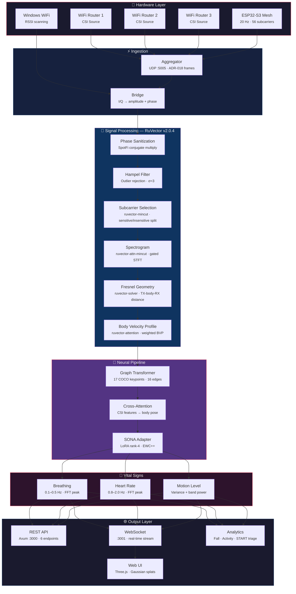
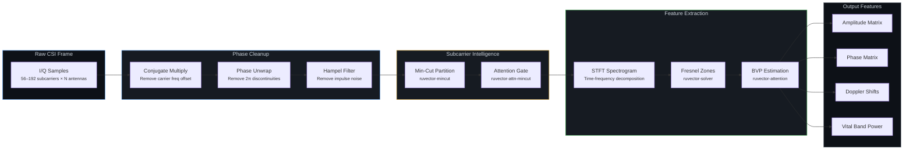
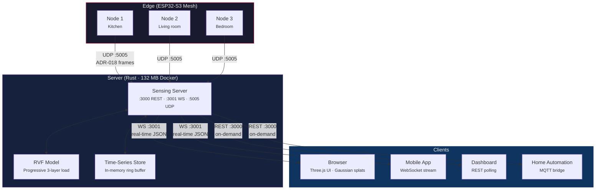

# WiFi DensePose

**See through walls with WiFi.** No cameras. No wearables. Just radio waves.

WiFi DensePose turns commodity WiFi signals into real-time human pose estimation, vital sign monitoring, and presence detection — all without a single pixel of video. By analyzing Channel State Information (CSI) disturbances caused by human movement, the system reconstructs body position, breathing rate, and heartbeat using physics-based signal processing and machine learning.

[](https://www.rust-lang.org/)
[](https://opensource.org/licenses/MIT)
[](https://github.com/ruvnet/wifi-densepose)
[](https://hub.docker.com/r/ruvnet/wifi-densepose)
[](#vital-sign-detection)
[](#esp32-s3-hardware-pipeline)
[](https://crates.io/crates/wifi-densepose-ruvector)

> | What | How | Speed |
> |------|-----|-------|
> | **Pose estimation** | CSI subcarrier amplitude/phase → DensePose UV maps | 54K fps (Rust) |
> | **Breathing detection** | Bandpass 0.1-0.5 Hz → FFT peak | 6-30 BPM |
> | **Heart rate** | Bandpass 0.8-2.0 Hz → FFT peak | 40-120 BPM |
> | **Presence sensing** | RSSI variance + motion band power | < 1ms latency |
> | **Through-wall** | Fresnel zone geometry + multipath modeling | Up to 5m depth |

```bash
# 30 seconds to live sensing — no toolchain required
docker pull ruvnet/wifi-densepose:latest
docker run -p 3000:3000 ruvnet/wifi-densepose:latest
# Open http://localhost:3000
```

> [!NOTE]
> **CSI-capable hardware required.** Pose estimation, vital signs, and through-wall sensing rely on Channel State Information (CSI) — per-subcarrier amplitude and phase data that standard consumer WiFi does not expose. You need CSI-capable hardware (ESP32-S3 or a research NIC) for full functionality. Consumer WiFi laptops can only provide RSSI-based presence detection, which is significantly less capable.

> **Hardware options** for live CSI capture:
>
> | Option | Hardware | Cost | Full CSI | Capabilities |
> |--------|----------|------|----------|-------------|
> | **ESP32 Mesh** (recommended) | 3-6x ESP32-S3 + WiFi router | ~$54 | Yes | Pose, breathing, heartbeat, motion, presence |
> | **Research NIC** | Intel 5300 / Atheros AR9580 | ~$50-100 | Yes | Full CSI with 3x3 MIMO |
> | **Any WiFi** | Windows, macOS, or Linux laptop | $0 | No | RSSI-only: coarse presence and motion |
>
> No hardware? Verify the signal processing pipeline with the deterministic reference signal: `python v1/data/proof/verify.py`

---

## 📖 Documentation

| Document | Description |
|----------|-------------|
| [User Guide](docs/user-guide.md) | Step-by-step guide: installation, first run, API usage, hardware setup, training |
| [WiFi-Mat User Guide](docs/wifi-mat-user-guide.md) | Disaster response module: search & rescue, START triage |
| [Build Guide](docs/build-guide.md) | Building from source (Rust and Python) |
| [Architecture Decisions](docs/adr/) | 27 ADRs covering signal processing, training, hardware, security, domain generalization |

---

## 🚀 Key Features

### Sensing

See people, breathing, and heartbeats through walls — using only WiFi signals already in the room.

| | Feature | What It Means |
|---|---------|---------------|
| 🔒 | **Privacy-First** | Tracks human pose using only WiFi signals — no cameras, no video, no images stored |
| 💓 | **Vital Signs** | Detects breathing rate (6-30 breaths/min) and heart rate (40-120 bpm) without any wearable |
| 👥 | **Multi-Person** | Tracks multiple people simultaneously, each with independent pose and vitals — no hard software limit (physics: ~3-5 per AP with 56 subcarriers, more with multi-AP) |
| 🧱 | **Through-Wall** | WiFi passes through walls, furniture, and debris — works where cameras cannot |
| 🚑 | **Disaster Response** | Detects trapped survivors through rubble and classifies injury severity (START triage) |

### Intelligence

The system learns on its own and gets smarter over time — no hand-tuning, no labeled data required.

| | Feature | What It Means |
|---|---------|---------------|
| 🧠 | **Self-Learning** | Teaches itself from raw WiFi data — no labeled training sets, no cameras needed to bootstrap ([ADR-024](docs/adr/ADR-024-contrastive-csi-embedding-model.md)) |
| 🎯 | **AI Signal Processing** | Attention networks, graph algorithms, and smart compression replace hand-tuned thresholds — adapts to each room automatically ([RuVector](https://github.com/ruvnet/ruvector)) |
| 🌍 | **Works Everywhere** | Train once, deploy in any room — adversarial domain generalization strips environment bias so models transfer across rooms, buildings, and hardware ([ADR-027](docs/adr/ADR-027-cross-environment-domain-generalization.md)) |

### Performance & Deployment

Fast enough for real-time use, small enough for edge devices, simple enough for one-command setup.

| | Feature | What It Means |
|---|---------|---------------|
| ⚡ | **Real-Time** | Analyzes WiFi signals in under 100 microseconds per frame — fast enough for live monitoring |
| 🦀 | **810x Faster** | Complete Rust rewrite: 54,000 frames/sec pipeline, 132 MB Docker image, 542+ tests |
| 🐳 | **One-Command Setup** | `docker pull ruvnet/wifi-densepose:latest` — live sensing in 30 seconds, no toolchain needed |
| 📦 | **Portable Models** | Trained models package into a single `.rvf` file — runs on edge, cloud, or browser (WASM) |

---

## 🔬 How It Works

WiFi routers flood every room with radio waves. When a person moves — or even breathes — those waves scatter differently. WiFi DensePose reads that scattering pattern and reconstructs what happened:

```
WiFi Router → radio waves pass through room → hit human body → scatter
    ↓
ESP32 / WiFi NIC captures 56+ subcarrier amplitudes & phases (CSI) at 20 Hz
    ↓
Signal Processing cleans noise, removes interference, extracts motion signatures
    ↓
AI Backbone (RuVector) applies attention, graph algorithms, and compression
    ↓
Neural Network maps processed signals → 17 body keypoints + vital signs
    ↓
Output: real-time pose, breathing rate, heart rate, presence, room fingerprint
```

No training cameras required — the [Self-Learning system (ADR-024)](docs/adr/ADR-024-contrastive-csi-embedding-model.md) bootstraps from raw WiFi data alone. [MERIDIAN (ADR-027)](docs/adr/ADR-027-cross-environment-domain-generalization.md) ensures the model works in any room, not just the one it trained in.

---

## 🏢 Use Cases & Applications

WiFi sensing works anywhere WiFi exists. No new hardware in most cases — just software on existing access points or a $8 ESP32 add-on. Because there are no cameras, deployments avoid privacy regulations (GDPR video, HIPAA imaging) by design.

**Scaling:** Each AP distinguishes ~3-5 people (56 subcarriers). Multi-AP multiplies linearly — a 4-AP retail mesh covers ~15-20 occupants. No hard software limit; the practical ceiling is signal physics.

| | Why WiFi sensing wins | Traditional alternative |
|---|----------------------|----------------------|
| 🔒 | **No video, no GDPR/HIPAA imaging rules** | Cameras require consent, signage, data retention policies |
| 🧱 | **Works through walls, shelving, debris** | Cameras need line-of-sight per room |
| 🌙 | **Works in total darkness** | Cameras need IR or visible light |
| 💰 | **$0-$8 per zone** (existing WiFi or ESP32) | Camera systems: $200-$2,000 per zone |
| 🔌 | **WiFi already deployed everywhere** | PIR/radar sensors require new wiring per room |

<details>
<summary><strong>🏥 Everyday</strong> — Healthcare, retail, office, hospitality (commodity WiFi)</summary>

| Use Case | What It Does | Hardware | Key Metric |
|----------|-------------|----------|------------|
| **Elderly care / assisted living** | Fall detection, nighttime activity monitoring, breathing rate during sleep — no wearable compliance needed | 1 ESP32-S3 per room ($8) | Fall alert <2s |
| **Hospital patient monitoring** | Continuous breathing + heart rate for non-critical beds without wired sensors; nurse alert on anomaly | 1-2 APs per ward | Breathing: 6-30 BPM |
| **Emergency room triage** | Automated occupancy count + wait-time estimation; detect patient distress (abnormal breathing) in waiting areas | Existing hospital WiFi | Occupancy accuracy >95% |
| **Retail occupancy & flow** | Real-time foot traffic, dwell time by zone, queue length — no cameras, no opt-in, GDPR-friendly | Existing store WiFi + 1 ESP32 | Dwell resolution ~1m |
| **Office space utilization** | Which desks/rooms are actually occupied, meeting room no-shows, HVAC optimization based on real presence | Existing enterprise WiFi | Presence latency <1s |
| **Hotel & hospitality** | Room occupancy without door sensors, minibar/bathroom usage patterns, energy savings on empty rooms | Existing hotel WiFi | 15-30% HVAC savings |
| **Restaurants & food service** | Table turnover tracking, kitchen staff presence, restroom occupancy displays — no cameras in dining areas | Existing WiFi | Queue wait ±30s |
| **Parking garages** | Pedestrian presence in stairwells and elevators where cameras have blind spots; security alert if someone lingers | Existing WiFi | Through-concrete walls |

</details>

<details>
<summary><strong>🏟️ Specialized</strong> — Events, fitness, education, civic (CSI-capable hardware)</summary>

| Use Case | What It Does | Hardware | Key Metric |
|----------|-------------|----------|------------|
| **Smart home automation** | Room-level presence triggers (lights, HVAC, music) that work through walls — no dead zones, no motion-sensor timeouts | 2-3 ESP32-S3 nodes ($24) | Through-wall range ~5m |
| **Fitness & sports** | Rep counting, posture correction, breathing cadence during exercise — no wearable, no camera in locker rooms | 3+ ESP32-S3 mesh | Pose: 17 keypoints |
| **Childcare & schools** | Naptime breathing monitoring, playground headcount, restricted-area alerts — privacy-safe for minors | 2-4 ESP32-S3 per zone | Breathing: ±1 BPM |
| **Event venues & concerts** | Crowd density mapping, crush-risk detection via breathing compression, emergency evacuation flow tracking | Multi-AP mesh (4-8 APs) | Density per m² |
| **Stadiums & arenas** | Section-level occupancy for dynamic pricing, concession staffing, emergency egress flow modeling | Enterprise AP grid | 15-20 per AP mesh |
| **Houses of worship** | Attendance counting without facial recognition — privacy-sensitive congregations, multi-room campus tracking | Existing WiFi | Zone-level accuracy |
| **Warehouse & logistics** | Worker safety zones, forklift proximity alerts, occupancy in hazardous areas — works through shelving and pallets | Industrial AP mesh | Alert latency <500ms |
| **Civic infrastructure** | Public restroom occupancy (no cameras possible), subway platform crowding, shelter headcount during emergencies | Municipal WiFi + ESP32 | Real-time headcount |
| **Museums & galleries** | Visitor flow heatmaps, exhibit dwell time, crowd bottleneck alerts — no cameras near artwork (flash/theft risk) | Existing WiFi | Zone dwell ±5s |

</details>

<details>
<summary><strong>🤖 Robotics & Industrial</strong> — Autonomous systems, manufacturing, android spatial awareness</summary>

WiFi sensing gives robots and autonomous systems a spatial awareness layer that works where LIDAR and cameras fail — through dust, smoke, fog, and around corners. The CSI signal field acts as a "sixth sense" for detecting humans in the environment without requiring line-of-sight.

| Use Case | What It Does | Hardware | Key Metric |
|----------|-------------|----------|------------|
| **Cobot safety zones** | Detect human presence near collaborative robots — auto-slow or stop before contact, even behind obstructions | 2-3 ESP32-S3 per cell | Presence latency <100ms |
| **Warehouse AMR navigation** | Autonomous mobile robots sense humans around blind corners, through shelving racks — no LIDAR occlusion | ESP32 mesh along aisles | Through-shelf detection |
| **Android / humanoid spatial awareness** | Ambient human pose sensing for social robots — detect gestures, approach direction, and personal space without cameras always on | Onboard ESP32-S3 module | 17-keypoint pose |
| **Manufacturing line monitoring** | Worker presence at each station, ergonomic posture alerts, headcount for shift compliance — works through equipment | Industrial AP per zone | Pose + breathing |
| **Construction site safety** | Exclusion zone enforcement around heavy machinery, fall detection from scaffolding, personnel headcount | Ruggedized ESP32 mesh | Alert <2s, through-dust |
| **Agricultural robotics** | Detect farm workers near autonomous harvesters in dusty/foggy field conditions where cameras are unreliable | Weatherproof ESP32 nodes | Range ~10m open field |
| **Drone landing zones** | Verify landing area is clear of humans — WiFi sensing works in rain, dust, and low light where downward cameras fail | Ground ESP32 nodes | Presence: >95% accuracy |
| **Clean room monitoring** | Personnel tracking without cameras (particle contamination risk from camera fans) — gown compliance via pose | Existing cleanroom WiFi | No particulate emission |

</details>

<details>
<summary><strong>🔥 Extreme</strong> — Through-wall, disaster, defense, underground</summary>

These scenarios exploit WiFi's ability to penetrate solid materials — concrete, rubble, earth — where no optical or infrared sensor can reach. The WiFi-Mat disaster module (ADR-001) is specifically designed for this tier.

| Use Case | What It Does | Hardware | Key Metric |
|----------|-------------|----------|------------|
| **Search & rescue (WiFi-Mat)** | Detect survivors through rubble/debris via breathing signature, START triage color classification, 3D localization | Portable ESP32 mesh + laptop | Through 30cm concrete |
| **Firefighting** | Locate occupants through smoke and walls before entry; breathing detection confirms life signs remotely | Portable mesh on truck | Works in zero visibility |
| **Prison & secure facilities** | Cell occupancy verification, distress detection (abnormal vitals), perimeter sensing — no camera blind spots | Dedicated AP infrastructure | 24/7 vital signs |
| **Military / tactical** | Through-wall personnel detection, room clearing confirmation, hostage vital signs at standoff distance | Directional WiFi + custom FW | Range: 5m through wall |
| **Border & perimeter security** | Detect human presence in tunnels, behind fences, in vehicles — passive sensing, no active illumination to reveal position | Concealed ESP32 mesh | Passive / covert |
| **Mining & underground** | Worker presence in tunnels where GPS/cameras fail, breathing detection after collapse, headcount at safety points | Ruggedized ESP32 mesh | Through rock/earth |
| **Maritime & naval** | Below-deck personnel tracking through steel bulkheads (limited range, requires tuning), man-overboard detection | Ship WiFi + ESP32 | Through 1-2 bulkheads |
| **Wildlife research** | Non-invasive animal activity monitoring in enclosures or dens — no light pollution, no visual disturbance | Weatherproof ESP32 nodes | Zero light emission |

</details>

---

<details>
<summary><strong>🧠 Self-Learning WiFi AI (ADR-024)</strong> — Adaptive recognition, self-optimization, and intelligent anomaly detection</summary>

Every WiFi signal that passes through a room creates a unique fingerprint of that space. WiFi-DensePose already reads these fingerprints to track people, but until now it threw away the internal "understanding" after each reading. The Self-Learning WiFi AI captures and preserves that understanding as compact, reusable vectors — and continuously optimizes itself for each new environment.

**What it does in plain terms:**
- Turns any WiFi signal into a 128-number "fingerprint" that uniquely describes what's happening in a room
- Learns entirely on its own from raw WiFi data — no cameras, no labeling, no human supervision needed
- Recognizes rooms, detects intruders, identifies people, and classifies activities using only WiFi
- Runs on an $8 ESP32 chip (the entire model fits in 55 KB of memory)
- Produces both body pose tracking AND environment fingerprints in a single computation

**Key Capabilities**

| What | How it works | Why it matters |
|------|-------------|----------------|
| **Self-supervised learning** | The model watches WiFi signals and teaches itself what "similar" and "different" look like, without any human-labeled data | Deploy anywhere — just plug in a WiFi sensor and wait 10 minutes |
| **Room identification** | Each room produces a distinct WiFi fingerprint pattern | Know which room someone is in without GPS or beacons |
| **Anomaly detection** | An unexpected person or event creates a fingerprint that doesn't match anything seen before | Automatic intrusion and fall detection as a free byproduct |
| **Person re-identification** | Each person disturbs WiFi in a slightly different way, creating a personal signature | Track individuals across sessions without cameras |
| **Environment adaptation** | MicroLoRA adapters (1,792 parameters per room) fine-tune the model for each new space | Adapts to a new room with minimal data — 93% less than retraining from scratch |
| **Memory preservation** | EWC++ regularization remembers what was learned during pretraining | Switching to a new task doesn't erase prior knowledge |
| **Hard-negative mining** | Training focuses on the most confusing examples to learn faster | Better accuracy with the same amount of training data |

**Architecture**

```
WiFi Signal [56 channels] → Transformer + Graph Neural Network
                                  ├→ 128-dim environment fingerprint (for search + identification)
                                  └→ 17-joint body pose (for human tracking)
```

**Quick Start**

```bash
# Step 1: Learn from raw WiFi data (no labels needed)
cargo run -p wifi-densepose-sensing-server -- --pretrain --dataset data/csi/ --pretrain-epochs 50

# Step 2: Fine-tune with pose labels for full capability
cargo run -p wifi-densepose-sensing-server -- --train --dataset data/mmfi/ --epochs 100 --save-rvf model.rvf

# Step 3: Use the model — extract fingerprints from live WiFi
cargo run -p wifi-densepose-sensing-server -- --model model.rvf --embed

# Step 4: Search — find similar environments or detect anomalies
cargo run -p wifi-densepose-sensing-server -- --model model.rvf --build-index env
```

**Training Modes**

| Mode | What you need | What you get |
|------|--------------|-------------|
| Self-Supervised | Just raw WiFi data | A model that understands WiFi signal structure |
| Supervised | WiFi data + body pose labels | Full pose tracking + environment fingerprints |
| Cross-Modal | WiFi data + camera footage | Fingerprints aligned with visual understanding |

**Fingerprint Index Types**

| Index | What it stores | Real-world use |
|-------|---------------|----------------|
| `env_fingerprint` | Average room fingerprint | "Is this the kitchen or the bedroom?" |
| `activity_pattern` | Activity boundaries | "Is someone cooking, sleeping, or exercising?" |
| `temporal_baseline` | Normal conditions | "Something unusual just happened in this room" |
| `person_track` | Individual movement signatures | "Person A just entered the living room" |

**Model Size**

| Component | Parameters | Memory (on ESP32) |
|-----------|-----------|-------------------|
| Transformer backbone | ~28,000 | 28 KB |
| Embedding projection head | ~25,000 | 25 KB |
| Per-room MicroLoRA adapter | ~1,800 | 2 KB |
| **Total** | **~55,000** | **55 KB** (of 520 KB available) |

The self-learning system builds on the [AI Backbone (RuVector)](#ai-backbone-ruvector) signal-processing layer — attention, graph algorithms, and compression — adding contrastive learning on top.

See [`docs/adr/ADR-024-contrastive-csi-embedding-model.md`](docs/adr/ADR-024-contrastive-csi-embedding-model.md) for full architectural details.

</details>

<details>
<summary><a id="cross-environment-generalization-adr-027"></a><strong>🌍 Cross-Environment Generalization (ADR-027 — Project MERIDIAN)</strong> — Train once, deploy in any room without retraining</summary>

WiFi pose models trained in one room lose 40-70% accuracy when moved to another — even in the same building. The model memorizes room-specific multipath patterns instead of learning human motion. MERIDIAN forces the network to forget which room it's in while retaining everything about how people move.

**What it does in plain terms:**
- Models trained in Room A work in Room B, C, D — without any retraining or calibration data
- Handles different WiFi hardware (ESP32, Intel 5300, Atheros) with automatic chipset normalization
- Knows where the WiFi transmitters are positioned and compensates for layout differences
- Generates synthetic "virtual rooms" during training so the model sees thousands of environments
- At deployment, adapts to a new room in seconds using a handful of unlabeled WiFi frames

**Key Components**

| What | How it works | Why it matters |
|------|-------------|----------------|
| **Gradient Reversal Layer** | An adversarial classifier tries to guess which room the signal came from; the main network is trained to fool it | Forces the model to discard room-specific shortcuts |
| **Geometry Encoder (FiLM)** | Transmitter/receiver positions are Fourier-encoded and injected as scale+shift conditioning on every layer | The model knows *where* the hardware is, so it doesn't need to memorize layout |
| **Hardware Normalizer** | Resamples any chipset's CSI to a canonical 56-subcarrier format with standardized amplitude | Intel 5300 and ESP32 data look identical to the model |
| **Virtual Domain Augmentation** | Generates synthetic environments with random room scale, wall reflections, scatterers, and noise profiles | Training sees 1000s of rooms even with data from just 2-3 |
| **Rapid Adaptation (TTT)** | Contrastive test-time training with LoRA weight generation from a few unlabeled frames | Zero-shot deployment — the model self-tunes on arrival |
| **Cross-Domain Evaluator** | Leave-one-out evaluation across all training environments with per-environment PCK/OKS metrics | Proves generalization, not just memorization |

**Architecture**

```
CSI Frame [any chipset]
    │
    ▼
HardwareNormalizer ──→ canonical 56 subcarriers, N(0,1) amplitude
    │
    ▼
CSI Encoder (existing) ──→ latent features
    │
    ├──→ Pose Head ──→ 17-joint pose (environment-invariant)
    │
    ├──→ Gradient Reversal Layer ──→ Domain Classifier (adversarial)
    │         λ ramps 0→1 via cosine/exponential schedule
    │
    └──→ Geometry Encoder ──→ FiLM conditioning (scale + shift)
              Fourier positional encoding → DeepSets → per-layer modulation
```

**Security hardening:**
- Bounded calibration buffer (max 10,000 frames) prevents memory exhaustion
- `adapt()` returns `Result<_, AdaptError>` — no panics on bad input
- Atomic instance counter ensures unique weight initialization across threads
- Division-by-zero guards on all augmentation parameters

See [`docs/adr/ADR-027-cross-environment-domain-generalization.md`](docs/adr/ADR-027-cross-environment-domain-generalization.md) for full architectural details.

</details>

---

<details>
<summary><strong>🔍 Independent Capability Audit (ADR-028)</strong> — 1,031 tests, SHA-256 proof, self-verifying witness bundle</summary>

A [3-agent parallel audit](docs/adr/ADR-028-esp32-capability-audit.md) independently verified every claim in this repository — ESP32 hardware, signal processing, neural networks, training pipeline, deployment, and security. Results:

```
Rust tests:     1,031 passed, 0 failed
Python proof:   VERDICT: PASS (SHA-256: 8c0680d7...)
Bundle verify:  7/7 checks PASS
```

**33-row attestation matrix:** 31 capabilities verified YES, 2 not measured at audit time (benchmark throughput, Kubernetes deploy).

**Verify it yourself** (no hardware needed):
```bash
# Run all tests
cd rust-port/wifi-densepose-rs && cargo test --workspace --no-default-features

# Run the deterministic proof
python v1/data/proof/verify.py

# Generate + verify the witness bundle
bash scripts/generate-witness-bundle.sh
cd dist/witness-bundle-ADR028-*/ && bash VERIFY.sh
```

| Document | What it contains |
|----------|-----------------|
| [ADR-028](docs/adr/ADR-028-esp32-capability-audit.md) | Full audit: ESP32 specs, signal algorithms, NN architectures, training phases, deployment infra |
| [Witness Log](docs/WITNESS-LOG-028.md) | 11 reproducible verification steps + 33-row attestation matrix with evidence per row |
| [`generate-witness-bundle.sh`](scripts/generate-witness-bundle.sh) | Creates self-contained tar.gz with test logs, proof output, firmware hashes, crate versions, VERIFY.sh |

</details>

---

## 📦 Installation

<details>
<summary><strong>Guided Installer</strong> — Interactive hardware detection and profile selection</summary>

```bash
./install.sh
```

The installer walks through 7 steps: system detection, toolchain check, WiFi hardware scan, profile recommendation, dependency install, build, and verification.

| Profile | What it installs | Size | Requirements |
|---------|-----------------|------|-------------|
| `verify` | Pipeline verification only | ~5 MB | Python 3.8+ |
| `python` | Full Python API server + sensing | ~500 MB | Python 3.8+ |
| `rust` | Rust pipeline (~810x faster) | ~200 MB | Rust 1.70+ |
| `browser` | WASM for in-browser execution | ~10 MB | Rust + wasm-pack |
| `iot` | ESP32 sensor mesh + aggregator | varies | Rust + ESP-IDF |
| `docker` | Docker-based deployment | ~1 GB | Docker |
| `field` | WiFi-Mat disaster response kit | ~62 MB | Rust + wasm-pack |
| `full` | Everything available | ~2 GB | All toolchains |

```bash
# Non-interactive
./install.sh --profile rust --yes

# Hardware check only
./install.sh --check-only
```

</details>

<details>
<summary><strong>From Source</strong> — Rust (primary) or Python</summary>

```bash
git clone https://github.com/ruvnet/wifi-densepose.git
cd wifi-densepose

# Rust (primary — 810x faster)
cd rust-port/wifi-densepose-rs
cargo build --release
cargo test --workspace

# Python (legacy v1)
pip install -r requirements.txt
pip install -e .

# Or via pip
pip install wifi-densepose
pip install wifi-densepose[gpu]   # GPU acceleration
pip install wifi-densepose[all]   # All optional deps
```

</details>

<details>
<summary><strong>Docker</strong> — Pre-built images, no toolchain needed</summary>

```bash
# Rust sensing server (132 MB — recommended)
docker pull ruvnet/wifi-densepose:latest
docker run -p 3000:3000 -p 3001:3001 -p 5005:5005/udp ruvnet/wifi-densepose:latest

# Python sensing pipeline (569 MB)
docker pull ruvnet/wifi-densepose:python
docker run -p 8765:8765 -p 8080:8080 ruvnet/wifi-densepose:python

# Both via docker-compose
cd docker && docker compose up

# Export RVF model
docker run --rm -v $(pwd):/out ruvnet/wifi-densepose:latest --export-rvf /out/model.rvf
```

| Image | Tag | Size | Ports |
|-------|-----|------|-------|
| `ruvnet/wifi-densepose` | `latest`, `rust` | 132 MB | 3000 (REST), 3001 (WS), 5005/udp (ESP32) |
| `ruvnet/wifi-densepose` | `python` | 569 MB | 8765 (WS), 8080 (UI) |

</details>

<details>
<summary><strong>System Requirements</strong></summary>

- **Rust**: 1.70+ (primary runtime — install via [rustup](https://rustup.rs/))
- **Python**: 3.8+ (for verification and legacy v1 API)
- **OS**: Linux (Ubuntu 18.04+), macOS (10.15+), Windows 10+
- **Memory**: Minimum 4GB RAM, Recommended 8GB+
- **Storage**: 2GB free space for models and data
- **Network**: WiFi interface with CSI capability (optional — installer detects what you have)
- **GPU**: Optional (NVIDIA CUDA or Apple Metal)

</details>

<details>
<summary><strong>Rust Crates</strong> — Individual crates on crates.io</summary>

The Rust workspace consists of 15 crates, all published to [crates.io](https://crates.io/):

```bash
# Add individual crates to your Cargo.toml
cargo add wifi-densepose-core       # Types, traits, errors
cargo add wifi-densepose-signal     # CSI signal processing (6 SOTA algorithms)
cargo add wifi-densepose-nn         # Neural inference (ONNX, PyTorch, Candle)
cargo add wifi-densepose-vitals     # Vital sign extraction (breathing + heart rate)
cargo add wifi-densepose-mat        # Disaster response (MAT survivor detection)
cargo add wifi-densepose-hardware   # ESP32, Intel 5300, Atheros sensors
cargo add wifi-densepose-train      # Training pipeline (MM-Fi dataset)
cargo add wifi-densepose-wifiscan   # Multi-BSSID WiFi scanning
cargo add wifi-densepose-ruvector   # RuVector v2.0.4 integration layer (ADR-017)
```

| Crate | Description | RuVector | crates.io |
|-------|-------------|----------|-----------|
| [`wifi-densepose-core`](https://crates.io/crates/wifi-densepose-core) | Foundation types, traits, and utilities | -- | [](https://crates.io/crates/wifi-densepose-core) |
| [`wifi-densepose-signal`](https://crates.io/crates/wifi-densepose-signal) | SOTA CSI signal processing (SpotFi, FarSense, Widar 3.0) | `mincut`, `attn-mincut`, `attention`, `solver` | [](https://crates.io/crates/wifi-densepose-signal) |
| [`wifi-densepose-nn`](https://crates.io/crates/wifi-densepose-nn) | Multi-backend inference (ONNX, PyTorch, Candle) | -- | [](https://crates.io/crates/wifi-densepose-nn) |
| [`wifi-densepose-train`](https://crates.io/crates/wifi-densepose-train) | Training pipeline with MM-Fi dataset (NeurIPS 2023) | **All 5** | [](https://crates.io/crates/wifi-densepose-train) |
| [`wifi-densepose-mat`](https://crates.io/crates/wifi-densepose-mat) | Mass Casualty Assessment Tool (disaster survivor detection) | `solver`, `temporal-tensor` | [](https://crates.io/crates/wifi-densepose-mat) |
| [`wifi-densepose-ruvector`](https://crates.io/crates/wifi-densepose-ruvector) | RuVector v2.0.4 integration layer — 7 signal+MAT integration points (ADR-017) | **All 5** | [](https://crates.io/crates/wifi-densepose-ruvector) |
| [`wifi-densepose-vitals`](https://crates.io/crates/wifi-densepose-vitals) | Vital signs: breathing (6-30 BPM), heart rate (40-120 BPM) | -- | [](https://crates.io/crates/wifi-densepose-vitals) |
| [`wifi-densepose-hardware`](https://crates.io/crates/wifi-densepose-hardware) | ESP32, Intel 5300, Atheros CSI sensor interfaces | -- | [](https://crates.io/crates/wifi-densepose-hardware) |
| [`wifi-densepose-wifiscan`](https://crates.io/crates/wifi-densepose-wifiscan) | Multi-BSSID WiFi scanning (Windows, macOS, Linux) | -- | [](https://crates.io/crates/wifi-densepose-wifiscan) |
| [`wifi-densepose-wasm`](https://crates.io/crates/wifi-densepose-wasm) | WebAssembly bindings for browser deployment | -- | [](https://crates.io/crates/wifi-densepose-wasm) |
| [`wifi-densepose-sensing-server`](https://crates.io/crates/wifi-densepose-sensing-server) | Axum server: UDP ingestion, WebSocket broadcast | -- | [](https://crates.io/crates/wifi-densepose-sensing-server) |
| [`wifi-densepose-cli`](https://crates.io/crates/wifi-densepose-cli) | Command-line tool for MAT disaster scanning | -- | [](https://crates.io/crates/wifi-densepose-cli) |
| [`wifi-densepose-api`](https://crates.io/crates/wifi-densepose-api) | REST + WebSocket API layer | -- | [](https://crates.io/crates/wifi-densepose-api) |
| [`wifi-densepose-config`](https://crates.io/crates/wifi-densepose-config) | Configuration management | -- | [](https://crates.io/crates/wifi-densepose-config) |
| [`wifi-densepose-db`](https://crates.io/crates/wifi-densepose-db) | Database persistence (PostgreSQL, SQLite, Redis) | -- | [](https://crates.io/crates/wifi-densepose-db) |

All crates integrate with [RuVector v2.0.4](https://github.com/ruvnet/ruvector) — see [AI Backbone](#ai-backbone-ruvector) below.

</details>

---

## 🚀 Quick Start

<details open>
<summary><strong>First API call in 3 commands</strong></summary>

### 1. Install

```bash
# Fastest path — Docker
docker pull ruvnet/wifi-densepose:latest
docker run -p 3000:3000 ruvnet/wifi-densepose:latest

# Or from source (Rust)
./install.sh --profile rust --yes
```

### 2. Start the System

```python
from wifi_densepose import WiFiDensePose

system = WiFiDensePose()
system.start()
poses = system.get_latest_poses()
print(f"Detected {len(poses)} persons")
system.stop()
```

### 3. REST API

```bash
# Health check
curl http://localhost:3000/health

# Latest sensing frame
curl http://localhost:3000/api/v1/sensing/latest

# Vital signs
curl http://localhost:3000/api/v1/vital-signs

# Pose estimation
curl http://localhost:3000/api/v1/pose/current

# Server info
curl http://localhost:3000/api/v1/info
```

### 4. Real-time WebSocket

```python
import asyncio, websockets, json

async def stream():
    async with websockets.connect("ws://localhost:3001/ws/sensing") as ws:
        async for msg in ws:
            data = json.loads(msg)
            print(f"Persons: {len(data.get('persons', []))}")

asyncio.run(stream())
```

</details>

---

## 📋 Table of Contents

<details open>
<summary><strong>📡 Signal Processing & Sensing</strong> — From raw WiFi frames to vital signs</summary>

The signal processing stack transforms raw WiFi Channel State Information into actionable human sensing data. Starting from 56-192 subcarrier complex values captured at 20 Hz, the pipeline applies research-grade algorithms (SpotFi phase correction, Hampel outlier rejection, Fresnel zone modeling) to extract breathing rate, heart rate, motion level, and multi-person body pose — all in pure Rust with zero external ML dependencies.

| Section | Description | Docs |
|---------|-------------|------|
| [Key Features](#key-features) | Sensing, Intelligence, and Performance & Deployment capabilities | — |
| [How It Works](#how-it-works) | End-to-end pipeline: radio waves → CSI capture → signal processing → AI → pose + vitals | — |
| [ESP32-S3 Hardware Pipeline](#esp32-s3-hardware-pipeline) | 20 Hz CSI streaming, binary frame parsing, flash & provision | [ADR-018](docs/adr/ADR-018-esp32-dev-implementation.md) · [Tutorial #34](https://github.com/ruvnet/wifi-densepose/issues/34) |
| [Vital Sign Detection](#vital-sign-detection) | Breathing 6-30 BPM, heartbeat 40-120 BPM, FFT peak detection | [ADR-021](docs/adr/ADR-021-vital-sign-detection-rvdna-pipeline.md) |
| [WiFi Scan Domain Layer](#wifi-scan-domain-layer) | 8-stage RSSI pipeline, multi-BSSID fingerprinting, Windows WiFi | [ADR-022](docs/adr/ADR-022-windows-wifi-enhanced-fidelity-ruvector.md) · [Tutorial #36](https://github.com/ruvnet/wifi-densepose/issues/36) |
| [WiFi-Mat Disaster Response](#wifi-mat-disaster-response) | Search & rescue, START triage, 3D localization through debris | [ADR-001](docs/adr/ADR-001-wifi-mat-disaster-detection.md) · [User Guide](docs/wifi-mat-user-guide.md) |
| [SOTA Signal Processing](#sota-signal-processing) | SpotFi, Hampel, Fresnel, STFT spectrogram, subcarrier selection, BVP | [ADR-014](docs/adr/ADR-014-sota-signal-processing.md) |

</details>

<details>
<summary><strong>🧠 Models & Training</strong> — DensePose pipeline, RVF containers, SONA adaptation, RuVector integration</summary>

The neural pipeline uses a graph transformer with cross-attention to map CSI feature matrices to 17 COCO body keypoints and DensePose UV coordinates. Models are packaged as single-file `.rvf` containers with progressive loading (Layer A instant, Layer B warm, Layer C full). SONA (Self-Optimizing Neural Architecture) enables continuous on-device adaptation via micro-LoRA + EWC++ without catastrophic forgetting. Signal processing is powered by 5 [RuVector](https://github.com/ruvnet/ruvector) crates (v2.0.4) with 7 integration points across the Rust workspace, plus 6 additional vendored crates for inference and graph intelligence.

| Section | Description | Docs |
|---------|-------------|------|
| [RVF Model Container](#rvf-model-container) | Binary packaging with Ed25519 signing, progressive 3-layer loading, SIMD quantization | [ADR-023](docs/adr/ADR-023-trained-densepose-model-ruvector-pipeline.md) |
| [Training & Fine-Tuning](#training--fine-tuning) | 8-phase pure Rust pipeline (7,832 lines), MM-Fi/Wi-Pose pre-training, 6-term composite loss, SONA LoRA | [ADR-023](docs/adr/ADR-023-trained-densepose-model-ruvector-pipeline.md) |
| [RuVector Crates](#ruvector-crates) | 11 vendored Rust crates from [ruvector](https://github.com/ruvnet/ruvector): attention, min-cut, solver, GNN, HNSW, temporal compression, sparse inference | [GitHub](https://github.com/ruvnet/ruvector) · [Source](vendor/ruvector/) |
| [AI Backbone (RuVector)](#ai-backbone-ruvector) | 5 AI capabilities replacing hand-tuned thresholds: attention, graph min-cut, sparse solvers, tiered compression | [crates.io](https://crates.io/crates/wifi-densepose-ruvector) |
| [Self-Learning WiFi AI (ADR-024)](#self-learning-wifi-ai-adr-024) | Contrastive self-supervised learning, room fingerprinting, anomaly detection, 55 KB model | [ADR-024](docs/adr/ADR-024-contrastive-csi-embedding-model.md) |
| [Cross-Environment Generalization (ADR-027)](docs/adr/ADR-027-cross-environment-domain-generalization.md) | Domain-adversarial training, geometry-conditioned inference, hardware normalization, zero-shot deployment | [ADR-027](docs/adr/ADR-027-cross-environment-domain-generalization.md) |

</details>

<details>
<summary><strong>🖥️ Usage & Configuration</strong> — CLI flags, API endpoints, hardware setup</summary>

The Rust sensing server is the primary interface, offering a comprehensive CLI with flags for data source selection, model loading, training, benchmarking, and RVF export. A REST API (Axum) and WebSocket server provide real-time data access. The Python v1 CLI remains available for legacy workflows.

| Section | Description | Docs |
|---------|-------------|------|
| [CLI Usage](#cli-usage) | `--source`, `--train`, `--benchmark`, `--export-rvf`, `--model`, `--progressive` | — |
| [REST API & WebSocket](#rest-api--websocket) | 6 REST endpoints (sensing, vitals, BSSID, SONA), WebSocket real-time stream | — |
| [Hardware Support](#hardware-support-1) | ESP32-S3 ($8), Intel 5300 ($15), Atheros AR9580 ($20), Windows RSSI ($0) | [ADR-012](docs/adr/ADR-012-esp32-csi-sensor-mesh.md) · [ADR-013](docs/adr/ADR-013-feature-level-sensing-commodity-gear.md) |

</details>

<details>
<summary><strong>⚙️ Development & Testing</strong> — 542+ tests, CI, deployment</summary>

The project maintains 542+ pure-Rust tests across 7 crate suites with zero mocks — every test runs against real algorithm implementations. Hardware-free simulation mode (`--source simulate`) enables full-stack testing without physical devices. Docker images are published on Docker Hub for zero-setup deployment.

| Section | Description | Docs |
|---------|-------------|------|
| [Testing](#testing) | 7 test suites: sensing-server (229), signal (83), mat (139), wifiscan (91), RVF (16), vitals (18) | — |
| [Deployment](#deployment) | Docker images (132 MB Rust / 569 MB Python), docker-compose, env vars | — |
| [Contributing](#contributing) | Fork → branch → test → PR workflow, Rust and Python dev setup | — |

</details>

<details>
<summary><strong>📊 Performance & Benchmarks</strong> — Measured throughput, latency, resource usage</summary>

All benchmarks are measured on the Rust sensing server using `cargo bench` and the built-in `--benchmark` CLI flag. The Rust v2 implementation delivers 810x end-to-end speedup over the Python v1 baseline, with motion detection reaching 5,400x improvement. The vital sign detector processes 11,665 frames/second in a single-threaded benchmark.

| Section | Description | Key Metric |
|---------|-------------|------------|
| [Performance Metrics](#performance-metrics) | Vital signs, CSI pipeline, motion detection, Docker image, memory | 11,665 fps vitals · 54K fps pipeline |
| [Rust vs Python](#python-vs-rust) | Side-by-side benchmarks across 5 operations | **810x** full pipeline speedup |

</details>

<details>
<summary><strong>📄 Meta</strong> — License, changelog, support</summary>

WiFi DensePose is MIT-licensed open source, developed by [ruvnet](https://github.com/ruvnet). The project has been in active development since March 2025, with 3 major releases delivering the Rust port, SOTA signal processing, disaster response module, and end-to-end training pipeline.

| Section | Description | Link |
|---------|-------------|------|
| [Changelog](#changelog) | v3.0.0 (AETHER AI + Docker), v2.0.0 (Rust port + SOTA + WiFi-Mat) | [CHANGELOG.md](CHANGELOG.md) |
| [License](#license) | MIT License | [LICENSE](LICENSE) |
| [Support](#support) | Bug reports, feature requests, community discussion | [Issues](https://github.com/ruvnet/wifi-densepose/issues) · [Discussions](https://github.com/ruvnet/wifi-densepose/discussions) |

</details>

---

## 📡 Signal Processing & Sensing

<details>
<summary><a id="esp32-s3-hardware-pipeline"></a><strong>📡 ESP32-S3 Hardware Pipeline (ADR-018)</strong> — 20 Hz CSI streaming, flash & provision</summary>

```
ESP32-S3 (STA + promiscuous)     UDP/5005      Rust aggregator
┌─────────────────────────┐    ──────────>    ┌──────────────────┐
│ WiFi CSI callback 20 Hz │    ADR-018        │ Esp32CsiParser   │
│ ADR-018 binary frames   │    binary         │ CsiFrame output  │
│ stream_sender (UDP)     │                   │ presence detect  │
└─────────────────────────┘                   └──────────────────┘
```

| Metric | Measured |
|--------|----------|
| Frame rate | ~20 Hz sustained |
| Subcarriers | 64 / 128 / 192 (LLTF, HT, HT40) |
| Latency | < 1ms (UDP loopback) |
| Presence detection | Motion score 10/10 at 3m |

```bash
# Pre-built binaries — no toolchain required
# https://github.com/ruvnet/wifi-densepose/releases/tag/v0.1.0-esp32

python -m esptool --chip esp32s3 --port COM7 --baud 460800 \
  write-flash --flash-mode dio --flash-size 4MB \
  0x0 bootloader.bin 0x8000 partition-table.bin 0x10000 esp32-csi-node.bin

python scripts/provision.py --port COM7 \
  --ssid "YourWiFi" --password "secret" --target-ip 192.168.1.20

cargo run -p wifi-densepose-hardware --bin aggregator -- --bind 0.0.0.0:5005 --verbose
```

See [firmware/esp32-csi-node/README.md](firmware/esp32-csi-node/README.md) and [Tutorial #34](https://github.com/ruvnet/wifi-densepose/issues/34).

</details>

<details>
<summary><strong>🦀 Rust Implementation (v2)</strong> — 810x faster, 54K fps pipeline</summary>

### Performance Benchmarks (Validated)

| Operation | Python (v1) | Rust (v2) | Speedup |
|-----------|-------------|-----------|---------|
| CSI Preprocessing (4x64) | ~5ms | **5.19 µs** | ~1000x |
| Phase Sanitization (4x64) | ~3ms | **3.84 µs** | ~780x |
| Feature Extraction (4x64) | ~8ms | **9.03 µs** | ~890x |
| Motion Detection | ~1ms | **186 ns** | ~5400x |
| **Full Pipeline** | ~15ms | **18.47 µs** | ~810x |
| **Vital Signs** | N/A | **86 µs** | 11,665 fps |

| Resource | Python (v1) | Rust (v2) |
|----------|-------------|-----------|
| Memory | ~500 MB | ~100 MB |
| Docker Image | 569 MB | 132 MB |
| Tests | 41 | 542+ |
| WASM Support | No | Yes |

```bash
cd rust-port/wifi-densepose-rs
cargo build --release
cargo test --workspace
cargo bench --package wifi-densepose-signal
```

</details>

<details>
<summary><a id="vital-sign-detection"></a><strong>💓 Vital Sign Detection (ADR-021)</strong> — Breathing and heartbeat via FFT</summary>

| Capability | Range | Method |
|------------|-------|--------|
| **Breathing Rate** | 6-30 BPM (0.1-0.5 Hz) | Bandpass filter + FFT peak detection |
| **Heart Rate** | 40-120 BPM (0.8-2.0 Hz) | Bandpass filter + FFT peak detection |
| **Sampling Rate** | 20 Hz (ESP32 CSI) | Real-time streaming |
| **Confidence** | 0.0-1.0 per sign | Spectral coherence + signal quality |

```bash
./target/release/sensing-server --source simulate --http-port 3000 --ws-port 3001 --ui-path ../../ui
curl http://localhost:3000/api/v1/vital-signs
```

See [ADR-021](docs/adr/ADR-021-vital-sign-detection-rvdna-pipeline.md).

</details>

<details>
<summary><a id="wifi-scan-domain-layer"></a><strong>📡 WiFi Scan Domain Layer (ADR-022/025)</strong> — 8-stage RSSI pipeline for Windows, macOS, and Linux WiFi</summary>

| Stage | Purpose |
|-------|---------|
| **Predictive Gating** | Pre-filter scan results using temporal prediction |
| **Attention Weighting** | Weight BSSIDs by signal relevance |
| **Spatial Correlation** | Cross-AP spatial signal correlation |
| **Motion Estimation** | Detect movement from RSSI variance |
| **Breathing Extraction** | Extract respiratory rate from sub-Hz oscillations |
| **Quality Gating** | Reject low-confidence estimates |
| **Fingerprint Matching** | Location and posture classification via RF fingerprints |
| **Orchestration** | Fuse all stages into unified sensing output |

```bash
cargo test -p wifi-densepose-wifiscan
```

See [ADR-022](docs/adr/ADR-022-windows-wifi-enhanced-fidelity-ruvector.md) and [Tutorial #36](https://github.com/ruvnet/wifi-densepose/issues/36).

</details>

<details>
<summary><a id="wifi-mat-disaster-response"></a><strong>🚨 WiFi-Mat: Disaster Response</strong> — Search & rescue, START triage, 3D localization</summary>

WiFi signals penetrate non-metallic debris (concrete, wood, drywall) where cameras and thermal sensors cannot reach. The WiFi-Mat module (`wifi-densepose-mat`, 139 tests) uses CSI analysis to detect survivors trapped under rubble, classify their condition using the START triage protocol, and estimate their 3D position — giving rescue teams actionable intelligence within seconds of deployment.

| Capability | How It Works | Performance Target |
|------------|-------------|-------------------|
| **Breathing Detection** | Bandpass 0.07-1.0 Hz + Fresnel zone modeling detects chest displacement of 5-10mm at 5 GHz | 4-60 BPM, <500ms latency |
| **Heartbeat Detection** | Micro-Doppler shift extraction from fine-grained CSI phase variation | Via ruvector-temporal-tensor |
| **3D Localization** | Multi-AP triangulation + CSI fingerprint matching + depth estimation through rubble layers | 3-5m penetration |
| **START Triage** | Ensemble classifier votes on breathing + movement + vital stability → P1-P4 priority | <1% false negative |
| **Zone Scanning** | 16+ concurrent scan zones with periodic re-scan and audit logging | Full disaster site |

**Triage classification (START protocol compatible):**

| Status | Color | Detection Criteria | Priority |
|--------|-------|-------------------|----------|
| Immediate | Red | Breathing detected, no movement | P1 |
| Delayed | Yellow | Movement + breathing, stable vitals | P2 |
| Minor | Green | Strong movement, responsive patterns | P3 |
| Deceased | Black | No vitals for >30 min continuous scan | P4 |

**Deployment modes:** portable (single TX/RX handheld), distributed (multiple APs around collapse site), drone-mounted (UAV scanning), vehicle-mounted (mobile command post).

```rust
use wifi_densepose_mat::{DisasterResponse, DisasterConfig, DisasterType, ScanZone, ZoneBounds};

let config = DisasterConfig::builder()
    .disaster_type(DisasterType::Earthquake)
    .sensitivity(0.85)
    .max_depth(5.0)
    .build();

let mut response = DisasterResponse::new(config);
response.initialize_event(location, "Building collapse")?;
response.add_zone(ScanZone::new("North Wing", ZoneBounds::rectangle(0.0, 0.0, 30.0, 20.0)))?;
response.start_scanning().await?;
```

**Safety guarantees:** fail-safe defaults (assume life present on ambiguous signals), redundant multi-algorithm voting, complete audit trail, offline-capable (no network required).

- [WiFi-Mat User Guide](docs/wifi-mat-user-guide.md) | [ADR-001](docs/adr/ADR-001-wifi-mat-disaster-detection.md) | [Domain Model](docs/ddd/wifi-mat-domain-model.md)

</details>

<details>
<summary><a id="sota-signal-processing"></a><strong>🔬 SOTA Signal Processing (ADR-014)</strong> — 6 research-grade algorithms</summary>

The signal processing layer bridges the gap between raw commodity WiFi hardware output and research-grade sensing accuracy. Each algorithm addresses a specific limitation of naive CSI processing — from hardware-induced phase corruption to environment-dependent multipath interference. All six are implemented in `wifi-densepose-signal/src/` with deterministic tests and no mock data.

| Algorithm | What It Does | Why It Matters | Math | Source |
|-----------|-------------|----------------|------|--------|
| **Conjugate Multiplication** | Multiplies CSI antenna pairs: `H₁[k] × conj(H₂[k])` | Cancels CFO, SFO, and packet detection delay that corrupt raw phase — preserves only environment-caused phase differences | `CSI_ratio[k] = H₁[k] * conj(H₂[k])` | [SpotFi](https://dl.acm.org/doi/10.1145/2789168.2790124) (SIGCOMM 2015) |
| **Hampel Filter** | Replaces outliers using running median ± scaled MAD | Z-score uses mean/std which are corrupted by the very outliers it detects (masking effect). Hampel uses median/MAD, resisting up to 50% contamination | `σ̂ = 1.4826 × MAD` | Standard DSP; WiGest (2015) |
| **Fresnel Zone Model** | Models signal variation from chest displacement crossing Fresnel zone boundaries | Zero-crossing counting fails in multipath-rich environments. Fresnel predicts *where* breathing should appear based on TX-RX-body geometry | `ΔΦ = 2π × 2Δd / λ`, `A = \|sin(ΔΦ/2)\|` | [FarSense](https://dl.acm.org/doi/10.1145/3300061.3345431) (MobiCom 2019) |
| **CSI Spectrogram** | Sliding-window FFT (STFT) per subcarrier → 2D time-frequency matrix | Breathing = 0.2-0.4 Hz band, walking = 1-2 Hz, static = noise. 2D structure enables CNN spatial pattern recognition that 1D features miss | `S[t,f] = \|Σₙ x[n] w[n-t] e^{-j2πfn}\|²` | Standard since 2018 |
| **Subcarrier Selection** | Ranks subcarriers by motion sensitivity (variance ratio) and selects top-K | Not all subcarriers respond to motion — some sit in multipath nulls. Selecting the 10-20 most sensitive improves SNR by 6-10 dB | `sensitivity[k] = var_motion / var_static` | [WiDance](https://dl.acm.org/doi/10.1145/3117811.3117826) (MobiCom 2017) |
| **Body Velocity Profile** | Extracts velocity distribution from Doppler shifts across subcarriers | BVP is domain-independent — same velocity profile regardless of room layout, furniture, or AP placement. Basis for cross-environment recognition | `BVP[v,t] = Σₖ \|STFTₖ[v,t]\|` | [Widar 3.0](https://dl.acm.org/doi/10.1145/3328916) (MobiSys 2019) |

**Processing pipeline order:** Raw CSI → Conjugate multiplication (phase cleaning) → Hampel filter (outlier removal) → Subcarrier selection (top-K) → CSI spectrogram (time-frequency) → Fresnel model (breathing) + BVP (activity)

See [ADR-014](docs/adr/ADR-014-sota-signal-processing.md) for full mathematical derivations.

</details>

---

## 🧠 Models & Training

<details>
<summary><a id="ai-backbone-ruvector"></a><strong>🤖 AI Backbone: RuVector</strong> — Attention, graph algorithms, and edge-AI compression powering the sensing pipeline</summary>

Raw WiFi signals are noisy, redundant, and environment-dependent. [RuVector](https://github.com/ruvnet/ruvector) is the AI intelligence layer that transforms them into clean, structured input for the DensePose neural network. It uses **attention mechanisms** to learn which signals to trust, **graph algorithms** that automatically discover which WiFi channels are sensitive to body motion, and **compressed representations** that make edge inference possible on an $8 microcontroller.

Without RuVector, WiFi DensePose would need hand-tuned thresholds, brute-force matrix math, and 4x more memory — making real-time edge inference impossible.

```
Raw WiFi CSI (56 subcarriers, noisy)
    |
    +-- ruvector-mincut ---------- Which channels carry body-motion signal? (learned graph partitioning)
    +-- ruvector-attn-mincut ----- Which time frames are signal vs noise? (attention-gated filtering)
    +-- ruvector-attention ------- How to fuse multi-antenna data? (learned weighted aggregation)
    |
    v
Clean, structured signal --> DensePose Neural Network --> 17-keypoint body pose
                         --> FFT Vital Signs -----------> breathing rate, heart rate
                         --> ruvector-solver ------------> physics-based localization
```

The [`wifi-densepose-ruvector`](https://crates.io/crates/wifi-densepose-ruvector) crate ([ADR-017](docs/adr/ADR-017-ruvector-signal-mat-integration.md)) connects all 7 integration points:

| AI Capability | What It Replaces | RuVector Crate | Result |
|--------------|-----------------|----------------|--------|
| **Self-optimizing channel selection** | Hand-tuned thresholds that break when rooms change | `ruvector-mincut` | Graph min-cut adapts to any environment automatically |
| **Attention-based signal cleaning** | Fixed energy cutoffs that miss subtle breathing | `ruvector-attn-mincut` | Learned gating amplifies body signals, suppresses noise |
| **Learned signal fusion** | Simple averaging where one bad channel corrupts all | `ruvector-attention` | Transformer-style attention downweights corrupted channels |
| **Physics-informed localization** | Expensive nonlinear solvers | `ruvector-solver` | Sparse least-squares Fresnel geometry in real-time |
| **O(1) survivor triangulation** | O(N^3) matrix inversion | `ruvector-solver` | Neumann series linearization for instant position updates |
| **75% memory compression** | 13.4 MB breathing buffers that overflow edge devices | `ruvector-temporal-tensor` | Tiered 3-8 bit quantization fits 60s of vitals in 3.4 MB |

See [issue #67](https://github.com/ruvnet/wifi-densepose/issues/67) for a deep dive with code examples, or [`cargo add wifi-densepose-ruvector`](https://crates.io/crates/wifi-densepose-ruvector) to use it directly.

</details>

<details>
<summary><a id="rvf-model-container"></a><strong>📦 RVF Model Container</strong> — Single-file deployment with progressive loading</summary>

The [RuVector Format (RVF)](https://github.com/ruvnet/ruvector/tree/main/crates/rvf) packages an entire trained model — weights, HNSW indexes, quantization codebooks, SONA adaptation deltas, and WASM inference runtime — into a single self-contained binary file. No external dependencies are needed at deployment time.

**Container structure:**

```
┌──────────────────────────────────────────────────────┐
│ RVF Container (.rvf)                                  │
│                                                       │
│  ┌─────────────┐  64-byte header per segment          │
│  │ Manifest     │  Magic: 0x52564653 ("RVFS")         │
│  ├─────────────┤  Type + content hash + compression   │
│  │ Weights      │  Model parameters (f32/f16/u8)      │
│  ├─────────────┤                                      │
│  │ HNSW Index   │  Vector search index                │
│  ├─────────────┤                                      │
│  │ Quant        │  Quantization codebooks              │
│  ├─────────────┤                                      │
│  │ SONA Profile │  LoRA deltas + EWC++ Fisher matrix  │
│  ├─────────────┤                                      │
│  │ Witness      │  Ed25519 training proof              │
│  ├─────────────┤                                      │
│  │ Vitals Config│  Breathing/HR filter parameters     │
│  └─────────────┘                                      │
└──────────────────────────────────────────────────────┘
```

**Deployment targets:**

| Target | Quantization | Size | Load Time | Use Case |
|--------|-------------|------|-----------|----------|
| **ESP32 / IoT** | int4 | ~0.7 MB | <5ms (Layer A) | Presence + breathing only |
| **Mobile / WebView** | int8 | ~6 MB | ~200ms (Layer B) | Pose estimation on phone |
| **Browser (WASM)** | int8 | ~10 MB | ~500ms (Layer B) | In-browser demo |
| **Field (WiFi-Mat)** | fp16 | ~62 MB | ~2s (Layer C) | Full DensePose + disaster triage |
| **Server / Cloud** | f32 | ~50+ MB | ~3s (Layer C) | Training + full inference |

| Property | Detail |
|----------|--------|
| **Format** | Segment-based binary, 20+ segment types, CRC32 integrity per segment |
| **Progressive Loading** | **Layer A** (<5ms): manifest + entry points → **Layer B** (100ms-1s): hot weights + adjacency → **Layer C** (seconds): full graph |
| **Signing** | Ed25519 training proofs for verifiable provenance — chain of custody from training data to deployed model |
| **Quantization** | Per-segment temperature-tiered: f32 (full), f16 (half), u8 (int8), int4 — with SIMD-accelerated distance computation |
| **CLI** | `--export-rvf` (generate), `--load-rvf` (config), `--save-rvf` (persist), `--model` (inference), `--progressive` (3-layer load) |

```bash
# Export model package
./target/release/sensing-server --export-rvf wifi-densepose-v1.rvf

# Load and run with progressive loading
./target/release/sensing-server --model wifi-densepose-v1.rvf --progressive

# Export via Docker
docker run --rm -v $(pwd):/out ruvnet/wifi-densepose:latest --export-rvf /out/model.rvf
```

Built on the [rvf](https://github.com/ruvnet/ruvector/tree/main/crates/rvf) crate family (rvf-types, rvf-wire, rvf-manifest, rvf-index, rvf-quant, rvf-crypto, rvf-runtime). See [ADR-023](docs/adr/ADR-023-trained-densepose-model-ruvector-pipeline.md).

</details>

<details>
<summary><a id="training--fine-tuning"></a><strong>🧬 Training & Fine-Tuning</strong> — MM-Fi/Wi-Pose pre-training, SONA adaptation</summary>

The training pipeline implements 8 phases in pure Rust (7,832 lines, zero external ML dependencies). It trains a graph transformer with cross-attention to map CSI feature matrices to 17 COCO body keypoints and DensePose UV coordinates — following the approach from the CMU "DensePose From WiFi" paper ([arXiv:2301.00250](https://arxiv.org/abs/2301.00250)). RuVector crates provide the core building blocks: [ruvector-attention](https://github.com/ruvnet/ruvector/tree/main/crates/ruvector-attention) for cross-attention layers, [ruvector-mincut](https://github.com/ruvnet/ruvector/tree/main/crates/ruvector-mincut) for multi-person matching, and [ruvector-temporal-tensor](https://github.com/ruvnet/ruvector/tree/main/crates/ruvector-temporal-tensor) for CSI buffer compression.

**Three-tier data strategy:**

| Tier | Method | Purpose | RuVector Integration |
|------|--------|---------|---------------------|
| **1. Pre-train** | MM-Fi + Wi-Pose public datasets | Cross-environment generalization (multi-subject, multi-room) | `ruvector-temporal-tensor` compresses CSI windows (114→56 subcarrier resampling) |
| **2. Fine-tune** | ESP32 CSI + camera pseudo-labels | Environment-specific multipath adaptation | `ruvector-solver` for Fresnel geometry, `ruvector-attn-mincut` for subcarrier gating |
| **3. SONA adapt** | Micro-LoRA (rank-4) + EWC++ | Continuous on-device learning without catastrophic forgetting | [SONA](https://github.com/ruvnet/ruvector/tree/main/crates/sona) architecture (Self-Optimizing Neural Architecture) |

**Training pipeline components:**

| Phase | Module | What It Does | RuVector Crate |
|-------|--------|-------------|----------------|
| 1 | `dataset.rs` (850 lines) | MM-Fi `.npy` + Wi-Pose `.mat` loaders, subcarrier resampling (114→56, 30→56), windowing | [ruvector-temporal-tensor](https://github.com/ruvnet/ruvector/tree/main/crates/ruvector-temporal-tensor) |
| 2 | `graph_transformer.rs` (855 lines) | COCO BodyGraph (17 kp, 16 edges), AntennaGraph, multi-head CrossAttention, GCN message passing | [ruvector-attention](https://github.com/ruvnet/ruvector/tree/main/crates/ruvector-attention) |
| 3 | `trainer.rs` (881 lines) | 6-term composite loss (MSE, CE, UV, temporal, bone, symmetry), SGD+momentum, cosine+warmup, PCK/OKS | [ruvector-mincut](https://github.com/ruvnet/ruvector/tree/main/crates/ruvector-mincut) (person matching) |
| 4 | `sona.rs` (639 lines) | LoRA adapters (A×B delta), EWC++ Fisher regularization, EnvironmentDetector (3-sigma drift) | [sona](https://github.com/ruvnet/ruvector/tree/main/crates/sona) |
| 5 | `sparse_inference.rs` (753 lines) | NeuronProfiler hot/cold partitioning, SparseLinear (skip cold rows), INT8/FP16 quantization | [ruvector-sparse-inference](https://github.com/ruvnet/ruvector/tree/main/crates/ruvector-sparse-inference) |
| 6 | `rvf_pipeline.rs` (1,027 lines) | Progressive 3-layer loader, HNSW index, OverlayGraph, `RvfModelBuilder` | [ruvector-core](https://github.com/ruvnet/ruvector/tree/main/crates/ruvector-core) (HNSW) |
| 7 | `rvf_container.rs` (914 lines) | Binary container format, 6+ segment types, CRC32 integrity | [rvf](https://github.com/ruvnet/ruvector/tree/main/crates/rvf) |
| 8 | `main.rs` integration | `--train`, `--model`, `--progressive` CLI flags, REST endpoints | — |

**SONA (Self-Optimizing Neural Architecture)** — the continuous adaptation system:

| Component | What It Does | Why It Matters |
|-----------|-------------|----------------|
| **Micro-LoRA (rank-4)** | Trains small A×B weight deltas instead of full weights | 100x fewer parameters to update → runs on ESP32 |
| **EWC++ (Fisher matrix)** | Penalizes changes to important weights from previous environments | Prevents catastrophic forgetting when moving between rooms |
| **EnvironmentDetector** | Monitors CSI feature drift with 3-sigma threshold | Auto-triggers adaptation when the model is moved to a new space |
| **Best-epoch snapshot** | Saves best validation loss weights, restores before export | Prevents shipping overfit final-epoch parameters |

```bash
# Pre-train on MM-Fi dataset
./target/release/sensing-server --train --dataset data/ --dataset-type mmfi --epochs 100

# Train and export to RVF in one step
./target/release/sensing-server --train --dataset data/ --epochs 100 --save-rvf model.rvf

# Via Docker (no toolchain needed)
docker run --rm -v $(pwd)/data:/data ruvnet/wifi-densepose:latest \
  --train --dataset /data --epochs 100 --export-rvf /data/model.rvf
```

See [ADR-023](docs/adr/ADR-023-trained-densepose-model-ruvector-pipeline.md) · [SONA crate](https://github.com/ruvnet/ruvector/tree/main/crates/sona) · [arXiv:2301.00250](https://arxiv.org/abs/2301.00250)

</details>

<details>
<summary><a id="ruvector-crates"></a><strong>🔩 RuVector Crates</strong> — 11 vendored signal intelligence crates from <a href="https://github.com/ruvnet/ruvector">github.com/ruvnet/ruvector</a></summary>

**5 directly-used crates** (v2.0.4, declared in `Cargo.toml`, 7 integration points):

| Crate | What It Does | Where It's Used in WiFi-DensePose | Source |
|-------|-------------|-----------------------------------|--------|
| [`ruvector-attention`](https://github.com/ruvnet/ruvector/tree/main/crates/ruvector-attention) | Scaled dot-product attention, MoE routing, sparse attention | `model.rs` (spatial attention), `bvp.rs` (sensitivity-weighted velocity profiles) | [crate](https://crates.io/crates/ruvector-attention) |
| [`ruvector-mincut`](https://github.com/ruvnet/ruvector/tree/main/crates/ruvector-mincut) | Subpolynomial dynamic min-cut O(n^1.5 log n) | `metrics.rs` (DynamicPersonMatcher — multi-person assignment), `subcarrier_selection.rs` (sensitive/insensitive split) | [crate](https://crates.io/crates/ruvector-mincut) |
| [`ruvector-attn-mincut`](https://github.com/ruvnet/ruvector/tree/main/crates/ruvector-attn-mincut) | Attention-gated spectrogram noise suppression | `model.rs` (antenna attention gating), `spectrogram.rs` (gate noisy time-frequency bins) | [crate](https://crates.io/crates/ruvector-attn-mincut) |
| [`ruvector-solver`](https://github.com/ruvnet/ruvector/tree/main/crates/ruvector-solver) | Sparse Neumann series solver O(sqrt(n)) | `fresnel.rs` (TX-body-RX geometry), `triangulation.rs` (3D localization), `subcarrier.rs` (sparse interpolation 114→56) | [crate](https://crates.io/crates/ruvector-solver) |
| [`ruvector-temporal-tensor`](https://github.com/ruvnet/ruvector/tree/main/crates/ruvector-temporal-tensor) | Tiered temporal compression (8/7/5/3-bit) | `dataset.rs` (CSI buffer compression), `breathing.rs` + `heartbeat.rs` (compressed vital sign spectrograms) | [crate](https://crates.io/crates/ruvector-temporal-tensor) |

**6 additional vendored crates** (used by training pipeline and inference):

| Crate | What It Does | Source |
|-------|-------------|--------|
| [`ruvector-core`](https://github.com/ruvnet/ruvector/tree/main/crates/ruvector-core) | VectorDB engine, HNSW index, SIMD distance functions, quantization codebooks | [crate](https://crates.io/crates/ruvector-core) |
| [`ruvector-gnn`](https://github.com/ruvnet/ruvector/tree/main/crates/ruvector-gnn) | Graph neural network layers, graph attention, EWC-regularized training | [crate](https://crates.io/crates/ruvector-gnn) |
| [`ruvector-graph-transformer`](https://github.com/ruvnet/ruvector/tree/main/crates/ruvector-graph-transformer) | Proof-gated graph transformer with cross-attention | [crate](https://crates.io/crates/ruvector-graph-transformer) |
| [`ruvector-sparse-inference`](https://github.com/ruvnet/ruvector/tree/main/crates/ruvector-sparse-inference) | PowerInfer-style hot/cold neuron partitioning, skip cold rows at runtime | [crate](https://crates.io/crates/ruvector-sparse-inference) |
| [`ruvector-nervous-system`](https://github.com/ruvnet/ruvector/tree/main/crates/ruvector-nervous-system) | PredictiveLayer, OscillatoryRouter, Hopfield associative memory | [crate](https://crates.io/crates/ruvector-nervous-system) |
| [`ruvector-coherence`](https://github.com/ruvnet/ruvector/tree/main/crates/ruvector-coherence) | Spectral coherence monitoring, HNSW graph health, Fiedler connectivity | [crate](https://crates.io/crates/ruvector-coherence) |

The full RuVector ecosystem includes 90+ crates. See [github.com/ruvnet/ruvector](https://github.com/ruvnet/ruvector) for the complete library, and [`vendor/ruvector/`](vendor/ruvector/) for the vendored source in this project.

</details>

---

<details>
<summary><strong>🏗️ System Architecture</strong> — End-to-end data flow from CSI capture to REST/WebSocket API</summary>

### End-to-End Pipeline



### Signal Processing Detail



### Deployment Topology



| Component | Crate / Module | Description |
|-----------|---------------|-------------|
| **Aggregator** | `wifi-densepose-hardware` | ESP32 UDP listener, ADR-018 frame parser, I/Q → amplitude/phase bridge |
| **Signal Processor** | `wifi-densepose-signal` | SpotFi phase sanitization, Hampel filter, STFT spectrogram, Fresnel geometry, BVP |
| **Subcarrier Selection** | `ruvector-mincut` + `ruvector-attn-mincut` | Dynamic sensitive/insensitive partitioning, attention-gated noise suppression |
| **Fresnel Solver** | `ruvector-solver` | Sparse Neumann series O(sqrt(n)) for TX-body-RX distance estimation |
| **Graph Transformer** | `wifi-densepose-train` | COCO BodyGraph (17 kp, 16 edges), cross-attention CSI→pose, GCN message passing |
| **SONA** | `sona` crate | Micro-LoRA (rank-4) adaptation, EWC++ catastrophic forgetting prevention |
| **Vital Signs** | `wifi-densepose-signal` | FFT-based breathing (0.1-0.5 Hz) and heartbeat (0.8-2.0 Hz) extraction |
| **REST API** | `wifi-densepose-sensing-server` | Axum server: `/api/v1/sensing`, `/health`, `/vital-signs`, `/bssid`, `/sona` |
| **WebSocket** | `wifi-densepose-sensing-server` | Real-time pose, sensing, and vital sign streaming on `:3001` |
| **Analytics** | `wifi-densepose-mat` | Fall detection, activity recognition, START triage (WiFi-Mat disaster module) |
| **Web UI** | `ui/` | Three.js scene, Gaussian splat visualization, signal dashboard |

</details>

---

## 🖥️ CLI Usage

<details>
<summary><strong>Rust Sensing Server</strong> — Primary CLI interface</summary>

```bash
# Start with simulated data (no hardware)
./target/release/sensing-server --source simulate --ui-path ../../ui

# Start with ESP32 CSI hardware
./target/release/sensing-server --source esp32 --udp-port 5005

# Start with Windows WiFi RSSI
./target/release/sensing-server --source wifi

# Run vital sign benchmark
./target/release/sensing-server --benchmark

# Export RVF model package
./target/release/sensing-server --export-rvf model.rvf

# Train a model
./target/release/sensing-server --train --dataset data/ --epochs 100

# Load trained model with progressive loading
./target/release/sensing-server --model wifi-densepose-v1.rvf --progressive
```

| Flag | Description |
|------|-------------|
| `--source` | Data source: `auto`, `wifi`, `esp32`, `simulate` |
| `--http-port` | HTTP port for UI and REST API (default: 8080) |
| `--ws-port` | WebSocket port (default: 8765) |
| `--udp-port` | UDP port for ESP32 CSI frames (default: 5005) |
| `--benchmark` | Run vital sign benchmark (1000 frames) and exit |
| `--export-rvf` | Export RVF container package and exit |
| `--load-rvf` | Load model config from RVF container |
| `--save-rvf` | Save model state on shutdown |
| `--model` | Load trained `.rvf` model for inference |
| `--progressive` | Enable progressive loading (Layer A instant start) |
| `--train` | Train a model and exit |
| `--dataset` | Path to dataset directory (MM-Fi or Wi-Pose) |
| `--epochs` | Training epochs (default: 100) |

</details>

<details>
<summary><a id="rest-api--websocket"></a><strong>REST API & WebSocket</strong> — Endpoints reference</summary>

#### REST API (Rust Sensing Server)

```bash
GET  /api/v1/sensing              # Latest sensing frame
GET  /api/v1/vital-signs          # Breathing, heart rate, confidence
GET  /api/v1/bssid                # Multi-BSSID registry
GET  /api/v1/model/layers         # Progressive loading status
GET  /api/v1/model/sona/profiles  # SONA profiles
POST /api/v1/model/sona/activate  # Activate SONA profile
```

WebSocket: `ws://localhost:3001/ws/sensing` (real-time sensing + vital signs)

> Default ports (Docker): HTTP 3000, WS 3001. Binary defaults: HTTP 8080, WS 8765. Override with `--http-port` / `--ws-port`.

</details>

<details>
<summary><a id="hardware-support-1"></a><strong>Hardware Support</strong> — Devices, cost, and guides</summary>

| Hardware | CSI | Cost | Guide |
|----------|-----|------|-------|
| **ESP32-S3** | Native | ~$8 | [Tutorial #34](https://github.com/ruvnet/wifi-densepose/issues/34) |
| Intel 5300 | Firmware mod | ~$15 | Linux `iwl-csi` |
| Atheros AR9580 | ath9k patch | ~$20 | Linux only |
| Any Windows WiFi | RSSI only | $0 | [Tutorial #36](https://github.com/ruvnet/wifi-densepose/issues/36) |
| Any macOS WiFi | RSSI only (CoreWLAN) | $0 | [ADR-025](docs/adr/ADR-025-macos-corewlan-wifi-sensing.md) |
| Any Linux WiFi | RSSI only (`iw`) | $0 | Requires `iw` + `CAP_NET_ADMIN` |

</details>

<details>
<summary><strong>Python Legacy CLI</strong> — v1 API server commands</summary>

```bash
wifi-densepose start                    # Start API server
wifi-densepose -c config.yaml start     # Custom config
wifi-densepose -v start                 # Verbose logging
wifi-densepose status                   # Check status
wifi-densepose stop                     # Stop server
wifi-densepose config show              # Show configuration
wifi-densepose db init                  # Initialize database
wifi-densepose tasks list               # List background tasks
```

</details>

<details>
<summary><strong>Documentation Links</strong></summary>

- [WiFi-Mat User Guide](docs/wifi-mat-user-guide.md) | [Domain Model](docs/ddd/wifi-mat-domain-model.md)
- [ADR-021](docs/adr/ADR-021-vital-sign-detection-rvdna-pipeline.md) | [ADR-022](docs/adr/ADR-022-windows-wifi-enhanced-fidelity-ruvector.md) | [ADR-023](docs/adr/ADR-023-trained-densepose-model-ruvector-pipeline.md)

</details>

---

## 🧪 Testing

<details>
<summary><strong>542+ tests across 7 suites</strong> — zero mocks, hardware-free simulation</summary>

```bash
# Rust tests (primary — 542+ tests)
cd rust-port/wifi-densepose-rs
cargo test --workspace

# Sensing server tests (229 tests)
cargo test -p wifi-densepose-sensing-server

# Vital sign benchmark
./target/release/sensing-server --benchmark

# Python tests
python -m pytest v1/tests/ -v

# Pipeline verification (no hardware needed)
./verify
```

| Suite | Tests | What It Covers |
|-------|-------|----------------|
| sensing-server lib | 147 | Graph transformer, trainer, SONA, sparse inference, RVF |
| sensing-server bin | 48 | CLI integration, WebSocket, REST API |
| RVF integration | 16 | Container build, read, progressive load |
| Vital signs integration | 18 | FFT detection, breathing, heartbeat |
| wifi-densepose-signal | 83 | SOTA algorithms, Doppler, Fresnel |
| wifi-densepose-mat | 139 | Disaster response, triage, localization |
| wifi-densepose-wifiscan | 91 | 8-stage RSSI pipeline |

</details>

---

## 🚀 Deployment

<details>
<summary><strong>Docker deployment</strong> — Production setup with docker-compose</summary>

```bash
# Rust sensing server (132 MB)
docker pull ruvnet/wifi-densepose:latest
docker run -p 3000:3000 -p 3001:3001 -p 5005:5005/udp ruvnet/wifi-densepose:latest

# Python pipeline (569 MB)
docker pull ruvnet/wifi-densepose:python
docker run -p 8765:8765 -p 8080:8080 ruvnet/wifi-densepose:python

# Both via docker-compose
cd docker && docker compose up

# Export RVF model
docker run --rm -v $(pwd):/out ruvnet/wifi-densepose:latest --export-rvf /out/model.rvf
```

### Environment Variables

```bash
RUST_LOG=info                    # Logging level
WIFI_INTERFACE=wlan0             # WiFi interface for RSSI
POSE_CONFIDENCE_THRESHOLD=0.7    # Minimum confidence
POSE_MAX_PERSONS=10              # Max tracked individuals
```

</details>

---

## 📊 Performance Metrics

<details>
<summary><strong>Measured benchmarks</strong> — Rust sensing server, validated via cargo bench</summary>

### Rust Sensing Server

| Metric | Value |
|--------|-------|
| Vital sign detection | **11,665 fps** (86 µs/frame) |
| Full CSI pipeline | **54,000 fps** (18.47 µs/frame) |
| Motion detection | **186 ns** (~5,400x vs Python) |
| Docker image | 132 MB |
| Memory usage | ~100 MB |
| Test count | 542+ |

### Python vs Rust

| Operation | Python | Rust | Speedup |
|-----------|--------|------|---------|
| CSI Preprocessing | ~5 ms | 5.19 µs | 1000x |
| Phase Sanitization | ~3 ms | 3.84 µs | 780x |
| Feature Extraction | ~8 ms | 9.03 µs | 890x |
| Motion Detection | ~1 ms | 186 ns | 5400x |
| **Full Pipeline** | ~15 ms | 18.47 µs | **810x** |

</details>

---

## 🤝 Contributing

<details>
<summary><strong>Dev setup, code standards, PR process</strong></summary>

```bash
git clone https://github.com/ruvnet/wifi-densepose.git
cd wifi-densepose

# Rust development
cd rust-port/wifi-densepose-rs
cargo build --release
cargo test --workspace

# Python development
python -m venv venv && source venv/bin/activate
pip install -r requirements-dev.txt && pip install -e .
pre-commit install
```

1. **Fork** the repository
2. **Create** a feature branch (`git checkout -b feature/amazing-feature`)
3. **Commit** your changes
4. **Push** and open a Pull Request

</details>

---

## 📄 Changelog

<details>
<summary><strong>Release history</strong></summary>

### v3.0.0 — 2026-03-01

Major release: AETHER contrastive embedding model, AI signal processing backbone, cross-platform adapters, Docker Hub images, and comprehensive README overhaul.

- **Project AETHER (ADR-024)** — Self-supervised contrastive learning for WiFi CSI fingerprinting, similarity search, and anomaly detection; 55 KB model fits on ESP32
- **AI Backbone (`wifi-densepose-ruvector`)** — 7 RuVector integration points replacing hand-tuned thresholds with attention, graph algorithms, and smart compression; [published to crates.io](https://crates.io/crates/wifi-densepose-ruvector)
- **Cross-platform RSSI adapters** — macOS CoreWLAN and Linux `iw` Rust adapters with `#[cfg(target_os)]` gating (ADR-025)
- **Docker images published** — `ruvnet/wifi-densepose:latest` (132 MB Rust) and `:python` (569 MB)
- **Project MERIDIAN (ADR-027)** — Cross-environment domain generalization: gradient reversal, geometry-conditioned FiLM, virtual domain augmentation, contrastive test-time training; zero-shot room transfer
- **10-phase DensePose training pipeline (ADR-023/027)** — Graph transformer, 6-term composite loss, SONA adaptation, RVF packaging, hardware normalization, domain-adversarial training
- **Vital sign detection (ADR-021)** — FFT-based breathing (6-30 BPM) and heartbeat (40-120 BPM), 11,665 fps
- **WiFi scan domain layer (ADR-022/025)** — 8-stage signal intelligence pipeline for Windows, macOS, and Linux
- **700+ Rust tests** — All passing, zero mocks

### v2.0.0 — 2026-02-28

Complete Rust sensing server, SOTA signal processing, WiFi-Mat disaster response, ESP32 hardware, RuVector integration, guided installer, and security hardening.

- **Rust sensing server** — Axum REST API + WebSocket, 810x speedup over Python, 54K fps pipeline
- **RuVector integration** — 11 vendored crates for HNSW, attention, GNN, temporal compression, min-cut, solver
- **6 SOTA signal algorithms (ADR-014)** — SpotFi, Hampel, Fresnel, spectrogram, subcarrier selection, BVP
- **WiFi-Mat disaster response** — START triage, 3D localization, priority alerts — 139 tests
- **ESP32 CSI hardware** — Binary frame parsing, $54 starter kit, 20 Hz streaming
- **Guided installer** — 7-step hardware detection, 8 install profiles
- **Three.js visualization** — 3D body model, 17 joints, real-time WebSocket
- **Security hardening** — 10 vulnerabilities fixed

</details>

---

## 📄 License

MIT License — see [LICENSE](LICENSE) for details.

## 📞 Support

[GitHub Issues](https://github.com/ruvnet/wifi-densepose/issues) | [Discussions](https://github.com/ruvnet/wifi-densepose/discussions) | [PyPI](https://pypi.org/project/wifi-densepose/)

---

**WiFi DensePose** — Privacy-preserving human pose estimation through WiFi signals.
