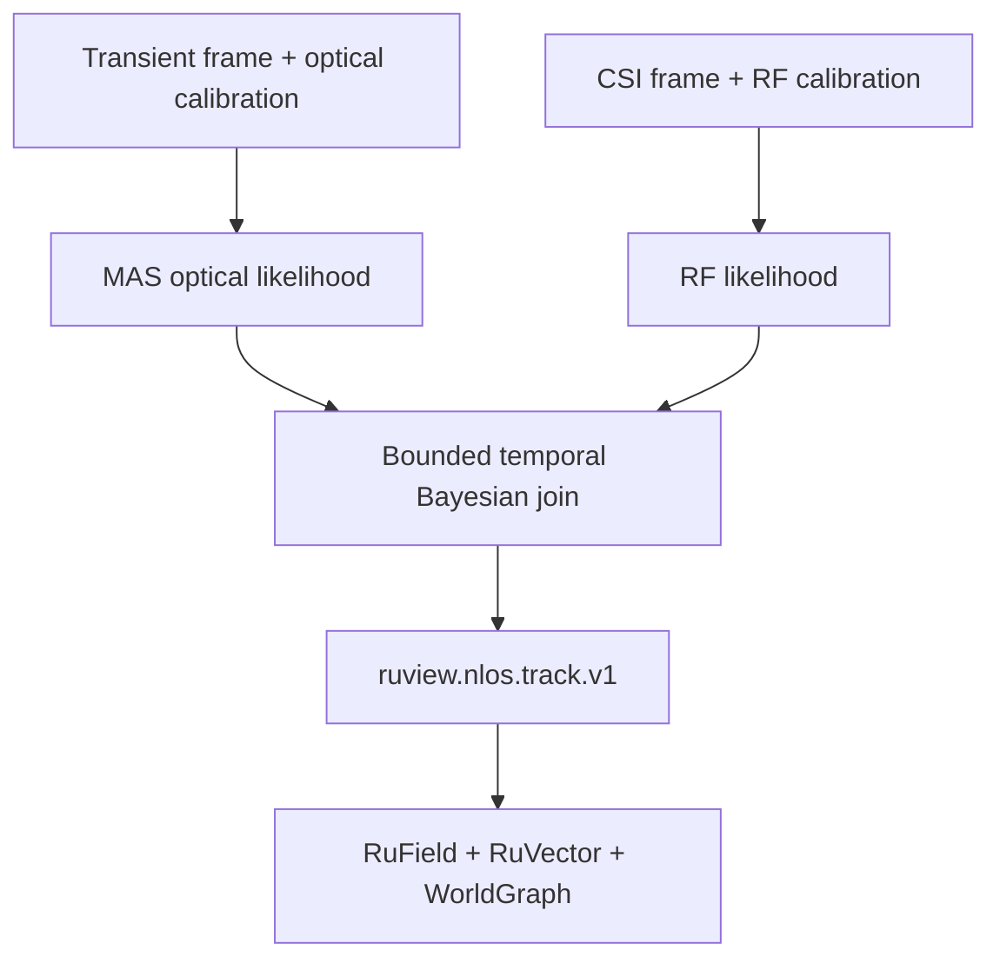

# ADR-329: Motion-induced aperture inference, CSI fusion, and RuView world-state integration

| Field | Decision |
|---|---|
| **Status** | Accepted for staged implementation; software fusion is testable with replay, retained performance claims require the live paired protocol |
| **Date** | 2026-08-22 |
| **Owners** | RuView Labs perception, RuVector, RuField, and WorldGraph maintainers |
| **Scope** | MAS forward model, temporal inference, calibrated RF/optical fusion, persistent identity-free state |
| **Depends on** | ADR-273, ADR-295, ADR-301 through ADR-305, ADR-311, ADR-319, ADR-328 |
| **Related** | ADR-330, ADR-331 |
| **Primary implementation** | `v2/crates/ruview-nlos`, `ruview.nlos.track.v1` |

## Context

The consumer-NLOS model converts weak, time-resolved optical multipath into a
posterior over hidden geometry or motion. Its strength is localized geometry
around a relay surface; its weaknesses include low signal-to-noise ratio,
reflectivity, range, aperture coverage, and temporal assumptions. RuView CSI
offers a different failure profile: RF can persist through walls and clutter,
but current commodity CSI generally provides coarser, environment-dependent
spatial evidence.

These modalities should not be concatenated merely because both are
interesting. Fusion is justified only when an independently evaluated RF
likelihood improves an objective endpoint over optical NLOS alone. It is also
unsafe to let a learned temporal store or graph overwrite current sensing
quality. RuVector, RuField, and WorldGraph must preserve uncertainty, freshness,
calibration, and provenance rather than manufacture confidence.

The [consumer-NLOS paper](https://arxiv.org/html/2605.17865v1) expresses tracking
as a sequential posterior and uses a particle filter to carry uncertainty and a
motion prior. This aligns with RuView's temporal and spatial primitives, but the
physics likelihood remains the authority for the optical observation.

## Decision

### 1. Use a typed latent state and explicit likelihood factors

For each session-scoped hidden target hypothesis, the latent state is

\[
X_t = (p_t, v_t, \Sigma_t, q_t, a_t)
\]

where position \(p_t\), velocity \(v_t\), covariance or particle distribution
\(\Sigma_t\), quality state \(q_t\), and bounded attributes \(a_t\) are expressed
in a versioned world coordinate frame. No identity field is inferred.

The fused filter computes

\[
P(X_t \mid L_{1:t}, R_{1:t}) \propto
P(L_t \mid X_t, C_L)^{w_L}
P(R_t \mid X_t, C_R)^{w_R}
P(X_t \mid X_{t-1}),
\]

where \(L_t\) is the normalized optical transient, \(R_t\) is independently
captured CSI evidence, and \(C_L,C_R\) are modality-specific calibration states.
The exponents are bounded reliability weights derived from current quality,
not user-facing confidence decoration.
Missing, stale, rejected or invalid modalities are omitted before factor
evaluation and contribute the multiplicative identity. They are never evaluated
as a zero likelihood raised to a zero weight (`0^0`).

Conditional independence is an approximation. Correlated errors such as motion,
clock drift, shared ground-truth leakage, and environmental change are measured
and documented. If correlation cannot be bounded, the implementation uses a
conservative mixture, covariance intersection, or gating rule instead of
multiplying overconfident factors.

### 2. Keep the MAS physics path inspectable

The optical likelihood follows the upstream structure:

1. transform the normalized transient into light-cone coordinates;
2. precompute a canonical space-time impulse response for the known target
   shape or reconstruction basis;
3. propagate a bounded particle set using the frozen motion model;
4. render each particle by indexing the canonical response at current relay-wall
   samples and pose;
5. score rendered and observed transients with a normalized, bounded likelihood;
6. normalize, calculate degeneracy diagnostics, and residual-resample; and
7. emit the posterior, entropy/effective-particle count, covariance, and quality.

Optimization may vectorize or cache rendering, but every optimized kernel is
compared against a scalar reference over golden and property-generated inputs.
NaN/Inf, all-zero likelihood, underflow, particle collapse, and out-of-volume
states produce a typed degradation or `unknown` result.

### 3. Calibrate CSI as a likelihood, not a centimetre claim

The initial RF factor is deliberately modest. It may provide:

1. hidden-region presence or absence likelihood;
2. coarse zone occupancy;
3. motion onset/cessation likelihood;
4. a broad position prior with measured covariance; or
5. an empty-volume vote for guarded optical background updates.

RF weights are zero when the CSI sensor identity, room calibration, coordinate
transform, freshness, or out-of-distribution gate is invalid. CSI never sharpens
an optical posterior beyond the calibration evidence that justifies it. A model
trained with LiDAR pseudo-labels is evaluated on a held-out partition with
external ground truth; it may not be scored against its own optical teacher.

### 4. Synchronize before fusion

Both inputs enter a bounded temporal join keyed by tenant, workspace, site,
world-frame ID, and capture session. The join records sensor timestamp, receive
timestamp, clock uncertainty, calibration digest, and maximum pairing skew.

Frames outside the preregistered skew are not interpolated into apparent
coherence. The system may make an optical-only or RF-only observation with the
missing modality named, but it may label output `fused` only when both factors
pass identity, freshness, calibration, and time/space alignment checks.

### 5. Divide responsibilities across RuView primitives

| Component | Responsibility | Explicit non-responsibility |
|---|---|---|
| MAS/particle filter | current optical likelihood and posterior update | long-term identity, authorization, hardware provenance creation |
| CSI adapter/model | current calibrated RF likelihood | optical histogram synthesis, centimetre precision without evidence |
| RuVector | embeddings for trajectory/canonical-response similarity and bounded temporal retrieval | replacing the live Bayesian update or upgrading evidence level |
| RuField | observation confidence, covariance, quality, provenance, calibration, and expiration | presenting unknown/stale data as ground truth |
| WorldGraph | session-scoped hidden-object hypothesis nodes and spatial/temporal relations | identity inference or permanent person graph by default |
| Evidence/witness layer | content digests, acceptance result, lineage and receipts | sensing, fusion, or actuation |

`ruview.nlos.track.v1` is the current shared output contract. It carries
track/session IDs, one source classification, position/velocity, covariance,
freshness/expiry, quality state, modality contribution weights, calibration
hash, evidence level, algorithm revision, and one provenance record. It does
not carry two authenticated modality lineages, a world-frame ID, coordinate
transform digest, or capture-manifest digest. Consequently v1 rejects measured
CSI fusion and `l3_corroborated`; the current CSI path is scope-bound synthetic
L0 regression only. A future v2 contract must add those bindings before F1/F2
measured fusion can be enabled. Consumers reject unknown schema versions and
stale tracks now; coordinate compatibility remains a future contract gate.

### 6. Cross-modal training follows, and cannot contaminate, evaluation

After a frozen rules/physics fusion baseline, LiDAR may supervise an RF model.
Dataset partitions are grouped by capture session, subject/target, room, sensor
configuration, and time block to prevent adjacent-frame and environment
leakage. Optical targets for RF training are probabilistic distributions with
quality masks, not hard ground truth. The test endpoint always uses independent
external ground truth and includes LiDAR-only, CSI-only, and fused arms.

The system retains a non-learned fallback. A learned score or fusion policy must
show stratified improvement and calibration before promotion. Model absence or
error degrades to the last independently validated factor, never direct action.

## Architecture and data flow

Only the join creates a fused track. RuVector and WorldGraph are downstream
state consumers, not a shortcut around missing, stale, or rejected modalities.

## Performance decision

1. The live tracking loop is bounded to the newest accepted frame. Backpressure
   drops obsolete queued work and records loss; it does not accumulate latency.
2. The particle count, canonical volume, search volume, history length, graph
   nodes per session, and temporal-join window are configuration-bounded.
3. The fusion budget is measured independently from optical tracking. Report
   p50/p95 sensor-to-track latency and update rate for LiDAR-only and fused arms.
4. Optimization is retained only when numerical agreement stays within the
   frozen tolerance and the paired research endpoint does not regress.
5. At least 27 accepted LiDAR-only track updates per second is required before
   the fusion endpoint is interpreted. A fast fused path cannot rescue a failed
   reproduction.

## Security and privacy

1. The join accepts only authenticated sensor/session identities and compatible
   tenant/workspace/world-frame bindings. Cross-tenant or cross-session joins
   are impossible by type and policy.
2. Sequence and timestamp replay defenses are per modality. Reusing an old CSI
   frame to make an optical track look persistent is rejected and audited.
3. A malicious modality may inject extreme likelihoods. Inputs and weights are
   bounded, posterior influence is observable, and single-modality ablations are
   recorded for forensic review.
4. Track IDs are random and session-scoped. Raw optical/CSI data is local by
   default; downstream stores receive bounded hypotheses and provenance unless
   an approved research protocol explicitly retains raw data.
5. Long-term memory uses TTL, purpose limitation, deletion, and tenant isolation.
   Similarity is not identity. The graph must not create a biometric profile.
6. No fusion output grants actuation. Governed actions require the independent
   ADR-321/327 policy, approval, freshness, and receipt path.

## Alternatives considered

### Concatenate optical and CSI tensors into one end-to-end network

Deferred. It obscures failure attribution, calibration, and missing-modality
behavior before a trustworthy baseline exists. A learned likelihood may be
added after the factorized paired benchmark.

### Use CSI only as a binary veto

Useful as an initial safety rule, but insufficient as the final design because
it discards calibrated spatial/motion information. The typed factor supports a
binary likelihood without fixing the architecture to it.

### Store only the posterior mean

Rejected. NLOS can be multimodal and ambiguous. Covariance, particles or a
bounded distribution summary, posterior entropy, and quality are essential for
honest downstream behavior.

### Let RuVector replace the particle filter

Rejected. Vector memory can retrieve similar histories or canonical responses,
but similarity alone is not the current physics likelihood and cannot enforce
frame-level calibration/provenance.

### Promote fusion if any pooled metric improves

Rejected. The objective endpoint, pairing, strata, confidence interval, and
non-success metrics are frozen before capture. Synthetic-only and pooled-only
gains do not pass.

## Consequences

### Positive

1. Optical localization evidence and RF persistence can complement one another without
   conflating their measurement physics.
2. Every downstream state retains uncertainty, freshness, modality, and lineage.
3. The factorized baseline makes ablation, failure analysis, and rollback clear.
4. Cross-modal training has a leakage-resistant target and external evaluation.

### Costs and limitations

1. Coordinate/clock calibration and paired ground truth add operational burden.
2. Conditional-independence violations can make naive multiplication
   overconfident; conservative fusion may sacrifice apparent sharpness.
3. Current CSI may not provide enough independent spatial information to meet
   the 25 percent endpoint. A negative result is acceptable and stops rollout.
4. The architecture tracks hypotheses; it does not establish identity, intent,
   photographic reconstruction, or safety certification.

## Rollout and rollback

| Phase | Behavior | Promotion | Rollback |
|---|---|---|---|
| F0 | optical-only reference plus recorded CSI | deterministic replay and calibration tests | disable RF factor |
| F1 | shadow fusion, output not consumed | ADR-328 live LiDAR-only reproduction is `MEASURED` at >=27 Hz in its capture-manifest witness report and paired live capture is complete | discard shadow output |
| F2 | research-visible fused track with explicit evidence | ADR-328 prerequisite remains valid; `MEASURED` >=25% endpoint has adjusted confidence support plus frozen-protocol, independent-CSI, security/privacy, guardrail and witness review | return to optical-only; invalidate certificate |
| F3 | cross-modal learned likelihood in shadow | held-out external-ground-truth gain and calibration | remove model artifact; retain factorized baseline |

Rollback is a configuration/capability-certificate change. Existing optical,
CSI, RuVector, RuField, and WorldGraph services continue independently.

## Objective acceptance mapping

| ID | Requirement | Evidence |
|---|---|---|
| NLOS-329-01 | Reference MAS likelihood is deterministic and bounded | scalar/golden/property tests, all-zero, omitted-factor/`0^0`, and numeric-extreme tests |
| NLOS-329-02 | Fused output requires valid identity, calibration, freshness, clocks, and coordinate frame for both factors | negative temporal/spatial join matrix plus missing/stale-factor omission tests |
| NLOS-329-03 | Missing/rejected modality cannot be mislabeled fused | modality/provenance state tests |
| NLOS-329-04 | RuVector/RuField/WorldGraph preserve uncertainty, TTL, lineage, and session scope | contract and integration tests |
| NLOS-329-05 | Fusion improves a preregistered objective endpoint | F2/ADR-331 gate under one frozen protocol over >=100 paired `LIVE_HARDWARE` sequences: `MEASURED` >=25% mean-position-error **or** lost-track-rate reduction, successful multiplicity-adjusted interval excludes zero, shared endpoint-pairing digest and full position coverage, all frozen guardrails pass, independent CSI plus privacy/security/witness reviews pass |
| NLOS-329-06 | Evaluation is leakage resistant | grouped partitions, frozen protocol, external ground truth, LiDAR/CSI/fused ablation |
| NLOS-329-07 | Optimization preserves correctness and bounded latency | reference equivalence, benchmark deltas, overload/backpressure tests |
| NLOS-329-08 | Fusion cannot actuate directly | policy/API tests proving hypothesis-only output |

## References

1. Somasundaram et al., [Nature article](https://doi.org/10.1038/s41586-026-10502-x).
2. [Motion-induced aperture model and particle-filter methods](https://arxiv.org/html/2605.17865v1).
3. ADR-273: Unified RF spatial world model.
4. ADR-295: Source provenance state machine.
5. ADR-301/302/303/304/305: calibration, OOD, ground truth, evidence, and authenticated sensor identity.
6. ADR-311: Real sensor fusion.
7. ADR-319: Witness chain.
