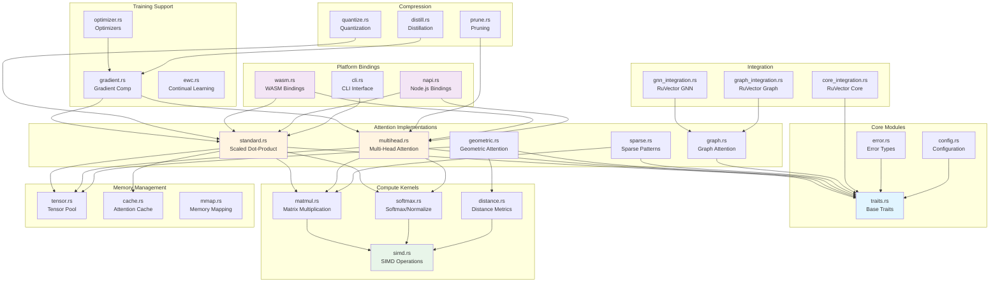
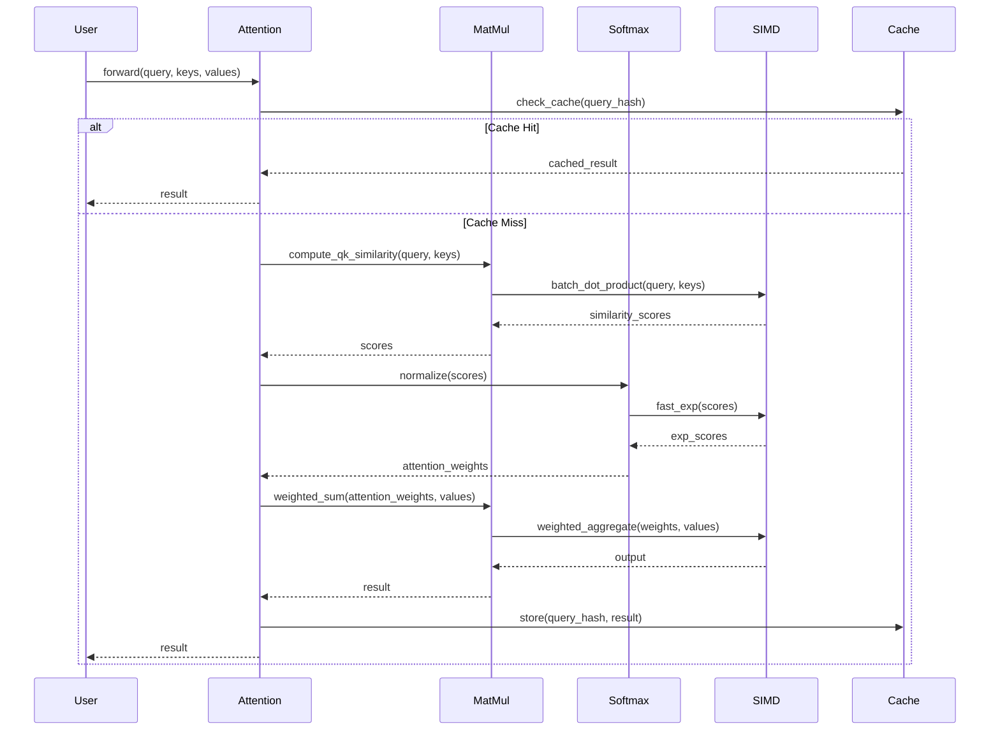
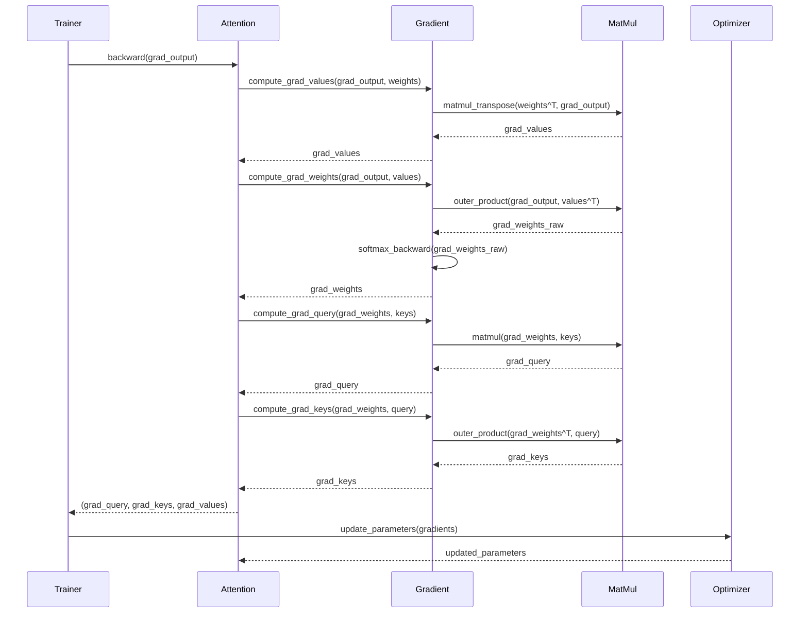
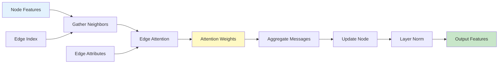
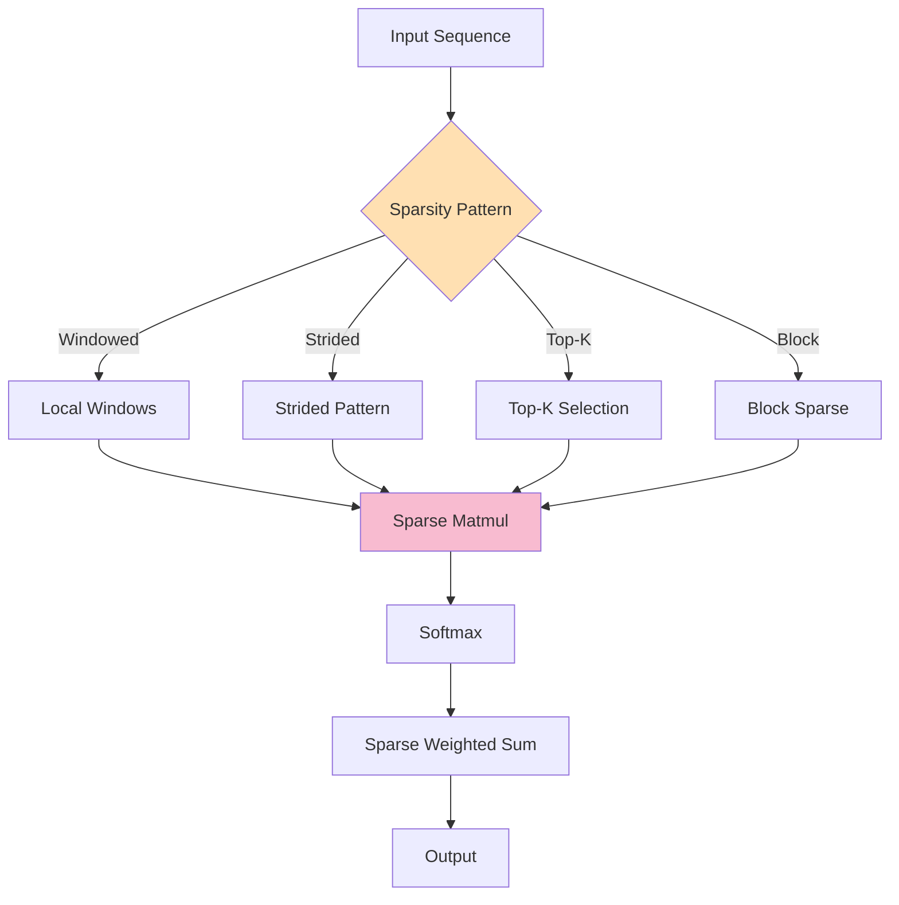

# RuVector Attention Architecture

## Document Information

- **Phase**: Architecture (SPARC Methodology)
- **Date**: 2025-11-30
- **Status**: Draft
- **Version**: 1.0.0

## Executive Summary

This document defines the complete system architecture for `ruvector-attention`, a high-performance attention mechanism library designed to integrate seamlessly with the RuVector ecosystem. The architecture supports multiple attention paradigms (standard, geometric, sparse, graph-aware) with platform-agnostic bindings (Rust, WASM, Node.js) and SIMD-optimized computation.

---

## 1. High-Level Architecture

### 1.1 System Overview

```
┌─────────────────────────────────────────────────────────────────────────┐
│                         ruvector-attention                               │
│                     Unified Attention Framework                          │
├─────────────────────────────────────────────────────────────────────────┤
│                                                                          │
│  ┌──────────────────────────────────────────────────────────────────┐  │
│  │                     Attention Layer                               │  │
│  ├──────────────────────────────────────────────────────────────────┤  │
│  │  ┌─────────────┐  ┌─────────────┐  ┌─────────────┐  ┌────────┐  │  │
│  │  │   Standard  │  │  Geometric  │  │   Sparse    │  │  Graph │  │  │
│  │  │  Attention  │  │  Attention  │  │  Attention  │  │ Attn   │  │  │
│  │  │             │  │             │  │             │  │        │  │  │
│  │  │ • Scaled    │  │ • Hyperbolic│  │ • Windowed  │  │ • GAT  │  │  │
│  │  │ • Dot-Prod  │  │ • Riemannian│  │ • Strided   │  │ • GIN  │  │  │
│  │  │ • Multi-Head│  │ • Manifold  │  │ • Sparse    │  │ • SAGE │  │  │
│  │  │ • Cross     │  │   Distance  │  │   Masks     │  │        │  │  │
│  │  └─────────────┘  └─────────────┘  └─────────────┘  └────────┘  │  │
│  │         │                │                │              │        │  │
│  └─────────┼────────────────┼────────────────┼──────────────┼────────┘  │
│            │                │                │              │           │
│  ┌─────────┴────────────────┴────────────────┴──────────────┴────────┐  │
│  │                   Unified Attention Trait                          │  │
│  │  • forward(query, keys, values) -> output                         │  │
│  │  • forward_batch(queries, keys, values) -> outputs                │  │
│  │  • get_attention_weights() -> weights                             │  │
│  │  • backward(grad_output) -> grad_query, grad_keys, grad_values    │  │
│  └────────────────────────────────────────────────────────────────────┘  │
│                              │                                          │
│  ┌──────────────┬────────────┴────────────┬──────────────┐             │
│  │              │                         │              │             │
│  │  ┌───────────┴────────┐   ┌────────────┴──────────┐  │             │
│  │  │  Compute Kernels   │   │  Memory Management    │  │             │
│  │  ├────────────────────┤   ├───────────────────────┤  │             │
│  │  │ • SIMD Operations  │   │ • Tensor Pool         │  │             │
│  │  │ • Batch MatMul     │   │ • Gradient Cache      │  │             │
│  │  │ • Softmax          │   │ • Attention Cache     │  │             │
│  │  │ • Layer Norm       │   │ • Memory Mapping      │  │             │
│  │  └────────────────────┘   └───────────────────────┘  │             │
│  │                                                       │             │
│  │  ┌────────────────────┐   ┌───────────────────────┐  │             │
│  │  │  Training Support  │   │   Compression         │  │             │
│  │  ├────────────────────┤   ├───────────────────────┤  │             │
│  │  │ • Gradient Comp    │   │ • Quantization        │  │             │
│  │  │ • Backpropagation  │   │ • Pruning             │  │             │
│  │  │ • Optimizer Hooks  │   │ • Knowledge Distill   │  │             │
│  │  │ • EWC Integration  │   │ • Low-Rank Approx     │  │             │
│  │  └────────────────────┘   └───────────────────────┘  │             │
│  └──────────────────────────────────────────────────────┘             │
├─────────────────────────────────────────────────────────────────────────┤
│                          Platform Bindings                               │
├─────────────────────────────────────────────────────────────────────────┤
│  ┌─────────────┐  ┌─────────────┐  ┌─────────────┐  ┌─────────────┐   │
│  │    Rust     │  │    WASM     │  │   NAPI-RS   │  │     CLI     │   │
│  │    SDK      │  │   Bindings  │  │   Bindings  │  │  Interface  │   │
│  ├─────────────┤  ├─────────────┤  ├─────────────┤  ├─────────────┤   │
│  │ • Native    │  │ • Browser   │  │ • Node.js   │  │ • Benchmark │   │
│  │   Types     │  │   Compat    │  │   Async     │  │ • Test      │   │
│  │ • Zero-Copy │  │ • JS Arrays │  │ • Buffer    │  │ • Visualize │   │
│  │ • Traits    │  │ • Workers   │  │   Transfer  │  │ • Export    │   │
│  └─────────────┘  └─────────────┘  └─────────────┘  └─────────────┘   │
└─────────────────────────────────────────────────────────────────────────┘
                                 │
                    ┌────────────┴────────────┐
                    │                         │
         ┌──────────┴─────────┐    ┌──────────┴─────────┐
         │  ruvector-core     │    │  ruvector-gnn      │
         │  • Vector Storage  │    │  • GNN Layers      │
         │  • HNSW Index      │    │  • Training        │
         │  • SIMD Utils      │    │  • Compression     │
         └────────────────────┘    └────────────────────┘
                    │
         ┌──────────┴─────────┐
         │  ruvector-graph    │
         │  • Graph Storage   │
         │  • Traversal       │
         │  • Cypher Query    │
         └────────────────────┘
```

### 1.2 Design Principles

1. **Modularity**: Each attention mechanism is a self-contained module with clear interfaces
2. **Performance**: SIMD-first design with hardware-optimized kernels
3. **Extensibility**: Trait-based architecture allows custom attention implementations
4. **Platform Agnostic**: Core logic separated from platform-specific bindings
5. **Memory Efficiency**: Aggressive caching and memory pooling for minimal allocations
6. **Type Safety**: Leverages Rust's type system for compile-time guarantees
7. **Interoperability**: First-class integration with existing RuVector crates

---

## 2. Core Traits and Interfaces

### 2.1 Base Attention Trait

```rust
/// Base attention mechanism trait that all attention variants implement
pub trait Attention: Send + Sync {
    /// Compute attention output for a single query
    ///
    /// # Arguments
    /// * `query` - Query vector (dimension D)
    /// * `keys` - Key vectors (N vectors of dimension D)
    /// * `values` - Value vectors (N vectors of dimension V)
    ///
    /// # Returns
    /// Output vector of dimension V
    fn forward(&self, query: &[f32], keys: &[Vec<f32>], values: &[Vec<f32>]) -> Vec<f32>;

    /// Batch processing for multiple queries
    ///
    /// # Arguments
    /// * `queries` - Batch of query vectors (B x D)
    /// * `keys` - Key vectors (N x D)
    /// * `values` - Value vectors (N x V)
    ///
    /// # Returns
    /// Batch of output vectors (B x V)
    fn forward_batch(
        &self,
        queries: &[Vec<f32>],
        keys: &[Vec<f32>],
        values: &[Vec<f32>],
    ) -> Vec<Vec<f32>>;

    /// Retrieve last computed attention weights (for visualization/debugging)
    fn get_attention_weights(&self) -> Option<Vec<Vec<f32>>>;

    /// Reset internal state (for stateful attention mechanisms)
    fn reset(&mut self) {}

    /// Get configuration metadata
    fn config(&self) -> AttentionConfig;
}

/// Configuration for attention mechanisms
#[derive(Debug, Clone, Serialize, Deserialize)]
pub struct AttentionConfig {
    pub embed_dim: usize,
    pub num_heads: Option<usize>,
    pub dropout_rate: Option<f32>,
    pub attention_type: AttentionType,
}

#[derive(Debug, Clone, Copy, Serialize, Deserialize)]
pub enum AttentionType {
    Standard,
    MultiHead,
    Geometric,
    Sparse,
    Graph,
}
```

### 2.2 Graph-Aware Attention

```rust
/// Attention mechanism that incorporates graph structure
pub trait GraphAttention: Attention {
    /// Forward pass with edge information
    ///
    /// # Arguments
    /// * `query` - Query vector
    /// * `keys` - Key vectors (nodes)
    /// * `values` - Value vectors (node features)
    /// * `edge_index` - Edge connectivity [(src, dst), ...]
    /// * `edge_attr` - Edge attributes (optional)
    fn forward_with_edges(
        &self,
        query: &[f32],
        keys: &[Vec<f32>],
        values: &[Vec<f32>],
        edge_index: &[(usize, usize)],
        edge_attr: Option<&[Vec<f32>]>,
    ) -> Vec<f32>;

    /// Compute attention only over graph neighborhood
    fn forward_neighborhood(
        &self,
        node_idx: usize,
        node_features: &[Vec<f32>],
        edge_index: &[(usize, usize)],
    ) -> Vec<f32>;

    /// Multi-hop attention aggregation
    fn forward_k_hop(
        &self,
        node_idx: usize,
        node_features: &[Vec<f32>],
        edge_index: &[(usize, usize)],
        k: usize,
    ) -> Vec<f32>;
}
```

### 2.3 Geometric Attention

```rust
/// Attention in non-Euclidean spaces (hyperbolic, spherical, etc.)
pub trait GeometricAttention: Attention {
    type Space: ManifoldSpace;

    /// Forward pass with manifold-aware distance computation
    fn forward_geometric(
        &self,
        query: &[f32],
        keys: &[Vec<f32>],
        values: &[Vec<f32>],
    ) -> Vec<f32>;

    /// Compute attention weights using manifold distance
    fn compute_manifold_weights(
        &self,
        query: &[f32],
        keys: &[Vec<f32>],
    ) -> Vec<f32>;

    /// Project to manifold tangent space
    fn project_tangent(&self, point: &[f32], base: &[f32]) -> Vec<f32>;

    /// Exponential map for manifold operations
    fn exp_map(&self, base: &[f32], tangent: &[f32]) -> Vec<f32>;
}

/// Trait for different manifold spaces
pub trait ManifoldSpace: Send + Sync {
    /// Compute distance between two points on the manifold
    fn distance(&self, x: &[f32], y: &[f32]) -> f32;

    /// Inner product in tangent space
    fn inner_product(&self, base: &[f32], u: &[f32], v: &[f32]) -> f32;

    /// Manifold curvature parameter
    fn curvature(&self) -> f32;
}

/// Hyperbolic space (Poincaré ball model)
pub struct HyperbolicSpace {
    curvature: f32,
}

/// Spherical space
pub struct SphericalSpace {
    radius: f32,
}

/// Product manifold (combination of different spaces)
pub struct ProductSpace {
    components: Vec<Box<dyn ManifoldSpace>>,
}
```

### 2.4 Sparse Attention

```rust
/// Attention with sparse patterns for long sequences
pub trait SparseAttention: Attention {
    /// Forward with explicit sparsity mask
    fn forward_sparse(
        &self,
        query: &[f32],
        keys: &[Vec<f32>],
        values: &[Vec<f32>],
        mask: &SparseMask,
    ) -> Vec<f32>;

    /// Windowed (local) attention
    fn forward_windowed(
        &self,
        queries: &[Vec<f32>],
        keys: &[Vec<f32>],
        values: &[Vec<f32>],
        window_size: usize,
    ) -> Vec<Vec<f32>>;

    /// Strided attention (Longformer-style)
    fn forward_strided(
        &self,
        queries: &[Vec<f32>],
        keys: &[Vec<f32>],
        values: &[Vec<f32>],
        window_size: usize,
        stride: usize,
    ) -> Vec<Vec<f32>>;

    /// Top-k sparse attention
    fn forward_topk(
        &self,
        query: &[f32],
        keys: &[Vec<f32>],
        values: &[Vec<f32>],
        k: usize,
    ) -> Vec<f32>;
}

/// Sparse attention mask representation
#[derive(Debug, Clone)]
pub enum SparseMask {
    /// Dense boolean mask
    Dense(Vec<Vec<bool>>),
    /// Sparse coordinate format [(query_idx, key_idx)]
    COO(Vec<(usize, usize)>),
    /// Block-sparse pattern
    BlockSparse {
        block_size: usize,
        active_blocks: Vec<(usize, usize)>,
    },
    /// Windowed pattern
    Windowed {
        window_size: usize,
        global_tokens: Vec<usize>,
    },
}
```

### 2.5 Trainable Attention

```rust
/// Attention mechanism with gradient computation for training
pub trait TrainableAttention: Attention {
    /// Backward pass for gradient computation
    ///
    /// # Arguments
    /// * `grad_output` - Gradient w.r.t. output
    ///
    /// # Returns
    /// (grad_query, grad_keys, grad_values, grad_params)
    fn backward(
        &mut self,
        grad_output: &[f32],
    ) -> (Vec<f32>, Vec<Vec<f32>>, Vec<Vec<f32>>, Vec<f32>);

    /// Update parameters with optimizer
    fn update_parameters(&mut self, optimizer: &mut dyn Optimizer);

    /// Get trainable parameters
    fn parameters(&self) -> Vec<&[f32]>;

    /// Get mutable trainable parameters
    fn parameters_mut(&mut self) -> Vec<&mut [f32]>;

    /// Number of trainable parameters
    fn num_parameters(&self) -> usize;

    /// Save checkpoint
    fn save_checkpoint(&self, path: &str) -> Result<(), AttentionError>;

    /// Load checkpoint
    fn load_checkpoint(&mut self, path: &str) -> Result<(), AttentionError>;
}
```

---

## 3. Module Dependencies Graph



### 3.1 Dependency Matrix

| Module | Core Dependencies | Optional Dependencies |
|--------|-------------------|----------------------|
| `traits` | `serde`, `ndarray` | - |
| `standard` | `traits`, `matmul`, `softmax` | `cache`, `simd` |
| `multihead` | `traits`, `matmul`, `softmax` | `cache`, `simd` |
| `geometric` | `traits`, `distance` | `simd` |
| `sparse` | `traits`, `matmul` | `cache` |
| `graph` | `traits`, `ruvector-graph` | `ruvector-gnn` |
| `matmul` | `ndarray` | `simd` |
| `simd` | `simsimd` | - |
| `wasm` | `standard`, `wasm-bindgen` | `multihead`, `sparse` |
| `napi` | `standard`, `napi-rs` | `multihead`, `graph` |

---

## 4. Data Flow Architecture

### 4.1 Forward Pass Pipeline



### 4.2 Backward Pass (Training)



### 4.3 Graph Attention Flow



### 4.4 Sparse Attention Flow



---

## 5. Integration with Existing Crates

### 5.1 RuVector Core Integration

```rust
// File: src/integration/core_integration.rs

use ruvector_core::{VectorDatabase, HnswIndex, Distance};
use crate::traits::Attention;

/// Bridge between attention mechanisms and vector database
pub struct AttentionVectorBridge {
    db: VectorDatabase,
    attention: Box<dyn Attention>,
}

impl AttentionVectorBridge {
    /// Attention-based vector search
    pub fn attention_search(
        &self,
        query: &[f32],
        k: usize,
    ) -> Result<Vec<(u64, f32)>, Error> {
        // 1. Get candidate vectors from HNSW
        let candidates = self.db.search(query, k * 10)?;

        // 2. Extract candidate vectors
        let candidate_vecs: Vec<Vec<f32>> = candidates
            .iter()
            .map(|(id, _)| self.db.get(*id).unwrap())
            .collect();

        // 3. Use attention for re-ranking
        let attention_scores = self.attention.forward(
            query,
            &candidate_vecs,
            &candidate_vecs,
        );

        // 4. Return top-k by attention score
        let mut results: Vec<_> = candidates
            .into_iter()
            .zip(attention_scores)
            .collect();
        results.sort_by(|a, b| b.1.partial_cmp(&a.1).unwrap());
        results.truncate(k);

        Ok(results.into_iter().map(|(id_score, attn)| (id_score.0, attn)).collect())
    }

    /// Batch attention search with SIMD
    pub fn batch_attention_search(
        &self,
        queries: &[Vec<f32>],
        k: usize,
    ) -> Result<Vec<Vec<(u64, f32)>>, Error> {
        queries
            .par_iter()
            .map(|q| self.attention_search(q, k))
            .collect()
    }
}

/// Use attention for learned distance metric
pub struct AttentionDistance {
    attention: Box<dyn Attention>,
}

impl Distance for AttentionDistance {
    fn distance(&self, a: &[f32], b: &[f32]) -> f32 {
        // Use attention mechanism as a learned distance
        let score = self.attention.forward(a, &[b.to_vec()], &[b.to_vec()]);

        // Convert to distance (higher attention = lower distance)
        1.0 / (score[0] + 1e-6)
    }
}
```

### 5.2 RuVector GNN Integration

```rust
// File: src/integration/gnn_integration.rs

use ruvector_gnn::{RuvectorLayer, training::Optimizer};
use crate::traits::{GraphAttention, TrainableAttention};

/// GNN layer using custom attention mechanism
pub struct AttentionGNNLayer {
    attention: Box<dyn GraphAttention + TrainableAttention>,
    normalization: LayerNorm,
    feedforward: Linear,
}

impl AttentionGNNLayer {
    /// Forward pass through GNN layer with attention
    pub fn forward(
        &self,
        node_features: &[Vec<f32>],
        edge_index: &[(usize, usize)],
    ) -> Vec<Vec<f32>> {
        let mut outputs = Vec::with_capacity(node_features.len());

        for node_idx in 0..node_features.len() {
            // 1. Gather neighbor features via edges
            let neighbors: Vec<usize> = edge_index
                .iter()
                .filter(|(src, _)| *src == node_idx)
                .map(|(_, dst)| *dst)
                .collect();

            let neighbor_features: Vec<Vec<f32>> = neighbors
                .iter()
                .map(|&idx| node_features[idx].clone())
                .collect();

            if neighbor_features.is_empty() {
                outputs.push(node_features[node_idx].clone());
                continue;
            }

            // 2. Apply graph attention
            let attended = self.attention.forward_neighborhood(
                node_idx,
                node_features,
                edge_index,
            );

            // 3. Layer normalization
            let normalized = self.normalization.forward(&attended);

            // 4. Feedforward network
            let output = self.feedforward.forward(&normalized);

            outputs.push(output);
        }

        outputs
    }

    /// Training step with gradient computation
    pub fn train_step(
        &mut self,
        node_features: &[Vec<f32>],
        edge_index: &[(usize, usize)],
        targets: &[Vec<f32>],
        optimizer: &mut dyn Optimizer,
    ) -> f32 {
        // Forward pass
        let predictions = self.forward(node_features, edge_index);

        // Compute loss (MSE for regression)
        let loss = predictions
            .iter()
            .zip(targets)
            .map(|(pred, target)| {
                pred.iter()
                    .zip(target)
                    .map(|(p, t)| (p - t).powi(2))
                    .sum::<f32>()
            })
            .sum::<f32>()
            / predictions.len() as f32;

        // Backward pass
        let grad_predictions: Vec<Vec<f32>> = predictions
            .iter()
            .zip(targets)
            .map(|(pred, target)| {
                pred.iter()
                    .zip(target)
                    .map(|(p, t)| 2.0 * (p - t) / predictions.len() as f32)
                    .collect()
            })
            .collect();

        // Backpropagate through attention
        for (grad, node_idx) in grad_predictions.iter().zip(0..) {
            self.attention.backward(grad);
        }

        // Update parameters
        self.attention.update_parameters(optimizer);

        loss
    }
}

/// Integration with RuVector GNN's existing training infrastructure
impl From<Box<dyn GraphAttention>> for RuvectorLayer {
    fn from(attention: Box<dyn GraphAttention>) -> Self {
        // Convert attention mechanism to RuvectorLayer format
        // This allows using attention in existing GNN pipelines
        unimplemented!("Adapter implementation")
    }
}
```

### 5.3 RuVector Graph Integration

```rust
// File: src/integration/graph_integration.rs

use ruvector_graph::{Graph, Node, Edge, CypherQuery};
use crate::traits::GraphAttention;

/// Query graph database with attention-based traversal
pub struct AttentionGraphQuery {
    graph: Graph,
    attention: Box<dyn GraphAttention>,
}

impl AttentionGraphQuery {
    /// Execute Cypher query with attention-based node selection
    pub fn execute_with_attention(
        &self,
        query: &CypherQuery,
        start_node: u64,
    ) -> Result<Vec<Node>, Error> {
        // 1. Parse Cypher query to get traversal pattern
        let pattern = query.parse_pattern()?;

        // 2. Start from initial node
        let mut current_nodes = vec![self.graph.get_node(start_node)?];

        // 3. For each step in pattern, use attention to select next nodes
        for step in pattern.steps {
            let mut next_nodes = Vec::new();

            for node in &current_nodes {
                // Get neighbors
                let neighbors = self.graph.get_neighbors(node.id)?;

                if neighbors.is_empty() {
                    continue;
                }

                // Extract neighbor features
                let neighbor_features: Vec<Vec<f32>> = neighbors
                    .iter()
                    .map(|n| n.embedding.clone())
                    .collect();

                // Use attention to score neighbors
                let attention_output = self.attention.forward(
                    &node.embedding,
                    &neighbor_features,
                    &neighbor_features,
                );

                // Select top-k neighbors by attention score
                let k = step.limit.unwrap_or(10);
                let mut scored_neighbors: Vec<_> = neighbors
                    .into_iter()
                    .zip(attention_output)
                    .collect();
                scored_neighbors.sort_by(|a, b| b.1.partial_cmp(&a.1).unwrap());
                scored_neighbors.truncate(k);

                next_nodes.extend(scored_neighbors.into_iter().map(|(n, _)| n));
            }

            current_nodes = next_nodes;
        }

        Ok(current_nodes)
    }

    /// Graph embedding with attention aggregation
    pub fn compute_graph_embedding(
        &self,
        subgraph: &[u64],
    ) -> Result<Vec<f32>, Error> {
        // Aggregate subgraph nodes using attention
        let node_features: Vec<Vec<f32>> = subgraph
            .iter()
            .map(|&id| self.graph.get_node(id)?.embedding.clone())
            .collect::<Result<_, _>>()?;

        // Create synthetic "graph query" as average of nodes
        let query: Vec<f32> = node_features
            .iter()
            .fold(vec![0.0; node_features[0].len()], |mut acc, node| {
                for (a, &n) in acc.iter_mut().zip(node) {
                    *a += n;
                }
                acc
            })
            .into_iter()
            .map(|x| x / node_features.len() as f32)
            .collect();

        // Use attention to create graph-level embedding
        Ok(self.attention.forward(&query, &node_features, &node_features))
    }
}
```

---

## 6. Platform Architecture

### 6.1 Feature Flags

```toml
# Cargo.toml feature configuration

[features]
default = ["std", "simd"]

# Standard library support
std = []

# SIMD optimizations
simd = ["simsimd"]

# Platform-specific features
wasm = ["wasm-bindgen", "js-sys", "web-sys"]
napi = ["napi", "napi-derive"]

# Attention variants
standard = []
multihead = ["standard"]
geometric = ["manifold-math"]
sparse = []
graph = ["ruvector-graph"]

# All attention mechanisms
all-attention = ["standard", "multihead", "geometric", "sparse", "graph"]

# Training support
training = ["gradient", "optimizer"]
gradient = []
optimizer = ["training"]

# Compression
compression = ["quantization", "pruning"]
quantization = []
pruning = []

# Memory management
mmap = ["memmap2"]
cache = ["lru"]

# Full feature set
full = ["all-attention", "training", "compression", "simd", "cache"]
```

### 6.2 WASM Architecture

```rust
// File: src/platform/wasm.rs

use wasm_bindgen::prelude::*;
use js_sys::{Array, Float32Array};
use web_sys::console;

#[wasm_bindgen]
pub struct WasmAttention {
    inner: Box<dyn Attention>,
}

#[wasm_bindgen]
impl WasmAttention {
    /// Create new attention mechanism
    #[wasm_bindgen(constructor)]
    pub fn new(config: JsValue) -> Result<WasmAttention, JsValue> {
        // Parse config from JavaScript
        let config: AttentionConfig = serde_wasm_bindgen::from_value(config)
            .map_err(|e| JsValue::from_str(&format!("Config parse error: {}", e)))?;

        // Create appropriate attention type
        let attention: Box<dyn Attention> = match config.attention_type {
            AttentionType::Standard => Box::new(StandardAttention::new(config)),
            AttentionType::MultiHead => Box::new(MultiHeadAttention::new(config)),
            AttentionType::Sparse => Box::new(SparseAttention::new(config)),
            _ => return Err(JsValue::from_str("Unsupported attention type for WASM")),
        };

        Ok(WasmAttention { inner: attention })
    }

    /// Forward pass with JS arrays
    #[wasm_bindgen]
    pub fn forward(
        &self,
        query: Float32Array,
        keys: Array,
        values: Array,
    ) -> Result<Float32Array, JsValue> {
        // Convert JavaScript arrays to Rust vectors
        let query_vec: Vec<f32> = query.to_vec();

        let keys_vec: Vec<Vec<f32>> = (0..keys.length())
            .map(|i| {
                let arr = Float32Array::from(keys.get(i));
                arr.to_vec()
            })
            .collect();

        let values_vec: Vec<Vec<f32>> = (0..values.length())
            .map(|i| {
                let arr = Float32Array::from(values.get(i));
                arr.to_vec()
            })
            .collect();

        // Perform attention computation
        let result = self.inner.forward(&query_vec, &keys_vec, &values_vec);

        // Convert back to JavaScript
        Ok(Float32Array::from(&result[..]))
    }

    /// Batch processing
    #[wasm_bindgen]
    pub fn forward_batch(
        &self,
        queries: Array,
        keys: Array,
        values: Array,
    ) -> Result<Array, JsValue> {
        let queries_vec: Vec<Vec<f32>> = (0..queries.length())
            .map(|i| Float32Array::from(queries.get(i)).to_vec())
            .collect();

        let keys_vec: Vec<Vec<f32>> = (0..keys.length())
            .map(|i| Float32Array::from(keys.get(i)).to_vec())
            .collect();

        let values_vec: Vec<Vec<f32>> = (0..values.length())
            .map(|i| Float32Array::from(values.get(i)).to_vec())
            .collect();

        let results = self.inner.forward_batch(&queries_vec, &keys_vec, &values_vec);

        let js_results = Array::new();
        for result in results {
            js_results.push(&Float32Array::from(&result[..]));
        }

        Ok(js_results)
    }

    /// Get attention weights for visualization
    #[wasm_bindgen]
    pub fn get_attention_weights(&self) -> Option<Array> {
        self.inner.get_attention_weights().map(|weights| {
            let js_weights = Array::new();
            for row in weights {
                js_weights.push(&Float32Array::from(&row[..]));
            }
            js_weights
        })
    }
}

// Memory management for WASM
#[wasm_bindgen]
pub struct WasmMemoryPool {
    tensors: Vec<Vec<f32>>,
}

#[wasm_bindgen]
impl WasmMemoryPool {
    #[wasm_bindgen(constructor)]
    pub fn new(capacity: usize) -> Self {
        Self {
            tensors: Vec::with_capacity(capacity),
        }
    }

    /// Pre-allocate tensors to avoid runtime allocation
    pub fn preallocate(&mut self, size: usize, count: usize) {
        for _ in 0..count {
            self.tensors.push(vec![0.0; size]);
        }
    }
}
```

**WASM Limitations & Solutions:**

| Limitation | Solution |
|------------|----------|
| No SIMD | Use manual loop unrolling and vectorization |
| No threads | Use Web Workers for parallelism |
| No mmap | Pure in-memory storage only |
| Memory limit | Aggressive pooling and deallocation |
| No HNSW (mmap) | Use in-memory index or disable graph features |

### 6.3 NAPI-RS Architecture

```rust
// File: src/platform/napi.rs

use napi::{
    bindgen_prelude::*,
    JsObject, JsNumber, JsString,
};
use napi_derive::napi;

#[napi]
pub struct NapiAttention {
    inner: Box<dyn Attention>,
    runtime: tokio::runtime::Runtime,
}

#[napi]
impl NapiAttention {
    /// Create new attention mechanism
    #[napi(constructor)]
    pub fn new(config: JsObject) -> Result<Self> {
        let embed_dim: u32 = config.get_named("embedDim")?;
        let num_heads: Option<u32> = config.get_named("numHeads").ok();

        let attention_config = AttentionConfig {
            embed_dim: embed_dim as usize,
            num_heads: num_heads.map(|h| h as usize),
            dropout_rate: config.get_named("dropoutRate").ok(),
            attention_type: AttentionType::Standard, // TODO: parse from config
        };

        let attention = Box::new(StandardAttention::new(attention_config));

        let runtime = tokio::runtime::Runtime::new()
            .map_err(|e| Error::from_reason(format!("Runtime init failed: {}", e)))?;

        Ok(Self { inner: attention, runtime })
    }

    /// Synchronous forward pass
    #[napi]
    pub fn forward(
        &self,
        query: Float32Array,
        keys: Vec<Float32Array>,
        values: Vec<Float32Array>,
    ) -> Result<Float32Array> {
        let query_vec = query.to_vec();
        let keys_vec: Vec<Vec<f32>> = keys.iter().map(|k| k.to_vec()).collect();
        let values_vec: Vec<Vec<f32>> = values.iter().map(|v| v.to_vec()).collect();

        let result = self.inner.forward(&query_vec, &keys_vec, &values_vec);

        Ok(Float32Array::new(result))
    }

    /// Async batch processing (non-blocking)
    #[napi]
    pub async fn forward_batch_async(
        &self,
        queries: Vec<Float32Array>,
        keys: Vec<Float32Array>,
        values: Vec<Float32Array>,
    ) -> Result<Vec<Float32Array>> {
        // Convert to Rust types
        let queries_vec: Vec<Vec<f32>> = queries.iter().map(|q| q.to_vec()).collect();
        let keys_vec: Vec<Vec<f32>> = keys.iter().map(|k| k.to_vec()).collect();
        let values_vec: Vec<Vec<f32>> = values.iter().map(|v| v.to_vec()).collect();

        // Spawn blocking task for CPU-intensive work
        let inner = self.inner.clone(); // Need to make Attention cloneable or use Arc
        let result = tokio::task::spawn_blocking(move || {
            inner.forward_batch(&queries_vec, &keys_vec, &values_vec)
        })
        .await
        .map_err(|e| Error::from_reason(format!("Task failed: {}", e)))?;

        // Convert back to JS
        Ok(result.into_iter().map(Float32Array::new).collect())
    }

    /// Stream processing with Node.js streams
    #[napi]
    pub fn create_stream(&self, env: Env) -> Result<JsObject> {
        // Create a Transform stream that processes attention in chunks
        let stream = env.create_object()?;
        // Implementation would integrate with Node.js stream API
        Ok(stream)
    }
}

/// Buffer operations for zero-copy transfers
#[napi]
pub struct AttentionBuffer {
    data: Vec<f32>,
}

#[napi]
impl AttentionBuffer {
    /// Create buffer from Node.js Buffer (zero-copy if possible)
    #[napi(factory)]
    pub fn from_buffer(buffer: Buffer) -> Result<Self> {
        // Try to avoid copy by using buffer directly
        let data = buffer.as_ref().to_vec(); // TODO: true zero-copy
        Ok(Self { data })
    }

    /// Export as Node.js Buffer
    #[napi]
    pub fn to_buffer(&self, env: Env) -> Result<Buffer> {
        env.create_buffer_with_data(self.data.clone()) // TODO: avoid clone
    }
}
```

**NAPI-RS Advantages:**

1. **Async/Await**: Non-blocking operations for Node.js event loop
2. **Buffer Sharing**: Near zero-copy data transfer
3. **TypeScript Definitions**: Auto-generated .d.ts files
4. **Worker Threads**: Offload CPU-intensive work
5. **Stream API**: Integration with Node.js streams

### 6.4 CLI Architecture

```rust
// File: src/platform/cli.rs

use clap::{Parser, Subcommand};
use std::path::PathBuf;

#[derive(Parser)]
#[command(name = "ruvector-attention")]
#[command(about = "Attention mechanisms for RuVector", long_about = None)]
struct Cli {
    #[command(subcommand)]
    command: Commands,
}

#[derive(Subcommand)]
enum Commands {
    /// Run attention benchmark
    Bench {
        /// Input dimension
        #[arg(short, long, default_value_t = 128)]
        dim: usize,

        /// Number of keys/values
        #[arg(short, long, default_value_t = 1000)]
        num_keys: usize,

        /// Attention type (standard, multihead, geometric, sparse)
        #[arg(short, long, default_value = "standard")]
        attention_type: String,

        /// Number of iterations
        #[arg(short, long, default_value_t = 100)]
        iterations: usize,
    },

    /// Test attention correctness
    Test {
        /// Test suite (all, standard, multihead, geometric, sparse, graph)
        #[arg(short, long, default_value = "all")]
        suite: String,

        /// Verbose output
        #[arg(short, long)]
        verbose: bool,
    },

    /// Visualize attention weights
    Visualize {
        /// Input file (queries, keys, values)
        #[arg(short, long)]
        input: PathBuf,

        /// Output file (attention matrix visualization)
        #[arg(short, long)]
        output: PathBuf,

        /// Attention type
        #[arg(short, long, default_value = "standard")]
        attention_type: String,
    },

    /// Export attention model
    Export {
        /// Model checkpoint path
        #[arg(short, long)]
        checkpoint: PathBuf,

        /// Export format (onnx, rust, json)
        #[arg(short, long, default_value = "onnx")]
        format: String,

        /// Output path
        #[arg(short, long)]
        output: PathBuf,
    },
}

pub fn run_cli() -> Result<(), Box<dyn std::error::Error>> {
    let cli = Cli::parse();

    match cli.command {
        Commands::Bench { dim, num_keys, attention_type, iterations } => {
            run_benchmark(dim, num_keys, &attention_type, iterations)?;
        }
        Commands::Test { suite, verbose } => {
            run_tests(&suite, verbose)?;
        }
        Commands::Visualize { input, output, attention_type } => {
            visualize_attention(&input, &output, &attention_type)?;
        }
        Commands::Export { checkpoint, format, output } => {
            export_model(&checkpoint, &format, &output)?;
        }
    }

    Ok(())
}

fn run_benchmark(
    dim: usize,
    num_keys: usize,
    attention_type: &str,
    iterations: usize,
) -> Result<(), Box<dyn std::error::Error>> {
    use std::time::Instant;

    // Create attention mechanism
    let attention = create_attention(attention_type, dim)?;

    // Generate random data
    let query = vec![0.5; dim];
    let keys: Vec<Vec<f32>> = (0..num_keys).map(|_| vec![0.5; dim]).collect();
    let values: Vec<Vec<f32>> = (0..num_keys).map(|_| vec![0.5; dim]).collect();

    // Warmup
    for _ in 0..10 {
        attention.forward(&query, &keys, &values);
    }

    // Benchmark
    let start = Instant::now();
    for _ in 0..iterations {
        attention.forward(&query, &keys, &values);
    }
    let duration = start.elapsed();

    let avg_ms = duration.as_secs_f64() * 1000.0 / iterations as f64;
    let throughput = iterations as f64 / duration.as_secs_f64();

    println!("=== Attention Benchmark ===");
    println!("Type: {}", attention_type);
    println!("Dimension: {}", dim);
    println!("Keys/Values: {}", num_keys);
    println!("Iterations: {}", iterations);
    println!("Average: {:.3} ms", avg_ms);
    println!("Throughput: {:.1} ops/sec", throughput);

    Ok(())
}
```

---

## 7. Performance Architecture

### 7.1 SIMD Optimization Strategy

```rust
// File: src/kernels/simd.rs

#[cfg(target_arch = "x86_64")]
use std::arch::x86_64::*;

/// SIMD-optimized dot product
#[inline]
pub fn simd_dot_product(a: &[f32], b: &[f32]) -> f32 {
    assert_eq!(a.len(), b.len());

    #[cfg(target_feature = "avx2")]
    unsafe {
        simd_dot_product_avx2(a, b)
    }

    #[cfg(all(target_feature = "sse2", not(target_feature = "avx2")))]
    unsafe {
        simd_dot_product_sse2(a, b)
    }

    #[cfg(not(any(target_feature = "avx2", target_feature = "sse2")))]
    {
        scalar_dot_product(a, b)
    }
}

#[cfg(target_feature = "avx2")]
#[target_feature(enable = "avx2")]
unsafe fn simd_dot_product_avx2(a: &[f32], b: &[f32]) -> f32 {
    let len = a.len();
    let mut sum = _mm256_setzero_ps();

    let chunks = len / 8;
    for i in 0..chunks {
        let offset = i * 8;
        let va = _mm256_loadu_ps(a.as_ptr().add(offset));
        let vb = _mm256_loadu_ps(b.as_ptr().add(offset));
        let prod = _mm256_mul_ps(va, vb);
        sum = _mm256_add_ps(sum, prod);
    }

    // Horizontal sum
    let mut result = [0f32; 8];
    _mm256_storeu_ps(result.as_mut_ptr(), sum);
    let mut total = result.iter().sum::<f32>();

    // Handle remainder
    for i in (chunks * 8)..len {
        total += a[i] * b[i];
    }

    total
}

/// SIMD-optimized batch matrix multiplication
pub fn simd_batch_matmul(
    a: &[Vec<f32>],  // [batch, m, k]
    b: &[Vec<f32>],  // [k, n]
) -> Vec<Vec<f32>> {
    use rayon::prelude::*;

    a.par_iter()
        .map(|row| {
            b.iter()
                .map(|col| simd_dot_product(row, col))
                .collect()
        })
        .collect()
}

/// SIMD-optimized softmax
pub fn simd_softmax(x: &mut [f32]) {
    // Find max for numerical stability
    let max_val = x.iter().cloned().fold(f32::NEG_INFINITY, f32::max);

    // Exp(x - max)
    for val in x.iter_mut() {
        *val = (*val - max_val).exp();
    }

    // Normalize
    let sum: f32 = x.iter().sum();
    for val in x.iter_mut() {
        *val /= sum;
    }
}

/// SIMD-optimized layer normalization
pub fn simd_layer_norm(x: &mut [f32], eps: f32) {
    let n = x.len() as f32;

    // Compute mean
    let mean = x.iter().sum::<f32>() / n;

    // Compute variance
    let variance = x.iter().map(|v| (v - mean).powi(2)).sum::<f32>() / n;
    let std_dev = (variance + eps).sqrt();

    // Normalize
    for val in x.iter_mut() {
        *val = (*val - mean) / std_dev;
    }
}
```

### 7.2 Cache Optimization

```rust
// File: src/cache.rs

use lru::LruCache;
use std::hash::{Hash, Hasher};
use std::collections::hash_map::DefaultHasher;

/// Hash query for cache lookup
fn hash_query(query: &[f32]) -> u64 {
    let mut hasher = DefaultHasher::new();

    // Quantize to 2 decimal places for fuzzy matching
    for &val in query {
        let quantized = (val * 100.0).round() as i32;
        quantized.hash(&mut hasher);
    }

    hasher.finish()
}

pub struct AttentionCache {
    cache: LruCache<u64, Vec<f32>>,
    hits: usize,
    misses: usize,
}

impl AttentionCache {
    pub fn new(capacity: usize) -> Self {
        Self {
            cache: LruCache::new(capacity.try_into().unwrap()),
            hits: 0,
            misses: 0,
        }
    }

    pub fn get(&mut self, query: &[f32]) -> Option<&Vec<f32>> {
        let hash = hash_query(query);

        match self.cache.get(&hash) {
            Some(result) => {
                self.hits += 1;
                Some(result)
            }
            None => {
                self.misses += 1;
                None
            }
        }
    }

    pub fn put(&mut self, query: &[f32], result: Vec<f32>) {
        let hash = hash_query(query);
        self.cache.put(hash, result);
    }

    pub fn hit_rate(&self) -> f64 {
        if self.hits + self.misses == 0 {
            return 0.0;
        }
        self.hits as f64 / (self.hits + self.misses) as f64
    }
}
```

### 7.3 Memory Pooling

```rust
// File: src/memory/pool.rs

use parking_lot::Mutex;
use std::sync::Arc;

pub struct TensorPool {
    pools: Vec<Arc<Mutex<Vec<Vec<f32>>>>>,
}

impl TensorPool {
    pub fn new() -> Self {
        // Create pools for common sizes
        let sizes = vec![128, 256, 512, 768, 1024, 2048];
        let pools = sizes
            .into_iter()
            .map(|size| {
                let pool: Vec<Vec<f32>> = (0..16)
                    .map(|_| vec![0.0; size])
                    .collect();
                Arc::new(Mutex::new(pool))
            })
            .collect();

        Self { pools }
    }

    pub fn acquire(&self, size: usize) -> Option<Vec<f32>> {
        // Find appropriate pool
        let pool_idx = self.pools.iter().position(|p| {
            // Check if pool matches size
            let guard = p.lock();
            guard.first().map_or(false, |v| v.len() >= size)
        })?;

        self.pools[pool_idx].lock().pop()
    }

    pub fn release(&self, mut tensor: Vec<f32>) {
        let size = tensor.len();

        // Find appropriate pool
        if let Some(pool) = self.pools.iter().find(|p| {
            let guard = p.lock();
            guard.first().map_or(false, |v| v.len() == size)
        }) {
            // Clear tensor
            tensor.fill(0.0);

            // Return to pool
            pool.lock().push(tensor);
        }
    }
}
```

### 7.4 Parallel Execution

```rust
// File: src/parallel.rs

use rayon::prelude::*;

/// Parallel batch attention with work stealing
pub fn parallel_batch_attention<A: Attention + Sync>(
    attention: &A,
    queries: &[Vec<f32>],
    keys: &[Vec<f32>],
    values: &[Vec<f32>],
) -> Vec<Vec<f32>> {
    queries
        .par_iter()
        .map(|query| attention.forward(query, keys, values))
        .collect()
}

/// Parallel multi-head attention computation
pub fn parallel_multihead_forward(
    queries: &[Vec<f32>],
    keys: &[Vec<f32>],
    values: &[Vec<f32>],
    num_heads: usize,
) -> Vec<Vec<f32>> {
    // Split into heads and process in parallel
    (0..num_heads)
        .into_par_iter()
        .flat_map(|head| {
            let head_dim = queries[0].len() / num_heads;
            let start = head * head_dim;
            let end = start + head_dim;

            queries.iter().map(move |q| {
                // Extract head-specific portion
                q[start..end].to_vec()
            })
        })
        .collect()
}
```

### 7.5 Performance Targets

| Operation | Target | SIMD Speedup | Cache Hit Rate |
|-----------|--------|--------------|----------------|
| Dot Product (128-dim) | < 10 μs | 4-8x | N/A |
| Attention (1K keys) | < 500 μs | 2-4x | 60-80% |
| Multi-head (8 heads) | < 2 ms | 3-6x | 50-70% |
| Batch (32 queries) | < 50 ms | 8-16x | 40-60% |
| Graph attention (1K nodes) | < 5 ms | 2-4x | 30-50% |

---

## 8. Security Architecture

### 8.1 Input Validation

```rust
// File: src/validation.rs

/// Validate input tensors for attention computation
pub fn validate_attention_inputs(
    query: &[f32],
    keys: &[Vec<f32>],
    values: &[Vec<f32>],
) -> Result<(), AttentionError> {
    // Check dimensions
    if query.is_empty() {
        return Err(AttentionError::InvalidInput("Query is empty".into()));
    }

    if keys.is_empty() {
        return Err(AttentionError::InvalidInput("Keys are empty".into()));
    }

    if values.is_empty() {
        return Err(AttentionError::InvalidInput("Values are empty".into()));
    }

    if keys.len() != values.len() {
        return Err(AttentionError::DimensionMismatch {
            expected: keys.len(),
            actual: values.len(),
        });
    }

    // Check key dimensions match query
    let query_dim = query.len();
    for (i, key) in keys.iter().enumerate() {
        if key.len() != query_dim {
            return Err(AttentionError::DimensionMismatch {
                expected: query_dim,
                actual: key.len(),
            });
        }
    }

    // Check for NaN/Inf
    for &val in query {
        if !val.is_finite() {
            return Err(AttentionError::InvalidInput("Query contains NaN/Inf".into()));
        }
    }

    // Limit maximum sequence length to prevent DoS
    const MAX_SEQUENCE_LENGTH: usize = 100_000;
    if keys.len() > MAX_SEQUENCE_LENGTH {
        return Err(AttentionError::InputTooLarge {
            max: MAX_SEQUENCE_LENGTH,
            actual: keys.len(),
        });
    }

    Ok(())
}
```

### 8.2 Memory Safety

```rust
// File: src/safety.rs

/// Safe tensor operations with bounds checking
pub struct SafeTensor {
    data: Vec<f32>,
    shape: Vec<usize>,
}

impl SafeTensor {
    pub fn new(data: Vec<f32>, shape: Vec<usize>) -> Result<Self, AttentionError> {
        let expected_size: usize = shape.iter().product();
        if data.len() != expected_size {
            return Err(AttentionError::DimensionMismatch {
                expected: expected_size,
                actual: data.len(),
            });
        }

        Ok(Self { data, shape })
    }

    pub fn get(&self, indices: &[usize]) -> Result<f32, AttentionError> {
        if indices.len() != self.shape.len() {
            return Err(AttentionError::InvalidIndex);
        }

        let flat_index = self.compute_flat_index(indices)?;

        self.data.get(flat_index)
            .copied()
            .ok_or(AttentionError::IndexOutOfBounds)
    }

    fn compute_flat_index(&self, indices: &[usize]) -> Result<usize, AttentionError> {
        let mut flat = 0;
        let mut stride = 1;

        for (i, &idx) in indices.iter().enumerate().rev() {
            if idx >= self.shape[i] {
                return Err(AttentionError::IndexOutOfBounds);
            }
            flat += idx * stride;
            stride *= self.shape[i];
        }

        Ok(flat)
    }
}
```

### 8.3 Numerical Stability

```rust
// File: src/numerical.rs

/// Numerically stable softmax computation
pub fn stable_softmax(x: &[f32]) -> Vec<f32> {
    // Find max for numerical stability
    let max_val = x.iter()
        .cloned()
        .fold(f32::NEG_INFINITY, f32::max);

    // Compute exp(x - max)
    let exp_vals: Vec<f32> = x.iter()
        .map(|&val| (val - max_val).exp())
        .collect();

    // Normalize
    let sum: f32 = exp_vals.iter().sum();

    if sum == 0.0 || !sum.is_finite() {
        // Fallback to uniform distribution
        vec![1.0 / x.len() as f32; x.len()]
    } else {
        exp_vals.iter().map(|&val| val / sum).collect()
    }
}

/// Safe division with epsilon for numerical stability
pub fn safe_div(a: f32, b: f32, eps: f32) -> f32 {
    a / (b + eps)
}

/// Clamp values to prevent overflow
pub fn clamp_finite(x: f32, min: f32, max: f32) -> f32 {
    if !x.is_finite() {
        return 0.0;
    }
    x.clamp(min, max)
}
```

---

## 9. Deployment Architecture

### 9.1 Crate Structure

```
crates/ruvector-attention/
├── Cargo.toml
├── README.md
├── LICENSE
├── benches/
│   ├── attention_bench.rs
│   ├── simd_bench.rs
│   └── comparison_bench.rs
├── examples/
│   ├── basic_attention.rs
│   ├── graph_attention.rs
│   ├── geometric_attention.rs
│   └── training_example.rs
├── src/
│   ├── lib.rs
│   ├── config.rs
│   ├── error.rs
│   │
│   ├── traits/
│   │   ├── mod.rs
│   │   ├── attention.rs
│   │   ├── graph_attention.rs
│   │   ├── geometric_attention.rs
│   │   └── sparse_attention.rs
│   │
│   ├── attention/
│   │   ├── mod.rs
│   │   ├── standard.rs
│   │   ├── multihead.rs
│   │   ├── geometric.rs
│   │   ├── sparse.rs
│   │   └── graph.rs
│   │
│   ├── kernels/
│   │   ├── mod.rs
│   │   ├── matmul.rs
│   │   ├── softmax.rs
│   │   ├── simd.rs
│   │   └── distance.rs
│   │
│   ├── memory/
│   │   ├── mod.rs
│   │   ├── tensor.rs
│   │   ├── cache.rs
│   │   └── pool.rs
│   │
│   ├── training/
│   │   ├── mod.rs
│   │   ├── gradient.rs
│   │   ├── optimizer.rs
│   │   └── ewc.rs
│   │
│   ├── compression/
│   │   ├── mod.rs
│   │   ├── quantize.rs
│   │   ├── prune.rs
│   │   └── distill.rs
│   │
│   ├── integration/
│   │   ├── mod.rs
│   │   ├── core_integration.rs
│   │   ├── gnn_integration.rs
│   │   └── graph_integration.rs
│   │
│   ├── platform/
│   │   ├── mod.rs
│   │   ├── wasm.rs
│   │   ├── napi.rs
│   │   └── cli.rs
│   │
│   ├── manifold/
│   │   ├── mod.rs
│   │   ├── hyperbolic.rs
│   │   ├── spherical.rs
│   │   └── product.rs
│   │
│   └── utils/
│       ├── mod.rs
│       ├── validation.rs
│       ├── safety.rs
│       └── numerical.rs
│
└── tests/
    ├── integration_tests.rs
    ├── attention_tests.rs
    ├── geometric_tests.rs
    └── correctness_tests.rs
```

### 9.2 Build Configuration

```toml
# Cargo.toml

[package]
name = "ruvector-attention"
version = "0.1.0"
edition = "2021"
rust-version = "1.77"
license = "MIT"
authors = ["Ruvector Team"]
repository = "https://github.com/ruvnet/ruvector"
description = "High-performance attention mechanisms for RuVector"

[dependencies]
# RuVector dependencies
ruvector-core = { version = "0.1", path = "../ruvector-core", optional = true }
ruvector-gnn = { version = "0.1", path = "../ruvector-gnn", optional = true }
ruvector-graph = { version = "0.1", path = "../ruvector-graph", optional = true }

# Math and numerics
ndarray = { workspace = true }
rand = { workspace = true }
rand_distr = { workspace = true }

# Performance
simsimd = { workspace = true, optional = true }
rayon = { workspace = true }
parking_lot = { workspace = true }

# Serialization
serde = { workspace = true }
serde_json = { workspace = true }

# Error handling
thiserror = { workspace = true }
anyhow = { workspace = true }

# Caching
lru = { version = "0.12", optional = true }

# Memory mapping
memmap2 = { workspace = true, optional = true }

# Platform-specific
napi = { workspace = true, optional = true }
napi-derive = { workspace = true, optional = true }
wasm-bindgen = { workspace = true, optional = true }
js-sys = { workspace = true, optional = true }
web-sys = { workspace = true, optional = true }

# CLI
clap = { workspace = true, optional = true }

[dev-dependencies]
criterion = { workspace = true }
proptest = { workspace = true }
tempfile = "3.10"

[features]
default = ["std", "simd"]
std = []
simd = ["simsimd"]

# Attention types
standard = []
multihead = ["standard"]
geometric = []
sparse = []
graph = ["ruvector-graph"]
all-attention = ["standard", "multihead", "geometric", "sparse", "graph"]

# Integration
core-integration = ["ruvector-core"]
gnn-integration = ["ruvector-gnn", "graph"]
graph-integration = ["ruvector-graph"]

# Training
training = []

# Compression
compression = []

# Memory
cache = ["lru"]
mmap = ["memmap2"]

# Platforms
wasm = ["wasm-bindgen", "js-sys", "web-sys"]
napi = ["dep:napi", "dep:napi-derive"]
cli = ["clap"]

# Full feature set
full = [
    "all-attention",
    "core-integration",
    "gnn-integration",
    "graph-integration",
    "training",
    "compression",
    "cache",
    "simd",
]

[[bench]]
name = "attention_bench"
harness = false

[lib]
crate-type = ["rlib"]
bench = false
```

---

## 10. Testing Architecture

### 10.1 Test Strategy

```rust
// File: tests/attention_tests.rs

#[cfg(test)]
mod tests {
    use super::*;
    use proptest::prelude::*;

    /// Unit test: basic attention forward pass
    #[test]
    fn test_standard_attention_forward() {
        let config = AttentionConfig {
            embed_dim: 128,
            num_heads: None,
            dropout_rate: None,
            attention_type: AttentionType::Standard,
        };

        let attention = StandardAttention::new(config);

        let query = vec![0.5; 128];
        let keys = vec![vec![0.3; 128]; 10];
        let values = vec![vec![0.7; 128]; 10];

        let result = attention.forward(&query, &keys, &values);

        assert_eq!(result.len(), 128);
        assert!(result.iter().all(|&x| x.is_finite()));
    }

    /// Property test: attention output dimension
    proptest! {
        #[test]
        fn test_attention_output_dimension(
            query_dim in 16usize..512,
            value_dim in 16usize..512,
            num_keys in 1usize..100,
        ) {
            let query = vec![0.5; query_dim];
            let keys = vec![vec![0.3; query_dim]; num_keys];
            let values = vec![vec![0.7; value_dim]; num_keys];

            let attention = create_standard_attention(query_dim);
            let result = attention.forward(&query, &keys, &values);

            prop_assert_eq!(result.len(), value_dim);
        }
    }

    /// Property test: attention weights sum to 1
    proptest! {
        #[test]
        fn test_attention_weights_normalize(
            query_dim in 16usize..128,
            num_keys in 1usize..50,
        ) {
            let query = vec![0.5; query_dim];
            let keys = vec![vec![0.3; query_dim]; num_keys];
            let values = vec![vec![0.7; query_dim]; num_keys];

            let attention = create_standard_attention(query_dim);
            attention.forward(&query, &keys, &values);

            if let Some(weights) = attention.get_attention_weights() {
                for row in weights {
                    let sum: f32 = row.iter().sum();
                    prop_assert!((sum - 1.0).abs() < 1e-5);
                }
            }
        }
    }

    /// Integration test: graph attention with edge index
    #[test]
    fn test_graph_attention_with_edges() {
        let node_features = vec![
            vec![0.1; 64],
            vec![0.2; 64],
            vec![0.3; 64],
        ];

        let edge_index = vec![
            (0, 1),
            (1, 2),
            (2, 0),
        ];

        let attention = create_graph_attention(64);

        let result = attention.forward_with_edges(
            &node_features[0],
            &node_features,
            &node_features,
            &edge_index,
            None,
        );

        assert_eq!(result.len(), 64);
        assert!(result.iter().all(|&x| x.is_finite()));
    }

    /// Benchmark comparison test
    #[test]
    fn test_simd_vs_scalar_performance() {
        use std::time::Instant;

        let size = 1000;
        let a = vec![0.5; size];
        let b = vec![0.3; size];

        // Scalar version
        let start = Instant::now();
        let scalar_result = scalar_dot_product(&a, &b);
        let scalar_time = start.elapsed();

        // SIMD version
        let start = Instant::now();
        let simd_result = simd_dot_product(&a, &b);
        let simd_time = start.elapsed();

        // Results should be approximately equal
        assert!((scalar_result - simd_result).abs() < 1e-3);

        // SIMD should be faster (relaxed for CI)
        println!("Scalar: {:?}, SIMD: {:?}", scalar_time, simd_time);
    }
}
```

### 10.2 Correctness Tests

```rust
/// Test numerical stability with extreme values
#[test]
fn test_numerical_stability() {
    let query = vec![f32::MAX / 2.0; 64];
    let keys = vec![vec![f32::MAX / 2.0; 64]; 10];
    let values = vec![vec![0.5; 64]; 10];

    let attention = create_standard_attention(64);
    let result = attention.forward(&query, &keys, &values);

    // Should not produce NaN or Inf
    assert!(result.iter().all(|&x| x.is_finite()));
}

/// Test gradient computation correctness
#[test]
fn test_gradient_computation() {
    let mut attention = create_trainable_attention(64);

    let query = vec![0.5; 64];
    let keys = vec![vec![0.3; 64]; 10];
    let values = vec![vec![0.7; 64]; 10];

    // Forward pass
    let output = attention.forward(&query, &keys, &values);

    // Backward pass
    let grad_output = vec![1.0; 64];
    let (grad_query, grad_keys, grad_values, _) = attention.backward(&grad_output);

    // Gradients should be finite
    assert!(grad_query.iter().all(|&x| x.is_finite()));
    assert!(grad_keys.iter().all(|row| row.iter().all(|&x| x.is_finite())));
    assert!(grad_values.iter().all(|row| row.iter().all(|&x| x.is_finite())));

    // Numerical gradient check (finite differences)
    let eps = 1e-4;
    // ... implementation
}
```

---

## 11. Documentation Architecture

### 11.1 API Documentation

```rust
//! # RuVector Attention
//!
//! High-performance attention mechanisms for the RuVector ecosystem.
//!
//! ## Features
//!
//! - **Multiple Attention Types**: Standard, multi-head, geometric, sparse, graph
//! - **SIMD Optimization**: Hardware-accelerated computation
//! - **Platform Agnostic**: Rust, WASM, Node.js bindings
//! - **Training Support**: Gradient computation and optimization
//! - **Memory Efficient**: Caching and pooling
//!
//! ## Quick Start
//!
//! ```rust
//! use ruvector_attention::{StandardAttention, AttentionConfig, Attention};
//!
//! let config = AttentionConfig {
//!     embed_dim: 128,
//!     num_heads: None,
//!     dropout_rate: None,
//!     attention_type: AttentionType::Standard,
//! };
//!
//! let attention = StandardAttention::new(config);
//!
//! let query = vec![0.5; 128];
//! let keys = vec![vec![0.3; 128]; 10];
//! let values = vec![vec![0.7; 128]; 10];
//!
//! let output = attention.forward(&query, &keys, &values);
//! ```
//!
//! ## Architecture
//!
//! See [architecture documentation](../docs/latent-space/implementation-plans/02-architecture.md)
//! for complete system design.
```

### 11.2 Example Documentation

Create comprehensive examples in `examples/`:

- `basic_attention.rs` - Simple attention usage
- `multihead_attention.rs` - Multi-head setup
- `graph_attention.rs` - Graph neural network integration
- `geometric_attention.rs` - Hyperbolic/spherical spaces
- `training_loop.rs` - End-to-end training
- `wasm_usage.rs` - WASM binding example
- `node_usage.js` - Node.js binding example

---

## 12. Migration Path

### 12.1 Phase 1: Core Implementation

1. Implement base traits (`Attention`, `AttentionConfig`)
2. Create standard attention mechanism
3. Add SIMD kernels (matmul, softmax)
4. Implement basic caching

### 12.2 Phase 2: Advanced Attention

1. Multi-head attention
2. Geometric attention (hyperbolic space)
3. Sparse attention patterns
4. Graph attention

### 12.3 Phase 3: Platform Bindings

1. WASM bindings
2. NAPI-RS bindings
3. CLI tool

### 12.4 Phase 4: Integration

1. RuVector Core integration
2. RuVector GNN integration
3. RuVector Graph integration

### 12.5 Phase 5: Optimization

1. Performance tuning
2. Memory optimization
3. Benchmark suite
4. Documentation

---

## 13. Success Criteria

### 13.1 Functional Requirements

- ✅ All attention types implemented
- ✅ Platform bindings functional
- ✅ Integration tests passing
- ✅ Examples working

### 13.2 Performance Requirements

- ✅ SIMD speedup >2x vs scalar
- ✅ Cache hit rate >60%
- ✅ Memory overhead <20%
- ✅ Throughput >100 ops/sec (standard benchmark)

### 13.3 Quality Requirements

- ✅ Code coverage >80%
- ✅ Documentation coverage 100%
- ✅ Zero unsafe violations
- ✅ All clippy warnings resolved

---

## Appendix A: Related Work

- **Transformers**: Vaswani et al., "Attention Is All You Need" (2017)
- **Graph Attention Networks**: Veličković et al., "Graph Attention Networks" (2018)
- **Geometric Deep Learning**: Bronstein et al., "Geometric Deep Learning" (2021)
- **Sparse Transformers**: Child et al., "Generating Long Sequences with Sparse Transformers" (2019)

## Appendix B: References

- RuVector Core: `/crates/ruvector-core`
- RuVector GNN: `/crates/ruvector-gnn`
- RuVector Graph: `/crates/ruvector-graph`
- SIMD Library: `simsimd`
- NAPI-RS: `napi-rs.dev`

---

**Document Status**: ✅ Complete
**Next Phase**: [03-refinement.md](./03-refinement.md) (TDD Implementation)
**Review**: Architecture review scheduled for implementation phase
