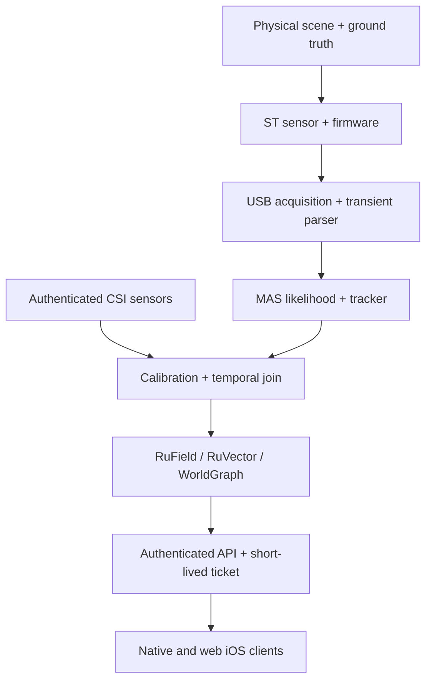

# Consumer NLOS threat model

**Status:** Required design and release gate for ADR-328 through ADR-331
**Last reviewed:** 2026-08-22
**Scope:** enrolled histogram-capable ST transient acquisition with recorded
board/silicon/firmware/API identity, MAS tracking/reconstruction, CSI
fusion, RuVector/RuField/WorldGraph state, native iOS, web iOS, evidence and
contributor harness
**Security posture:** Research capability, local-first, identity-free,
fail-closed, no direct actuation

## 1. Executive security decision

Around-the-corner tracking changes the privacy boundary of a space: a person can
be observed without being in direct view of the operator or device. The output
is sparse probability/geometry rather than a photograph, but location,
trajectory, occupancy and joined RF evidence remain sensitive. “Camera-free”
must never be used as “privacy-free.”

The first RuView deployment is a controlled, consented research experiment with
an external, upstream-compatible ST histogram sensor over local USB. Raw transients, CSI and
ground truth remain local under an approved retention plan. Live APIs expose
only bounded, expiring, session-scoped hypotheses. No NLOS output directly
controls an actuator or certifies that a hidden region is safe.

This PR is software stage G0 only. Its local USB source label (`st-local`) is
not cryptographic sensor enrollment, and `ruview.nlos.track.v1` has no tenant,
workspace or world-frame field. The controls below that depend on those
bindings are mandatory live-promotion work; their documentation does not enable
L2 or make the current scaffold physically authenticated.

Release is blocked by a confirmed high or critical finding, missing consent,
unauthenticated sensor/transport, ambiguous live/replay provenance, unbounded
parser, cross-tenant/world-frame join, or absent stale/replay protection.

## 2. System and trust boundaries

Trust boundaries are crossed at every arrow. Physical proximity does not imply
logical trust. USB is a device/input boundary; the ST firmware and upstream
Python are supply-chain inputs; CSI is an independent, potentially malicious
modality; memory is tenant/purpose separated; API clients are untrusted; and
the UI is not evidence authority.

The contributor harness reads repository metadata and optional bounded evidence
JSON. It does not receive raw captures, credentials, sensing authority, or a
runtime role.

## 3. Assets

| Asset | Security/privacy need | Default handling |
|---|---|---|
| Raw per-zone photon histograms | integrity, confidentiality, purpose/retention | local encrypted research store; never Git/logs |
| Raw CSI/CIR and RF calibration | confidentiality, tenant isolation, provenance | edge/local; no default cloud export |
| Ground-truth video/tags/trajectories | highest participant privacy and synchronization integrity | separated encrypted store, least access, scheduled deletion |
| Sensor identity and firmware/config digest | authenticity and chain of custody | certificate/key reference plus content digest; no private key export |
| Wall/background/extrinsic calibration | integrity, freshness, deployment binding | signed/content-addressed, expiring, invalidatable |
| Track posterior/covariance/history | confidentiality, freshness, non-reidentification | session ID, TTL, bounded history, purpose-limited |
| WorldGraph/RuVector state | tenant isolation, deletion, no identity escalation | tenant/workspace namespace, TTL, audited access |
| API credentials/tickets | confidentiality, replay resistance, least authority | native pairing secret in ThisDeviceOnly Keychain; web uses short-lived scoped ticket; never URL/log/local storage bearer |
| Capture/evidence manifest | integrity, reproducibility, nonrepudiation | canonical digest and witness record; no embedded raw data |
| Model/canonical response | integrity and license/provenance | pinned digest, reviewed source, immutable artifact |
| Availability/quality state | integrity and fail-closed semantics | explicit unavailable/degraded/unknown/expired states |

## 4. Adversaries and misuse

1. **Unauthorized operator** deploys or leaves sensing active without notice or
   beyond the approved room/time/purpose.
2. **Nearby attacker** injects RF, optical, physical-motion or relay-surface
   changes to produce, hide or move a track.
3. **Compromised sensor/firmware** fabricates histograms, sequence/timestamps,
   calibration identity or firmware version.
4. **Compromised CSI node** contributes an extreme likelihood or replays a frame
   to create false persistence.
5. **Malicious client** sends parser bombs, requests another tenant/session,
   reuses a web ticket, scrapes track history or alters provenance labels.
6. **Supply-chain attacker** compromises upstream Git/Python/firmware, Cargo/npm/
   Swift packages, build tools or model artifacts.
7. **Insider/researcher** copies raw captures, joins session tracks across time,
   bypasses deletion or selectively reports favorable trials.
8. **Curious contributor agent/harness** attempts to read secrets/raw data,
   execute untrusted evidence, mutate code/hardware or promote a claim.
9. **Accidental failure** includes clock/coordinate mismatch, stale calibration,
   overflow, NaN, queue buildup, app suspension and simulator/replay confusion.

Out of scope does not mean acceptable: nation-state hardware implants and
physical destruction are not fully mitigated by this software, so high-assurance
or safety deployments require a separate hardware/security case.

## 5. Security invariants

1. `LIVE_HARDWARE`, `REPLAY`, and `SYNTHETIC` are mutually exclusive by type.
   Unknown is never live.
2. A frame/track is usable only when schema, identity, session, sequence,
   freshness, calibration, coordinate frame, numeric bounds and size pass.
3. Fused output requires two independently valid modalities within the frozen
   time/space join bounds. Missing or rejected input cannot be labeled fused.
4. RuVector/WorldGraph similarity and persistence never upgrade acquisition
   provenance, infer identity, or bypass freshness.
5. Raw sensor and ground-truth data is local/minimized by default and never
   enters Git, harness manifests, package tarballs, logs or client telemetry.
6. Authorization is tenant/workspace/session/purpose scoped. A read scope is not
   actuation authority.
7. Stale, contradictory, out-of-distribution or low-quality evidence produces
   `unknown`/degraded, not a confident fallback.
8. No parser allocates from unchecked zone × bin × object × history dimensions.
9. No client rendering rate, simulator build or replay can satisfy the live
   research gate.
10. A NLOS hypothesis has no direct actuator callback.

## 6. Threat register

Ratings describe the uncontrolled design. “Required control” is a release gate;
it is not a claim that every future implementation is automatically safe.

| ID | Threat | Initial risk | Required controls | Verification / residual risk |
|---|---|---:|---|---|
| T01 | Covert or overbroad sensing beyond direct view | Critical | explicit approved purpose/space/time, participant notice/consent, persistent indicator, pause/stop, background off, audit and deletion | privacy review plus physical walkthrough; residual High for misuse by an authorized operator, so no unconsented deployment |
| T02 | Unauthenticated sensor or CSI impersonation | Critical | ADR-305 identity, enrollment, tenant/session binding, TLS where networked, digest/certificate on frame/calibration | forged/unknown identity tests; residual Medium for stolen keys, mitigated by rotation/revocation |
| T03 | Replay/duplicate/future timestamp creates false track | High | monotonic sequence, nonce/session, bounded skew/TTL, duplicate cache, clock uncertainty, stale clear | exact/changed replay, wrap and clock-jump tests; residual Low/Medium under clock loss → unknown |
| T04 | Calibration/background substitution or poisoning | High | signed/content-addressed calibration bound to sensor/config/room, expiry/OOD, controlled empty capture, immutable audit | mismatched/expired/poisoned calibration tests; residual Medium for slow physical drift |
| T05 | Direct line of sight contaminates “hidden” result | High | opaque geometry check, independent scene inspection, registered camera/ground-truth exclusion, capture manifest | randomized occluder/negative trials; residual Medium for unnoticed reflections/view gaps |
| T06 | Optical/RF adversarial injection or physical spoof | High | per-modality quality/OOD, bounded influence, optical-only/CSI-only ablation, multi-view/temporal consistency, unknown on contradiction | extreme likelihood and conflicting-modality tests; residual High in adversarial environments, so no safety claim |
| T07 | Coordinate or time-frame mismatch fuses different targets | High | typed units/frame IDs, calibrated transform+uncertainty, bounded pairing skew, no cross-frame fallback | incompatible frame/unit/skew test matrix; residual Low after fail-closed controls |
| T08 | Parser overflow, NaN/Inf, oversized histogram/track | High | pre-allocation dimension/product bounds, finite checks, fixed max message/evidence size, fuzz/property tests, bounded tails | sanitizers/fuzz/boundary corpus; residual Low/Medium for third-party decoders |
| T09 | Queue/memory/CPU exhaustion hides freshness | High | bounded queues/particles/history, newest-frame policy, rate limits, timeouts, backpressure/drop counters | overload/slow-client tests; residual Medium under sustained physical/authorized load |
| T10 | Web ticket/token theft or cross-origin stream | High | ATS/TLS, short-lived one-use scoped ticket, fixed origin, no bearer in URL/log/local storage, CSP, reconnect bounds | expiry/reuse/origin/tenant negative integration tests; residual Medium for compromised client device |
| T11 | Native/web stale UI remains visually live | High | expiry timer independent of incoming messages, clear on suspend/disconnect/decode error, provenance/quality always visible | fake-clock/suspend/disconnect/replay UI tests; residual Low |
| T12 | Cross-tenant or cross-session memory leakage | Critical | typed namespace at ingest/join/store/query, authorization, TTL/deletion, no global person ID | tenant/session isolation tests and access audit; residual Medium for admin/backup controls |
| T13 | Re-identification from trajectory/embedding | High | random session track IDs, no identity training/labels, bounded TTL, purpose limitation, aggregation, access logging | privacy review and deletion tests; residual Medium/High in small populations, so identity use prohibited |
| T14 | Raw data, secrets or positions leak via Git/log/telemetry/package | High | repo incident controls, `.gitignore`, secret/data scans, redaction, synthetic fixtures, no raw telemetry, tarball review | repository-policy, package dry run, log tests; residual Low/Medium for human export |
| T15 | Upstream/firmware/dependency/model compromise | High | pin commits/versions/digests, license/source review, isolated sidecar, dependency audit, signed release/provenance, no auto-flash | SBOM/audit/reproducible hash and firmware review; residual Medium for build toolchain |
| T16 | Malicious evidence JSON/path escape/code execution | High | regular bounded repository-confined JSON, realpath containment, no eval/import, strict schema/digest/arithmetic | traversal/symlink/oversize/malformed tests; residual Low |
| T17 | Selective reporting, leakage or metric gaming | High | preregistration, immutable grouped split, external ground truth, paired arms, all strata/secondary metrics, witness review | independent analysis reproduction; residual Medium for undisclosed captures |
| T18 | Learned RF model copies LiDAR labels and appears independent | High | group splits, test on external ground truth, LiDAR/CSI/fused ablations, teacher quality masks, sealed holdout | leakage/adjoining-frame tests; residual Medium under environmental confounding |
| T19 | Harness/agent mutation gains sensing or release authority | High | MCP/static tools read-only and default-deny; opt-in CLI builds only in a trusted checkout with scrubbed environment/redacted tails; MetaHarness dev-only; human promotion | policy/tool/build-output tests and package manifest; residual Medium because build tools execute repository code |
| T20 | Track drives unsafe actuator/decision | Critical | hypothesis-only API, explicit no actuator, ADR-321/327 independent governed action and deployment safety case | interface/source tests; residual Critical if bypassed, therefore release blocker |
| T21 | Private/undocumented Apple API use | High | public SDK only, `canImport`/availability checks, official-doc review, no hidden entitlement/reverse engineering | Xcode source/entitlement review; residual Low with external-sensor-only claim |
| T22 | Eye/laser or electrical hazard from modified hardware | High | unmodified Class 1 sensor, manufacturer limits, approved power/enclosure, no emitter modification, trained operator | hardware checklist; residual Medium; any optical modification requires new safety review |

## 7. Input-boundary controls

### 7.1 Transient frame

Reject before allocating or mutating state when any of these is true:

1. schema/version is unknown;
2. zone/bin dimensions are zero, exceed configured maxima, or their product
   overflows;
3. bin width, timestamps, pose, intrinsics, wall points, ambient level or
   normalized counts are non-finite/out of physical configured range;
4. sensor/session identity is absent, revoked or mismatched;
5. sequence is duplicate/regressing or time is stale/future beyond uncertainty;
6. firmware/config/calibration digest differs from the session manifest;
7. transform is non-invertible, units differ, or coordinate frame is unknown;
8. calibration is not `VALID`; or
9. the source-provenance transition is illegal.

### 7.2 Track/API message

`ruview.nlos.track.v1` validation happens before store/render. Bound message
bytes, track count, history length, covariance/particle summary, strings and
metadata. Position/velocity/covariance are finite and covariance is valid under
the chosen representation. The client owns an independent expiry timer.
Tenant/workspace/world-frame, capture-certificate and audience/origin checks are
the required L2 contract. Current v1 validates session/schema/sequence/freshness,
bounded exact shape, calibration hash and generic transient provenance only; it
must remain G0 until the missing authorization/frame bindings are versioned end
to end.

### 7.3 Evidence record

The harness permits at most 1 MiB, regular JSON inside the canonical repository
root. `realpath` containment rejects `..` and symlink escapes. JSON is parsed as
data, never imported or executed. Research pass requires exact live provenance,
external ground truth, frozen protocol, digests, zero synthetic/replay frames,
minimum sample size, valid rates/errors and the frozen arithmetic.

## 8. Authentication, authorization and key handling

1. Before live promotion, sensor enrollment creates a non-secret, scoped sensor identity reference and protects
   the private key outside captures/manifests. Revocation invalidates future
   frames and live capability certificates.
2. Service authorization is least-privilege: read tracks for one tenant,
   workspace, session and purpose. It grants no calibration write, firmware
   flash, memory export, evidence promotion or actuation.
3. The current G0 browser exchanges an authenticated session for a 30-second,
   one-use WebSocket ticket bound to the server session; the client requires a
   server-session acknowledgement, pins the returned WSS URL to the configured
   same authority, and the server uses exact CORS. It does **not** yet bind
   tenant/workspace/audience/origin claims in the ticket. Those bindings and
   their negative tests are mandatory before L2. Tickets are not stored
   persistently. Native pairing tokens are scoped, revocable, validated before
   use, and stored as `WhenUnlockedThisDeviceOnly` Keychain data.
4. TLS certificate verification is on in release builds. Debug/local exceptions
   are explicit, non-exportable release configuration.
5. Secrets are never command-line arguments when avoidable and never printed in
   error tails. Harness tools accept no raw token/API key field.
6. Research-store encryption keys are purpose/experiment scoped, kept outside
   captures, manifests and backups, access-audited, rotated on compromise, and
   destroyed at retention expiry. Backup retention cannot silently defeat
   deletion or crypto-erasure evidence.

## 9. Privacy impact and data lifecycle

| Stage | Minimization | Access/retention | Deletion proof |
|---|---|---|---|
| Capture | record only approved zones/modalities/window; no audio; ground truth separated | named researchers, encrypted local store, frozen short schedule | manifest tombstone plus storage audit |
| Calibration | no person present; bind to room/sensor/config | operators and pipeline; expire on change | invalidation record and artifact deletion |
| Inference | process raw at edge; emit bounded position/covariance/provenance | live authorized clients only | TTL and session teardown tests |
| RuVector/WorldGraph | no stable identity; session scope; minimal embeddings/relations | tenant/purpose-scoped queries | namespace purge and index compaction evidence |
| Evidence | hashes and aggregate metrics, no raw person data | reviewers | retain per research governance without reconstructing raw capture |
| Logs/telemetry | counters, digests truncated where needed, redacted errors | operators/security | rotation verification |

Consent/notice must explain around-corner sensing in plain language. An optical
sensor without RGB imagery can still infer a hidden person's location and
movement. Withdrawal/deletion limitations for already aggregated, non-personal
published metrics are documented before participation.

## 10. Availability and safe degradation

Every dependency has an explicit safe state:

| Failure | Required behavior |
|---|---|
| sensor disconnect or malformed frame | stop live optical updates; emit unavailable/unknown |
| calibration/OOD failure | invalidate likelihood; request recalibration; no cached live fallback |
| CSI missing | optical-only label if optical remains valid; never fused |
| optical missing | RF-only/coarse label if separately permitted; never NLOS/fused |
| clock/coordinate disagreement | no join; record diagnostic counter |
| tracker numeric collapse | reset bounded filter and emit unknown during reacquisition |
| API auth/ticket expiry | disconnect and clear live state |
| native suspension/web background | expire display independently of server |
| RuVector/WorldGraph unavailable | current local track may continue without persistence; no memory fabrication |
| harness/MetaHarness unavailable | no runtime impact; run direct crate/app tests |

## 11. Security verification plan

Minimum software evidence is staged: current G0 must pass the checks applicable
to its implemented schema; every listed check is mandatory before live L2
promotion. A test cannot stand in for a field the protocol does not yet carry.

1. Rust unit/property/fuzz or boundary tests for transient/track decode,
   dimension-product overflow, numeric extremes, calibration/provenance state,
   temporal/coordinate join and bounded filter behavior.
2. Swift and TypeScript cross-language golden vectors plus malformed/stale/
   oversized/provenance tests.
3. Authentication integration tests for invalid/expired/reused/cross-origin/
   cross-tenant tickets and disconnect state.
4. Empty/rejected modality, conflicting modality, replay, clock jump, sequence
   wrap, overload and slow-client tests.
5. Repository secret/data incident scan, Cargo/npm/Swift dependency review,
   license/SBOM review and `npm pack --dry-run` inspection.
6. Harness policy, evidence traversal/oversize/synthetic rejection, manifest,
   brain/flywheel replay and full legacy tests.
7. Manual review for private Apple API/entitlement use, raw data/credentials in
   fixtures/logs, direct actuator callbacks and overclaimed metrics.

### Closed dependency exception record `NLOS-SEC-EX-001`

| Field | Record |
|---|---|
| Status | **CLOSED BY REMEDIATION**; no risk exception was approved or consumed |
| Original finding | high-severity `image-size@1.2.1` advisories [GHSA-w3rx-r6r6-pgpr](https://github.com/advisories/GHSA-w3rx-r6r6-pgpr) and [GHSA-5p2g-fcmc-qvqq](https://github.com/advisories/GHSA-5p2g-fcmc-qvqq) through the prior Metro lock |
| Remediation | aligned the Expo SDK 55 dependency set and regenerated `ui/mobile/package-lock.json`; the resulting 2026-08-22 audit reports zero high and zero critical findings |
| Verification | `npm ci --ignore-scripts` plus `npm audit --json`; local audit digest `b6e5236f2b07dec4f714d60e7c8a5683348464455392d636fc77b9c591bb8dcb` |
| Remaining findings | ten moderate transitive build-tool findings, including `uuid` through `xcode`; tracked normally and not covered by an exception |
| CI policy | fail every high or critical dependency finding; no NLOS allowlist exists |
| Promotion mapping | the former dependency block is removed; all other G0→G1 physical, privacy, authorization, provenance and witness gates remain closed until independently satisfied |

The closed record is retained so reviewers can see why the lockfile changed and
verify that the project remediated rather than silently accepted the finding.

Live L2 evidence additionally needs a physical setup inspection, firmware and
sensor identity witness, direct-line-of-sight exclusion, external ground-truth
clock test, capture access/retention review, and independent reproduction of the
analysis from the immutable manifest.

## 12. Incident response and rollback

On suspected unauthorized sensing, provenance failure, key theft, raw-data leak,
metric manipulation or unsafe downstream use:

1. stop capture and live stream; revoke sensor/client credentials and tickets;
2. freeze bounded logs/manifests without copying unnecessary raw participant
   data;
3. disable the NLOS/fusion capability certificate and UI live flag;
4. notify the privacy/security owner and affected participants/organizations as
   required;
5. determine affected tenants/sessions/captures/models and delete/quarantine per
   policy;
6. patch and add a focused regression test; rerun the complete gate;
7. re-enable only after independent review and, where evidence was affected, a
   fresh preregistered capture.

Rollback may return to optical-only, RF-only, replay-only or fully unavailable.
It never changes old provenance or represents replay as a live substitute.

## 13. Residual-risk decision

Even with controls, authorized misuse, physical spoofing, environment shift,
re-identification from trajectories and supply-chain compromise retain material
risk. Therefore the accepted scope is controlled, consented RuView Labs
research and advisory visualization. Public-space surveillance, covert sensing,
biometric identity, through-wall safety guarantees, vehicle collision avoidance,
medical monitoring and autonomous actuation are not approved by these ADRs.

Any expansion requires a new threat model, evidence level, deployment/privacy
review, operational monitoring, incident/rollback plan and accountable owner.
