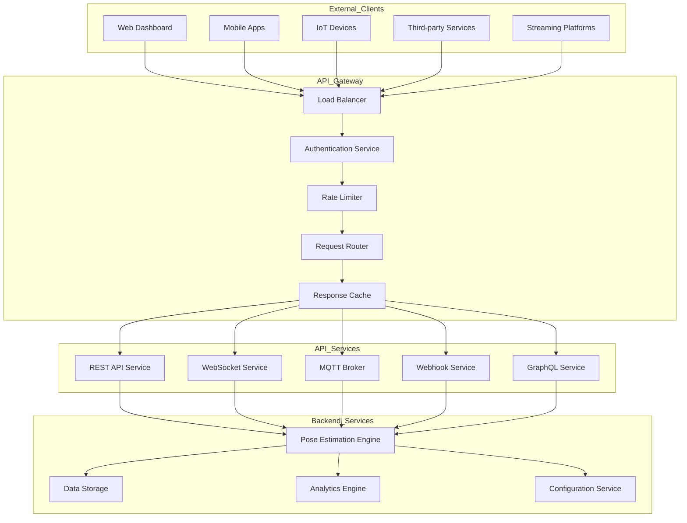
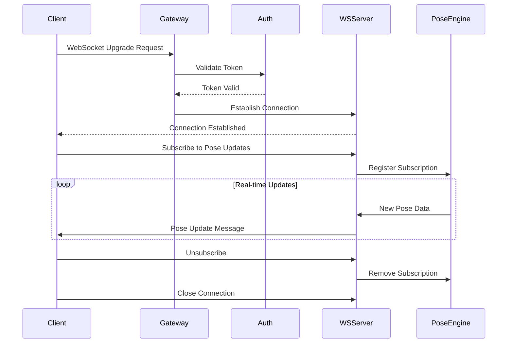
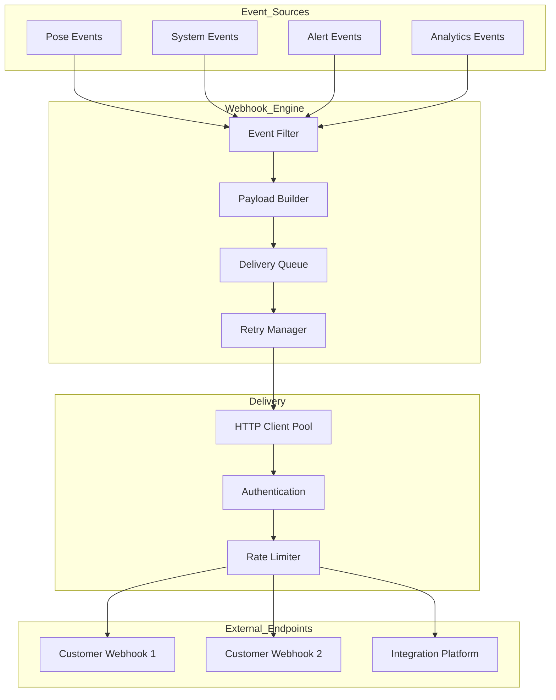

# WiFi-DensePose API Architecture

## Document Information
- **Version**: 1.0
- **Date**: 2025-06-07
- **Project**: InvisPose - WiFi-Based Dense Human Pose Estimation
- **Status**: Draft

---

## 1. API Architecture Overview

### 1.1 System Overview

The WiFi-DensePose API architecture provides comprehensive interfaces for accessing pose estimation data, controlling system operations, and integrating with external platforms. The architecture supports REST APIs, WebSocket connections, MQTT messaging, and webhook notifications to serve diverse client needs.

### 1.2 API Gateway Architecture



### 1.3 Key API Features

- **RESTful Design**: Standard HTTP methods for resource manipulation
- **Real-time Streaming**: WebSocket support for live pose data
- **Event-Driven**: MQTT and webhooks for IoT and event notifications
- **GraphQL Support**: Flexible queries for complex data requirements
- **Multi-Protocol**: Support for HTTP/2, WebSocket, MQTT, and gRPC
- **Comprehensive Security**: OAuth2, JWT, API keys, and rate limiting

---

## 2. REST API Architecture

### 2.1 API Design Principles

```yaml
Design Principles:
  - Resource-Oriented: URLs identify resources, not actions
  - Stateless: Each request contains all necessary information
  - Cacheable: Responses indicate cacheability
  - Uniform Interface: Consistent naming and structure
  - Layered System: Clear separation of concerns
  - HATEOAS: Hypermedia as the engine of application state
```

### 2.2 Resource Structure

```mermaid
graph TD
    A[/api/v1] --> B[/pose]
    A --> C[/system]
    A --> D[/analytics]
    A --> E[/config]
    A --> F[/stream]
    
    B --> B1[/current]
    B --> B2[/history]
    B --> B3[/persons]
    B --> B4[/zones]
    
    C --> C1[/status]
    C --> C2[/health]
    C --> C3[/routers]
    C --> C4[/performance]
    
    D --> D1[/activity]
    D --> D2[/heatmaps]
    D --> D3[/reports]
    D --> D4[/export]
    
    E --> E1[/routers]
    E --> E2[/zones]
    E --> E3[/alerts]
    E --> E4[/templates]
    
    F --> F1[/rtmp]
    F --> F2[/hls]
    F --> F3[/dash]
    F --> F4[/webrtc]
```

### 2.3 REST API Implementation

```python
from fastapi import FastAPI, HTTPException, Depends, Query
from fastapi.middleware.cors import CORSMiddleware
from typing import List, Optional, Dict
import datetime

app = FastAPI(
    title="WiFi-DensePose API",
    version="1.0.0",
    description="Privacy-preserving human pose estimation using WiFi signals"
)

# CORS configuration
app.add_middleware(
    CORSMiddleware,
    allow_origins=["*"],
    allow_credentials=True,
    allow_methods=["*"],
    allow_headers=["*"],
)

# API Models
from pydantic import BaseModel, Field

class Keypoint(BaseModel):
    """Individual keypoint in pose estimation"""
    id: int = Field(..., description="Keypoint ID (0-16 for COCO format)")
    x: float = Field(..., description="X coordinate (0-1 normalized)")
    y: float = Field(..., description="Y coordinate (0-1 normalized)")
    confidence: float = Field(..., description="Detection confidence (0-1)")
    name: str = Field(..., description="Keypoint name (e.g., 'nose', 'left_shoulder')")

class Person(BaseModel):
    """Detected person with pose information"""
    id: str = Field(..., description="Unique person ID")
    keypoints: List[Keypoint] = Field(..., description="17 keypoints in COCO format")
    confidence: float = Field(..., description="Overall detection confidence")
    bounding_box: Dict[str, float] = Field(..., description="Person bounding box")
    activity: Optional[str] = Field(None, description="Detected activity")
    zone_id: Optional[str] = Field(None, description="Current zone ID")

class PoseFrame(BaseModel):
    """Single frame of pose estimation data"""
    timestamp: datetime.datetime = Field(..., description="Frame timestamp")
    frame_id: int = Field(..., description="Sequential frame ID")
    persons: List[Person] = Field(..., description="Detected persons")
    processing_time_ms: float = Field(..., description="Processing time in milliseconds")
    metadata: Dict[str, any] = Field(default_factory=dict, description="Additional metadata")

# Pose Endpoints
@app.get("/api/v1/pose/current", response_model=PoseFrame)
async def get_current_pose(
    zone_id: Optional[str] = Query(None, description="Filter by zone ID"),
    min_confidence: float = Query(0.5, description="Minimum confidence threshold")
):
    """Get the most recent pose estimation frame"""
    try:
        current_frame = await pose_engine.get_latest_frame()
        
        if not current_frame:
            raise HTTPException(status_code=404, detail="No pose data available")
        
        # Apply filters
        if zone_id:
            current_frame.persons = [
                p for p in current_frame.persons 
                if p.zone_id == zone_id
            ]
        
        if min_confidence > 0:
            current_frame.persons = [
                p for p in current_frame.persons 
                if p.confidence >= min_confidence
            ]
        
        return current_frame
        
    except Exception as e:
        logger.error(f"Error getting current pose: {e}")
        raise HTTPException(status_code=500, detail=str(e))

@app.get("/api/v1/pose/history", response_model=List[PoseFrame])
async def get_pose_history(
    start_time: datetime.datetime = Query(..., description="Start time for history"),
    end_time: datetime.datetime = Query(..., description="End time for history"),
    person_id: Optional[str] = Query(None, description="Filter by person ID"),
    limit: int = Query(100, le=1000, description="Maximum number of frames"),
    skip: int = Query(0, description="Number of frames to skip")
):
    """Get historical pose data within time range"""
    try:
        history = await pose_engine.get_history(
            start_time=start_time,
            end_time=end_time,
            person_id=person_id,
            limit=limit,
            offset=skip
        )
        
        return history
        
    except Exception as e:
        logger.error(f"Error getting pose history: {e}")
        raise HTTPException(status_code=500, detail=str(e))

@app.get("/api/v1/pose/persons/{person_id}", response_model=Dict)
async def get_person_details(
    person_id: str,
    include_history: bool = Query(False, description="Include movement history")
):
    """Get detailed information about a specific person"""
    try:
        person_info = await pose_engine.get_person_info(person_id)
        
        if not person_info:
            raise HTTPException(status_code=404, detail="Person not found")
        
        result = {
            "person_id": person_id,
            "first_seen": person_info.first_seen,
            "last_seen": person_info.last_seen,
            "current_zone": person_info.current_zone,
            "average_confidence": person_info.avg_confidence,
            "detected_activities": person_info.activities
        }
        
        if include_history:
            result["movement_history"] = await pose_engine.get_person_trajectory(person_id)
        
        return result
        
    except Exception as e:
        logger.error(f"Error getting person details: {e}")
        raise HTTPException(status_code=500, detail=str(e))

# System Endpoints
@app.get("/api/v1/system/status")
async def get_system_status():
    """Get current system status and statistics"""
    try:
        status = await system_monitor.get_status()
        
        return {
            "status": status.overall_status,
            "uptime_seconds": status.uptime,
            "active_routers": status.active_routers,
            "total_persons_tracked": status.total_persons,
            "current_fps": status.current_fps,
            "average_latency_ms": status.avg_latency,
            "memory_usage_mb": status.memory_usage,
            "gpu_usage_percent": status.gpu_usage
        }
        
    except Exception as e:
        logger.error(f"Error getting system status: {e}")
        raise HTTPException(status_code=500, detail=str(e))

@app.get("/api/v1/system/health")
async def health_check():
    """Health check endpoint for monitoring"""
    try:
        health = await system_monitor.check_health()
        
        if not health.is_healthy:
            raise HTTPException(status_code=503, detail=health.issues)
        
        return {
            "status": "healthy",
            "timestamp": datetime.datetime.utcnow(),
            "components": health.component_status
        }
        
    except Exception as e:
        return {
            "status": "unhealthy",
            "timestamp": datetime.datetime.utcnow(),
            "error": str(e)
        }
```

### 2.4 API Versioning Strategy

```python
class APIVersioning:
    """API versioning implementation"""
    
    def __init__(self):
        self.versions = {
            'v1': {
                'status': 'stable',
                'deprecated': False,
                'sunset_date': None
            },
            'v2': {
                'status': 'beta',
                'deprecated': False,
                'sunset_date': None
            }
        }
    
    def get_router(self, version: str):
        """Get router for specific API version"""
        if version not in self.versions:
            raise ValueError(f"Unsupported API version: {version}")
        
        if version == 'v1':
            from .v1 import router as v1_router
            return v1_router
        elif version == 'v2':
            from .v2 import router as v2_router
            return v2_router
    
    def check_deprecation(self, version: str):
        """Check if API version is deprecated"""
        version_info = self.versions.get(version)
        
        if version_info and version_info['deprecated']:
            return {
                'deprecated': True,
                'sunset_date': version_info['sunset_date'],
                'migration_guide': f'/docs/migration/{version}-to-v{int(version[1])+1}'
            }
        
        return {'deprecated': False}

# Version negotiation middleware
@app.middleware("http")
async def version_negotiation(request: Request, call_next):
    """Handle API version negotiation"""
    # Check Accept header for version
    accept_header = request.headers.get('Accept', '')
    version = 'v1'  # Default version
    
    if 'version=' in accept_header:
        version = accept_header.split('version=')[1].split(';')[0]
    
    # Check URL path for version
    if request.url.path.startswith('/api/v'):
        path_version = request.url.path.split('/')[2]
        version = path_version
    
    # Add version to request state
    request.state.api_version = version
    
    # Check deprecation
    deprecation_info = versioning.check_deprecation(version)
    
    response = await call_next(request)
    
    # Add deprecation headers if needed
    if deprecation_info['deprecated']:
        response.headers['Sunset'] = deprecation_info['sunset_date']
        response.headers['Deprecation'] = 'true'
        response.headers['Link'] = f'<{deprecation_info["migration_guide"]}>; rel="deprecation"'
    
    return response
```

---

## 3. WebSocket Architecture

### 3.1 WebSocket Server Design



### 3.2 WebSocket Implementation

```python
from fastapi import WebSocket, WebSocketDisconnect, Depends
from typing import Set, Dict
import json
import asyncio

class WebSocketManager:
    """Manages WebSocket connections and subscriptions"""
    
    def __init__(self):
        self.active_connections: Dict[str, WebSocket] = {}
        self.subscriptions: Dict[str, Set[str]] = {
            'pose_updates': set(),
            'system_alerts': set(),
            'zone_events': set(),
            'person_tracking': set()
        }
        self.client_info: Dict[str, dict] = {}
    
    async def connect(self, websocket: WebSocket, client_id: str):
        """Accept new WebSocket connection"""
        await websocket.accept()
        self.active_connections[client_id] = websocket
        self.client_info[client_id] = {
            'connected_at': datetime.datetime.utcnow(),
            'subscriptions': set(),
            'message_count': 0
        }
        
        # Send welcome message
        await self.send_personal_message({
            'type': 'connection',
            'status': 'connected',
            'client_id': client_id,
            'server_time': datetime.datetime.utcnow().isoformat()
        }, client_id)
    
    def disconnect(self, client_id: str):
        """Remove WebSocket connection"""
        if client_id in self.active_connections:
            del self.active_connections[client_id]
            
            # Remove from all subscriptions
            for topic in self.subscriptions:
                self.subscriptions[topic].discard(client_id)
            
            # Clean up client info
            if client_id in self.client_info:
                del self.client_info[client_id]
    
    async def subscribe(self, client_id: str, topic: str, filters: dict = None):
        """Subscribe client to topic"""
        if topic not in self.subscriptions:
            raise ValueError(f"Unknown topic: {topic}")
        
        self.subscriptions[topic].add(client_id)
        self.client_info[client_id]['subscriptions'].add(topic)
        
        # Store filters if provided
        if filters:
            if 'filters' not in self.client_info[client_id]:
                self.client_info[client_id]['filters'] = {}
            self.client_info[client_id]['filters'][topic] = filters
        
        # Send confirmation
        await self.send_personal_message({
            'type': 'subscription',
            'topic': topic,
            'status': 'subscribed',
            'filters': filters
        }, client_id)
    
    async def unsubscribe(self, client_id: str, topic: str):
        """Unsubscribe client from topic"""
        if topic in self.subscriptions:
            self.subscriptions[topic].discard(client_id)
            self.client_info[client_id]['subscriptions'].discard(topic)
            
            # Remove filters
            if 'filters' in self.client_info[client_id]:
                self.client_info[client_id]['filters'].pop(topic, None)
        
        # Send confirmation
        await self.send_personal_message({
            'type': 'subscription',
            'topic': topic,
            'status': 'unsubscribed'
        }, client_id)
    
    async def broadcast_to_topic(self, topic: str, message: dict):
        """Broadcast message to all subscribers of a topic"""
        if topic not in self.subscriptions:
            return
        
        # Get subscribers
        subscribers = self.subscriptions[topic].copy()
        
        # Send to each subscriber
        disconnected = []
        for client_id in subscribers:
            if client_id in self.active_connections:
                # Apply filters if any
                if self._should_send_to_client(client_id, topic, message):
                    try:
                        await self.send_personal_message(message, client_id)
                    except Exception as e:
                        logger.error(f"Error sending to {client_id}: {e}")
                        disconnected.append(client_id)
        
        # Clean up disconnected clients
        for client_id in disconnected:
            self.disconnect(client_id)
    
    async def send_personal_message(self, message: dict, client_id: str):
        """Send message to specific client"""
        if client_id in self.active_connections:
            websocket = self.active_connections[client_id]
            await websocket.send_json(message)
            self.client_info[client_id]['message_count'] += 1
    
    def _should_send_to_client(self, client_id: str, topic: str, message: dict) -> bool:
        """Check if message should be sent based on client filters"""
        client = self.client_info.get(client_id, {})
        filters = client.get('filters', {}).get(topic, {})
        
        if not filters:
            return True
        
        # Apply filters based on topic
        if topic == 'pose_updates':
            # Filter by zone
            if 'zone_id' in filters and message.get('zone_id') != filters['zone_id']:
                return False
            
            # Filter by confidence
            if 'min_confidence' in filters:
                if message.get('confidence', 0) < filters['min_confidence']:
                    return False
        
        elif topic == 'person_tracking':
            # Filter by person ID
            if 'person_id' in filters and message.get('person_id') != filters['person_id']:
                return False
        
        return True

# WebSocket endpoint
@app.websocket("/ws/v1/stream")
async def websocket_endpoint(
    websocket: WebSocket,
    token: str = Query(..., description="Authentication token")
):
    """WebSocket endpoint for real-time streaming"""
    # Authenticate
    client_id = await authenticate_websocket(token)
    if not client_id:
        await websocket.close(code=4001, reason="Authentication failed")
        return
    
    # Connect
    await manager.connect(websocket, client_id)
    
    try:
        while True:
            # Receive messages from client
            data = await websocket.receive_json()
            
            # Handle different message types
            message_type = data.get('type')
            
            if message_type == 'subscribe':
                await manager.subscribe(
                    client_id,
                    data['topic'],
                    data.get('filters')
                )
            
            elif message_type == 'unsubscribe':
                await manager.unsubscribe(client_id, data['topic'])
            
            elif message_type == 'ping':
                await manager.send_personal_message({
                    'type': 'pong',
                    'timestamp': datetime.datetime.utcnow().isoformat()
                }, client_id)
            
            elif message_type == 'configure':
                # Handle client configuration updates
                await handle_client_configuration(client_id, data['config'])
            
    except WebSocketDisconnect:
        manager.disconnect(client_id)
        logger.info(f"Client {client_id} disconnected")
    except Exception as e:
        logger.error(f"WebSocket error for {client_id}: {e}")
        manager.disconnect(client_id)
```

### 3.3 Real-Time Data Streaming

```python
class RealtimeDataStreamer:
    """Handles real-time data streaming to WebSocket clients"""
    
    def __init__(self, websocket_manager: WebSocketManager):
        self.ws_manager = websocket_manager
        self.streaming_tasks = {}
        
    async def start_streaming(self):
        """Start all streaming tasks"""
        self.streaming_tasks['pose'] = asyncio.create_task(
            self._stream_pose_updates()
        )
        self.streaming_tasks['alerts'] = asyncio.create_task(
            self._stream_system_alerts()
        )
        self.streaming_tasks['zones'] = asyncio.create_task(
            self._stream_zone_events()
        )
    
    async def _stream_pose_updates(self):
        """Stream pose updates to subscribers"""
        while True:
            try:
                # Get latest pose data
                pose_frame = await pose_engine.get_latest_frame_async()
                
                if pose_frame:
                    # Format message
                    message = {
                        'type': 'pose_update',
                        'timestamp': pose_frame.timestamp.isoformat(),
                        'frame_id': pose_frame.frame_id,
                        'persons': [
                            {
                                'id': person.id,
                                'keypoints': [
                                    {
                                        'id': kp.id,
                                        'x': kp.x,
                                        'y': kp.y,
                                        'confidence': kp.confidence
                                    }
                                    for kp in person.keypoints
                                ],
                                'confidence': person.confidence,
                                'zone_id': person.zone_id,
                                'activity': person.activity
                            }
                            for person in pose_frame.persons
                        ],
                        'processing_time_ms': pose_frame.processing_time_ms
                    }
                    
                    # Broadcast to subscribers
                    await self.ws_manager.broadcast_to_topic('pose_updates', message)
                
                # Stream at configured rate
                await asyncio.sleep(1.0 / STREAM_FPS)
                
            except Exception as e:
                logger.error(f"Error streaming pose updates: {e}")
                await asyncio.sleep(1.0)
    
    async def _stream_system_alerts(self):
        """Stream system alerts to subscribers"""
        alert_queue = system_monitor.get_alert_queue()
        
        while True:
            try:
                # Wait for alerts
                alert = await alert_queue.get()
                
                # Format alert message
                message = {
                    'type': 'system_alert',
                    'timestamp': alert.timestamp.isoformat(),
                    'severity': alert.severity,
                    'category': alert.category,
                    'message': alert.message,
                    'details': alert.details
                }
                
                # Broadcast to subscribers
                await self.ws_manager.broadcast_to_topic('system_alerts', message)
                
            except Exception as e:
                logger.error(f"Error streaming alerts: {e}")
                await asyncio.sleep(1.0)
```

---

## 4. MQTT Integration Architecture

### 4.1 MQTT Broker Configuration

```python
class MQTTBrokerConfig:
    """MQTT broker configuration and management"""
    
    def __init__(self):
        self.broker_config = {
            'host': 'localhost',
            'port': 1883,
            'websocket_port': 9001,
            'tls_port': 8883,
            'max_connections': 1000,
            'message_size_limit': 256 * 1024,  # 256KB
            'persistence': True,
            'authentication': True
        }
        
        self.topics = {
            # Pose data topics
            'pose/current': {
                'qos': 0,
                'retained': True,
                'description': 'Current pose estimation data'
            },
            'pose/person/+/update': {
                'qos': 1,
                'retained': False,
                'description': 'Individual person updates'
            },
            'pose/zone/+/occupancy': {
                'qos': 1,
                'retained': True,
                'description': 'Zone occupancy information'
            },
            
            # System topics
            'system/status': {
                'qos': 1,
                'retained': True,
                'description': 'System status information'
            },
            'system/alerts/+': {
                'qos': 2,
                'retained': False,
                'description': 'System alerts by category'
            },
            
            # Command topics
            'command/zone/+/configure': {
                'qos': 2,
                'retained': False,
                'description': 'Zone configuration commands'
            },
            'command/system/+': {
                'qos': 2,
                'retained': False,
                'description': 'System control commands'
            }
        }
```

### 4.2 MQTT Publisher Implementation

```python
import asyncio
import json
from asyncio_mqtt import Client as MQTTClient
from contextlib import asynccontextmanager

class MQTTPublisher:
    """MQTT publisher for WiFi-DensePose data"""
    
    def __init__(self, broker_config: MQTTBrokerConfig):
        self.config = broker_config
        self.client = None
        self.connected = False
        self.publish_queue = asyncio.Queue(maxsize=1000)
        
    @asynccontextmanager
    async def connect(self):
        """Connect to MQTT broker"""
        try:
            async with MQTTClient(
                hostname=self.config.broker_config['host'],
                port=self.config.broker_config['port'],
                client_id=f"wifidensepose_publisher_{uuid.uuid4().hex[:8]}"
            ) as client:
                self.client = client
                self.connected = True
                logger.info("Connected to MQTT broker")
                
                # Start publish worker
                publish_task = asyncio.create_task(self._publish_worker())
                
                try:
                    yield self
                finally:
                    publish_task.cancel()
                    self.connected = False
                    
        except Exception as e:
            logger.error(f"MQTT connection error: {e}")
            raise
    
    async def publish_pose_update(self, pose_frame: PoseFrame):
        """Publish pose update to MQTT"""
        if not self.connected:
            return
        
        # Publish current pose data
        current_pose_topic = "pose/current"
        current_pose_payload = {
            'timestamp': pose_frame.timestamp.isoformat(),
            'frame_id': pose_frame.frame_id,
            'person_count': len(pose_frame.persons),
            'persons': [
                {
                    'id': p.id,
                    'confidence': p.confidence,
                    'zone_id': p.zone_id,
                    'activity': p.activity,
                    'keypoint_summary': {
                        'detected': sum(1 for kp in p.keypoints if kp.confidence > 0.5),
                        'total': len(p.keypoints)
                    }
                }
                for p in pose_frame.persons
            ]
        }
        
        await self._queue_message(
            current_pose_topic,
            json.dumps(current_pose_payload),
            qos=0,
            retain=True
        )
        
        # Publish individual person updates
        for person in pose_frame.persons:
            person_topic = f"pose/person/{person.id}/update"
            person_payload = {
                'timestamp': pose_frame.timestamp.isoformat(),
                'person_id': person.id,
                'keypoints': [
                    {
                        'id': kp.id,
                        'name': kp.name,
                        'x': round(kp.x, 3),
                        'y': round(kp.y, 3),
                        'confidence': round(kp.confidence, 3)
                    }
                    for kp in person.keypoints
                ],
                'bounding_box': person.bounding_box,
                'confidence': person.confidence,
                'zone_id': person.zone_id,
                'activity': person.activity
            }
            
            await self._queue_message(
                person_topic,
                json.dumps(person_payload),
                qos=1,
                retain=False
            )
        
        # Update zone occupancy
        zone_occupancy = {}
        for person in pose_frame.persons:
            if person.zone_id:
                zone_occupancy[person.zone_id] = zone_occupancy.get(person.zone_id, 0) + 1
        
        for zone_id, count in zone_occupancy.items():
            zone_topic = f"pose/zone/{zone_id}/occupancy"
            zone_payload = {
                'timestamp': pose_frame.timestamp.isoformat(),
                'zone_id': zone_id,
                'occupancy_count': count,
                'person_ids': [p.id for p in pose_frame.persons if p.zone_id == zone_id]
            }
            
            await self._queue_message(
                zone_topic,
                json.dumps(zone_payload),
                qos=1,
                retain=True
            )
    
    async def publish_system_status(self, status: SystemStatus):
        """Publish system status to MQTT"""
        topic = "system/status"
        payload = {
            'timestamp': datetime.datetime.utcnow().isoformat(),
            'status': status.overall_status,
            'uptime_seconds': status.uptime,
            'performance': {
                'fps': status.current_fps,
                'latency_ms': status.avg_latency,
                'cpu_usage': status.cpu_usage,
                'memory_usage_mb': status.memory_usage,
                'gpu_usage': status.gpu_usage
            },
            'routers': {
                'active': status.active_routers,
                'total': status.total_routers
            }
        }
        
        await self._queue_message(
            topic,
            json.dumps(payload),
            qos=1,
            retain=True
        )
    
    async def _queue_message(self, topic: str, payload: str, qos: int = 0, retain: bool = False):
        """Queue message for publishing"""
        message = {
            'topic': topic,
            'payload': payload,
            'qos': qos,
            'retain': retain
        }
        
        try:
            await self.publish_queue.put(message)
        except asyncio.QueueFull:
            logger.warning(f"MQTT publish queue full, dropping message for {topic}")
    
    async def _publish_worker(self):
        """Worker to publish queued messages"""
        while self.connected:
            try:
                # Get message from queue
                message = await self.publish_queue.get()
                
                # Publish to broker
                await self.client.publish(
                    message['topic'],
                    message['payload'],
                    qos=message['qos'],
                    retain=message['retain']
                )
                
            except Exception as e:
                logger.error(f"MQTT publish error: {e}")
                await asyncio.sleep(0.1)
```

### 4.3 MQTT Subscriber Implementation

```python
class MQTTSubscriber:
    """MQTT subscriber for command and control"""
    
    def __init__(self, broker_config: MQTTBrokerConfig):
        self.config = broker_config
        self.client = None
        self.handlers = {}
        self.subscriptions = []
        
    async def connect_and_subscribe(self):
        """Connect to broker and subscribe to command topics"""
        async with MQTTClient(
            hostname=self.config.broker_config['host'],
            port=self.config.broker_config['port'],
            client_id=f"wifidensepose_subscriber_{uuid.uuid4().hex[:8]}"
        ) as client:
            self.client = client
            
            # Subscribe to command topics
            await self._subscribe_to_commands()
            
            # Start message handler
            async with client.filtered_messages() as messages:
                await client.subscribe("#")  # Subscribe to all topics
                
                async for message in messages:
                    await self._handle_message(message)
    
    async def _subscribe_to_commands(self):
        """Subscribe to command topics"""
        command_topics = [
            ("command/zone/+/configure", 2),
            ("command/system/+", 2),
            ("command/analytics/+", 1)
        ]
        
        for topic, qos in command_topics:
            await self.client.subscribe(topic, qos)
            logger.info(f"Subscribed to {topic} with QoS {qos}")
    
    async def _handle_message(self, message):
        """Handle incoming MQTT message"""
        try:
            topic = message.topic
            payload = json.loads(message.payload.decode())
            
            logger.info(f"Received MQTT message on {topic}")
            
            # Route to appropriate handler
            if topic.startswith("command/zone/"):
                await self._handle_zone_command(topic, payload)
            elif topic.startswith("command/system/"):
                await self._handle_system_command(topic, payload)
            elif topic.startswith("command/analytics/"):
                await self._handle_analytics_command(topic, payload)
                
        except Exception as e:
            logger.error(f"Error handling MQTT message: {e}")
    
    async def _handle_zone_command(self, topic: str, payload: dict):
        """Handle zone configuration commands"""
        parts = topic.split('/')
        zone_id = parts[2]
        command = parts[3]
        
        if command == 'configure':
            # Update zone configuration
            zone_config = payload.get('configuration', {})
            await zone_manager.update_zone(zone_id, zone_config)
            
            # Publish confirmation
            response_topic = f"response/zone/{zone_id}/configure"
            response = {
                'status': 'success',
                'zone_id': zone_id,
                'timestamp': datetime.datetime.utcnow().isoformat()
            }
            
            await self.client.publish(
                response_topic,
                json.dumps(response),
                qos=1
            )
```

---

## 5. Webhook Integration

### 5.1 Webhook Architecture



### 5.2 Webhook Implementation

```python
from typing import List, Dict, Optional
import aiohttp
import asyncio
from dataclasses import dataclass
import hashlib
import hmac

@dataclass
class WebhookConfig:
    """Webhook configuration"""
    id: str
    url: str
    events: List[str]
    secret: Optional[str] = None
    headers: Dict[str, str] = None
    retry_policy: Dict[str, int] = None
    active: bool = True

class WebhookManager:
    """Manages webhook subscriptions and delivery"""
    
    def __init__(self):
        self.webhooks: Dict[str, WebhookConfig] = {}
        self.delivery_queue = asyncio.Queue(maxsize=10000)
        self.session = None
        self.workers = []
        
    async def start(self, num_workers: int = 5):
        """Start webhook delivery system"""
        # Create HTTP session
        timeout = aiohttp.ClientTimeout(total=30)
        self.session = aiohttp.ClientSession(timeout=timeout)
        
        # Start delivery workers
        for i in range(num_workers):
            worker = asyncio.create_task(self._delivery_worker(i))
            self.workers.append(worker)
        
        logger.info(f"Started {num_workers} webhook delivery workers")
    
    def register_webhook(self, config: WebhookConfig):
        """Register new webhook"""
        self.webhooks[config.id] = config
        logger.info(f"Registered webhook {config.id} for events: {config.events}")
    
    async def trigger_event(self, event_type: str, event_data: dict):
        """Trigger webhook for event"""
        # Find matching webhooks
        matching_webhooks = [
            webhook for webhook in self.webhooks.values()
            if webhook.active and event_type in webhook.events
        ]
        
        if not matching_webhooks:
            return
        
        # Create event payload
        event_payload = {
            'event_type': event_type,
            'timestamp': datetime.datetime.utcnow().isoformat(),
            'data': event_data
        }
        
        # Queue delivery for each webhook
        for webhook in matching_webhooks:
            delivery = {
                'webhook': webhook,
                'payload': event_payload,
                'attempt': 0
            }
            
            try:
                await self.delivery_queue.put(delivery)
            except asyncio.QueueFull:
                logger.error(f"Webhook delivery queue full, dropping event for {webhook.id}")
    
    async def _delivery_worker(self, worker_id: int):
        """Worker to deliver webhooks"""
        while True:
            try:
                delivery = await self.delivery_queue.get()
                await self._deliver_webhook(delivery)
                
            except Exception as e:
                logger.error(f"Webhook worker {worker_id} error: {e}")
                await asyncio.sleep(1.0)
    
    async def _deliver_webhook(self, delivery: dict):
        """Deliver webhook with retry logic"""
        webhook = delivery['webhook']
        payload = delivery['payload']
        attempt = delivery['attempt']
        
        # Prepare headers
        headers = {
            'Content-Type': 'application/json',
            'User-Agent': 'WiFi-DensePose/1.0',
            'X-Event-Type': payload['event_type'],
            'X-Delivery-ID': str(uuid.uuid4()),
            'X-Timestamp': payload['timestamp']
        }
        
        # Add custom headers
        if webhook.headers:
            headers.update(webhook.headers)
        
        # Add signature if secret configured
        if webhook.secret:
            signature = self._generate_signature(webhook.secret, payload)
            headers['X-Signature'] = signature
        
        # Attempt delivery
        try:
            async with self.session.post(
                webhook.url,
                json=payload,
                headers=headers
            ) as response:
                if response.status < 400:
                    logger.info(f"Successfully delivered webhook to {webhook.id}")
                    return
                else:
                    logger.warning(
                        f"Webhook delivery failed for {webhook.id}: "
                        f"HTTP {response.status}"
                    )
                    
                    # Retry if configured
                    if self._should_retry(webhook, attempt, response.status):
                        await self._schedule_retry(delivery)
                        
        except Exception as e:
            logger.error(f"Webhook delivery error for {webhook.id}: {e}")
            
            # Retry on network errors
            if self._should_retry(webhook, attempt, 0):
                await self._schedule_retry(delivery)
    
    def _generate_signature(self, secret: str, payload: dict) -> str:
        """Generate HMAC signature for webhook"""
        payload_bytes = json.dumps(payload, sort_keys=True).encode('utf-8')
        signature = hmac.new(
            secret.encode('utf-8'),
            payload_bytes,
            hashlib.sha256
        ).hexdigest()
        
        return f"sha256={signature}"
    
    def _should_retry(self, webhook: WebhookConfig, attempt: int, status_code: int) -> bool:
        """Determine if webhook should be retried"""
        retry_policy = webhook.retry_policy or {
            'max_attempts': 3,
            'retry_on_status': [500, 502, 503, 504]
        }
        
        if attempt >= retry_policy['max_attempts']:
            return False
        
        if status_code == 0:  # Network error
            return True
        
        return status_code in retry_policy.get('retry_on_status', [])
    
    async def _schedule_retry(self, delivery: dict):
        """Schedule webhook retry with exponential backoff"""
        delivery['attempt'] += 1
        delay = min(300, 2 ** delivery['attempt'])  # Max 5 minutes
        
        logger.info(
            f"Scheduling retry for {delivery['webhook'].id} "
            f"in {delay} seconds (attempt {delivery['attempt']})"
        )
        
        await asyncio.sleep(delay)
        await self.delivery_queue.put(delivery)
```

### 5.3 Webhook Event Types

```python
class WebhookEvents:
    """Webhook event definitions"""
    
    # Pose events
    PERSON_DETECTED = "person.detected"
    PERSON_LOST = "person.lost"
    PERSON_ENTERED_ZONE = "person.entered_zone"
    PERSON_LEFT_ZONE = "person.left_zone"
    FALL_DETECTED = "person.fall_detected"
    ACTIVITY_DETECTED = "person.activity_detected"
    
    # System events
    SYSTEM_STARTED = "system.started"
    SYSTEM_STOPPED = "system.stopped"
    ROUTER_CONNECTED = "router.connected"
    ROUTER_DISCONNECTED = "router.disconnected"
    
    # Alert events
    HIGH_OCCUPANCY = "alert.high_occupancy"
    RESTRICTED_ZONE_BREACH = "alert.restricted_zone_breach"
    SYSTEM_ERROR = "alert.system_error"
    PERFORMANCE_DEGRADED = "alert.performance_degraded"
    
    # Analytics events
    REPORT_GENERATED = "analytics.report_generated"
    THRESHOLD_EXCEEDED = "analytics.threshold_exceeded"

# Event payload examples
EVENT_PAYLOADS = {
    WebhookEvents.PERSON_DETECTED: {
        "person_id": "person_123",
        "timestamp": "2025-01-07T10:30:00Z",
        "location": {"zone_id": "zone_1", "x": 0.5, "y": 0.7},
        "confidence": 0.95
    },
    
    WebhookEvents.FALL_DETECTED: {
        "person_id": "person_456",
        "timestamp": "2025-01-07T10:31:00Z",
        "location": {"zone_id": "zone_2", "x": 0.3, "y": 0.4},
        "confidence": 0.89,
        "severity": "high",
        "alert_triggered": True
    },
    
    WebhookEvents.HIGH_OCCUPANCY: {
        "zone_id": "zone_main",
        "timestamp": "2025-01-07T10:32:00Z",
        "current_occupancy": 25,
        "max_occupancy": 20,
        "duration_seconds": 300
    }
}
```

---

## 6. External Integration Patterns

### 6.1 Restream Integration

```python
class RestreamIntegration:
    """Integration with Restream.io for multi-platform streaming"""
    
    def __init__(self, api_key: str):
        self.api_key = api_key
        self.base_url = "https://api.restream.io/v2"
        self.active_streams = {}
        
    async def create_stream(self, title: str, description: str):
        """Create new stream on Restream"""
        headers = {
            'Authorization': f'Bearer {self.api_key}',
            'Content-Type': 'application/json'
        }
        
        payload = {
            'title': title,
            'description': description,
            'privacy': 'public',
            'streaming_platforms': [
                {'platform': 'youtube', 'enabled': True},
                {'platform': 'twitch', 'enabled': True},
                {'platform': 'facebook', 'enabled': True}
            ]
        }
        
        async with aiohttp.ClientSession() as session:
            async with session.post(
                f"{self.base_url}/streams",
                headers=headers,
                json=payload
            ) as response:
                if response.status == 201:
                    stream_data = await response.json()
                    stream_id = stream_data['id']
                    rtmp_url = stream_data['ingests']['rtmp']['url']
                    stream_key = stream_data['ingests']['rtmp']['stream_key']
                    
                    self.active_streams[stream_id] = {
                        'rtmp_url': rtmp_url,
                        'stream_key': stream_key,
                        'status': 'created'
                    }
                    
                    return stream_id, f"{rtmp_url}/{stream_key}"
                else:
                    raise Exception(f"Failed to create stream: {response.status}")
    
    async def start_pose_visualization_stream(self, stream_id: str):
        """Start streaming pose visualization"""
        if stream_id not in self.active_streams:
            raise ValueError(f"Unknown stream: {stream_id}")
        
        stream_info = self.active_streams[stream_id]
        rtmp_endpoint = f"{stream_info['rtmp_url']}/{stream_info['stream_key']}"
        
        # Start FFmpeg process for streaming
        ffmpeg_cmd = [
            'ffmpeg',
            '-f', 'rawvideo',
            '-pixel_format', 'bgr24',
            '-video_size', '1280x720',
            '-framerate', '30',
            '-i', '-',  # Input from stdin
            '-c:v', 'libx264',
            '-preset', 'veryfast',
            '-maxrate', '3000k',
            '-bufsize', '6000k',
            '-pix_fmt', 'yuv420p',
            '-g', '60',
            '-f', 'flv',
            rtmp_endpoint
        ]
        
        process = await asyncio.create_subprocess_exec(
            *ffmpeg_cmd,
            stdin=asyncio.subprocess.PIPE,
            stdout=asyncio.subprocess.PIPE,
            stderr=asyncio.subprocess.PIPE
        )
        
        self.active_streams[stream_id]['process'] = process
        self.active_streams[stream_id]['status'] = 'streaming'
        
        # Start frame sender
        asyncio.create_task(self._send_visualization_frames(stream_id))
        
        return True
    
    async def _send_visualization_frames(self, stream_id: str):
        """Send visualization frames to FFmpeg"""
        stream_info = self.active_streams[stream_id]
        process = stream_info['process']
        
        while stream_info['status'] == 'streaming':
            try:
                # Get latest pose frame
                pose_frame = await pose_engine.get_latest_frame_async()
                
                if pose_frame:
                    # Generate visualization
                    visualization = await self._generate_pose_visualization(pose_frame)
                    
                    # Send to FFmpeg
                    process.stdin.write(visualization.tobytes())
                    await process.stdin.drain()
                
                # Maintain frame rate
                await asyncio.sleep(1.0 / 30)  # 30 FPS
                
            except Exception as e:
                logger.error(f"Error sending frame: {e}")
                break
    
    async def _generate_pose_visualization(self, pose_frame: PoseFrame):
        """Generate visualization frame from pose data"""
        import cv2
        import numpy as np
        
        # Create blank frame
        frame = np.zeros((720, 1280, 3), dtype=np.uint8)
        
        # Draw pose skeletons
        for person in pose_frame.persons:
            # Draw keypoints
            for kp in person.keypoints:
                if kp.confidence > 0.5:
                    x = int(kp.x * 1280)
                    y = int(kp.y * 720)
                    cv2.circle(frame, (x, y), 5, (0, 255, 0), -1)
            
            # Draw skeleton connections
            connections = [
                (0, 1), (0, 2), (1, 3), (2, 4),  # Head
                (5, 6), (5, 7), (7, 9), (6, 8), (8, 10),  # Arms
                (5, 11), (6, 12), (11, 12),  # Torso
                (11, 13), (13, 15), (12, 14), (14, 16)  # Legs
            ]
            
            for conn in connections:
                kp1 = person.keypoints[conn[0]]
                kp2 = person.keypoints[conn[1]]
                
                if kp1.confidence > 0.5 and kp2.confidence > 0.5:
                    pt1 = (int(kp1.x * 1280), int(kp1.y * 720))
                    pt2 = (int(kp2.x * 1280), int(kp2.y * 720))
                    cv2.line(frame, pt1, pt2, (0, 255, 0), 2)
        
        # Add overlay information
        cv2.putText(frame, f"Persons: {len(pose_frame.persons)}", 
                   (10, 30), cv2.FONT_HERSHEY_SIMPLEX, 1, (255, 255, 255), 2)
        cv2.putText(frame, f"FPS: {1000 / pose_frame.processing_time_ms:.1f}", 
                   (10, 60), cv2.FONT_HERSHEY_SIMPLEX, 1, (255, 255, 255), 2)
        
        return frame
```

---

## 7. API Security Architecture

### 7.1 Authentication and Authorization

```python
from fastapi import Security, HTTPException, status
from fastapi.security import HTTPBearer, HTTPAuthorizationCredentials
import jwt
from datetime import datetime, timedelta

class APISecurityManager:
    """Manages API authentication and authorization"""
    
    def __init__(self, secret_key: str):
        self.secret_key = secret_key
        self.algorithm = "HS256"
        self.bearer_scheme = HTTPBearer()
        
    def create_access_token(self, user_id: str, scopes: List[str], expires_delta: timedelta = None):
        """Create JWT access token"""
        if expires_delta:
            expire = datetime.utcnow() + expires_delta
        else:
            expire = datetime.utcnow() + timedelta(hours=24)
        
        payload = {
            'sub': user_id,
            'exp': expire,
            'iat': datetime.utcnow(),
            'scopes': scopes
        }
        
        token = jwt.encode(payload, self.secret_key, algorithm=self.algorithm)
        return token
    
    async def verify_token(self, credentials: HTTPAuthorizationCredentials = Security(HTTPBearer())):
        """Verify JWT token"""
        token = credentials.credentials
        
        try:
            payload = jwt.decode(token, self.secret_key, algorithms=[self.algorithm])
            user_id = payload.get('sub')
            scopes = payload.get('scopes', [])
            
            if user_id is None:
                raise HTTPException(
                    status_code=status.HTTP_401_UNAUTHORIZED,
                    detail="Invalid authentication credentials",
                    headers={"WWW-Authenticate": "Bearer"},
                )
            
            return {'user_id': user_id, 'scopes': scopes}
            
        except jwt.ExpiredSignatureError:
            raise HTTPException(
                status_code=status.HTTP_401_UNAUTHORIZED,
                detail="Token has expired",
                headers={"WWW-Authenticate": "Bearer"},
            )
        except jwt.JWTError:
            raise HTTPException(
                status_code=status.HTTP_401_UNAUTHORIZED,
                detail="Invalid token",
                headers={"WWW-Authenticate": "Bearer"},
            )
    
    def require_scopes(self, required_scopes: List[str]):
        """Decorator to require specific scopes"""
        async def scope_checker(token_data: dict = Depends(self.verify_token)):
            user_scopes = token_data.get('scopes', [])
            
            for scope in required_scopes:
                if scope not in user_scopes:
                    raise HTTPException(
                        status_code=status.HTTP_403_FORBIDDEN,
                        detail=f"Not enough permissions. Required scope: {scope}"
                    )
            
            return token_data
        
        return scope_checker

# API Scopes
class APIScopes:
    # Read scopes
    POSE_READ = "pose:read"
    ANALYTICS_READ = "analytics:read"
    SYSTEM_READ = "system:read"
    
    # Write scopes
    CONFIG_WRITE = "config:write"
    ZONE_WRITE = "zone:write"
    
    # Admin scopes
    ADMIN_ALL = "admin:all"
    
    # Stream scopes
    STREAM_SUBSCRIBE = "stream:subscribe"
    STREAM_PUBLISH = "stream:publish"
```

### 7.2 Rate Limiting

```python
from typing import Dict, Tuple
import time
from collections import defaultdict

class RateLimiter:
    """API rate limiting implementation"""
    
    def __init__(self):
        self.limits = {
            'default': (100, 3600),  # 100 requests per hour
            'authenticated': (1000, 3600),  # 1000 requests per hour
            'premium': (10000, 3600),  # 10000 requests per hour
            'streaming': (3600, 3600)  # 1 request per second for streaming
        }
        self.requests = defaultdict(lambda: defaultdict(list))
    
    async def check_rate_limit(self, client_id: str, tier: str = 'default') -> Tuple[bool, Dict]:
        """Check if request is within rate limit"""
        limit, window = self.limits.get(tier, self.limits['default'])
        now = time.time()
        
        # Clean old requests
        self.requests[client_id][tier] = [
            req_time for req_time in self.requests[client_id][tier]
            if now - req_time < window
        ]
        
        # Check limit
        request_count = len(self.requests[client_id][tier])
        
        if request_count >= limit:
            reset_time = min(self.requests[client_id][tier]) + window
            return False, {
                'limit': limit,
                'remaining': 0,
                'reset': int(reset_time),
                'retry_after': int(reset_time - now)
            }
        
        # Add request
        self.requests[client_id][tier].append(now)
        
        return True, {
            'limit': limit,
            'remaining': limit - request_count - 1,
            'reset': int(now + window)
        }

# Rate limiting middleware
@app.middleware("http")
async def rate_limit_middleware(request: Request, call_next):
    """Apply rate limiting to requests"""
    # Get client identifier
    client_id = request.client.host
    
    # Determine tier based on authentication
    tier = 'default'
    if 'authorization' in request.headers:
        # Check if authenticated
        tier = 'authenticated'
    
    # Check rate limit
    allowed, limit_info = await rate_limiter.check_rate_limit(client_id, tier)
    
    if not allowed:
        return JSONResponse(
            status_code=429,
            content={
                'error': 'Rate limit exceeded',
                'retry_after': limit_info['retry_after']
            },
            headers={
                'X-RateLimit-Limit': str(limit_info['limit']),
                'X-RateLimit-Remaining': str(limit_info['remaining']),
                'X-RateLimit-Reset': str(limit_info['reset']),
                'Retry-After': str(limit_info['retry_after'])
            }
        )
    
    # Process request
    response = await call_next(request)
    
    # Add rate limit headers
    response.headers['X-RateLimit-Limit'] = str(limit_info['limit'])
    response.headers['X-RateLimit-Remaining'] = str(limit_info['remaining'])
    response.headers['X-RateLimit-Reset'] = str(limit_info['reset'])
    
    return response
```

---

## 8. API Monitoring and Analytics

### 8.1 API Metrics Collection

```python
from prometheus_client import Counter, Histogram, Gauge
import time

class APIMetrics:
    """Collect API metrics for monitoring"""
    
    def __init__(self):
        # Request metrics
        self.request_count = Counter(
            'api_requests_total',
            'Total API requests',
            ['method', 'endpoint', 'status']
        )
        
        self.request_duration = Histogram(
            'api_request_duration_seconds',
            'API request duration',
            ['method', 'endpoint'],
            buckets=[0.01, 0.025, 0.05, 0.1, 0.25, 0.5, 1.0, 2.5, 5.0]
        )
        
        # WebSocket metrics
        self.ws_connections = Gauge(
            'websocket_connections_active',
            'Active WebSocket connections'
        )
        
        self.ws_messages = Counter(
            'websocket_messages_total',
            'Total WebSocket messages',
            ['direction', 'type']
        )
        
        # Error metrics
        self.error_count = Counter(
            'api_errors_total',
            'Total API errors',
            ['endpoint', 'error_type']
        )
    
    def record_request(self, method: str, endpoint: str, status: int, duration: float):
        """Record API request metrics"""
        self.request_count.labels(
            method=method,
            endpoint=endpoint,
            status=status
        ).inc()
        
        self.request_duration.labels(
            method=method,
            endpoint=endpoint
        ).observe(duration)
    
    def record_websocket_connection(self, delta: int):
        """Record WebSocket connection change"""
        self.ws_connections.inc(delta)
    
    def record_websocket_message(self, direction: str, msg_type: str):
        """Record WebSocket message"""
        self.ws_messages.labels(
            direction=direction,
            type=msg_type
        ).inc()

# Metrics middleware
@app.middleware("http")
async def metrics_middleware(request: Request, call_next):
    """Collect metrics for each request"""
    start_time = time.time()
    
    # Process request
    response = await call_next(request)
    
    # Record metrics
    duration = time.time() - start_time
    api_metrics.record_request(
        method=request.method,
        endpoint=request.url.path,
        status=response.status_code,
        duration=duration
    )
    
    return response
```

---

## 9. Conclusion

The WiFi-DensePose API architecture provides a comprehensive and flexible interface for accessing pose estimation data and controlling system operations. Key features include:

1. **Multi-Protocol Support**: REST, WebSocket, MQTT, and webhooks for diverse integration needs
2. **Real-Time Streaming**: Low-latency pose data streaming via WebSocket and MQTT
3. **Scalable Design**: Horizontal scaling support with load balancing and caching
4. **Comprehensive Security**: JWT authentication, OAuth2 support, and rate limiting
5. **External Integration**: Native support for IoT platforms, streaming services, and third-party systems
6. **Monitoring and Analytics**: Built-in metrics collection and performance monitoring

The architecture ensures reliable, secure, and performant API services while maintaining flexibility for future enhancements and integrations.