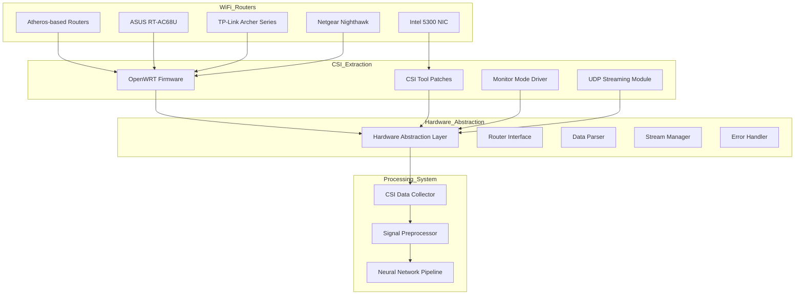
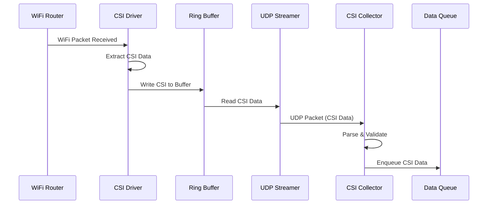
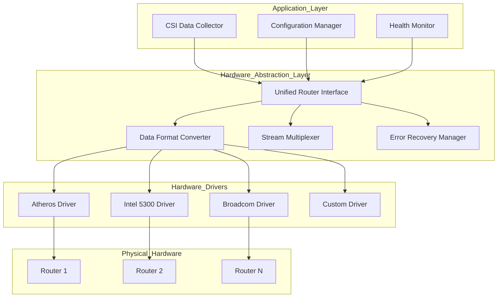
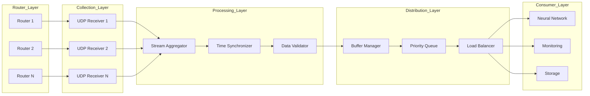

# WiFi-DensePose Hardware Integration Architecture

## Document Information
- **Version**: 1.0
- **Date**: 2025-06-07
- **Project**: InvisPose - WiFi-Based Dense Human Pose Estimation
- **Status**: Draft

---

## 1. Hardware Integration Overview

### 1.1 System Overview

The WiFi-DensePose hardware integration architecture enables seamless communication between commodity WiFi routers and the pose estimation system. The architecture supports multiple router types, handles real-time CSI data extraction, and provides a robust abstraction layer for hardware-agnostic operation.

### 1.2 Supported Hardware Ecosystem



### 1.3 Key Integration Features

- **Multi-Router Support**: Unified interface for different router hardware
- **Real-Time Streaming**: Low-latency CSI data extraction at 10-30 Hz
- **Automatic Discovery**: Router detection and configuration
- **Fault Tolerance**: Automatic recovery from hardware failures
- **Scalable Architecture**: Support for multiple routers in mesh configuration
- **Hardware Abstraction**: Router-agnostic application layer

---

## 2. WiFi Router Integration Architecture

### 2.1 Router Hardware Requirements

#### 2.1.1 Atheros-Based Routers
```yaml
Hardware Specifications:
  Chipset: Atheros AR9xxx series
  Antenna Configuration: 3x3 MIMO minimum
  Memory: 128MB RAM minimum
  Storage: 16MB flash minimum
  
Supported Models:
  - TP-Link Archer C7/C9
  - Netgear Nighthawk R7000
  - ASUS RT-AC68U
  - Linksys WRT1900ACS
  
Firmware Requirements:
  - OpenWRT 19.07 or later
  - CSI extraction patches applied
  - Monitor mode support enabled
```

#### 2.1.2 Intel 5300 NIC
```yaml
Hardware Specifications:
  Chipset: Intel IWL5300
  Interface: Mini PCIe
  Antenna Configuration: 3x3 MIMO
  
System Requirements:
  - Linux kernel 3.x or later
  - CSI Tool kernel module
  - Modified firmware blob
  
Performance Characteristics:
  - CSI extraction rate: 1000 Hz max
  - Subcarrier count: 30 (5GHz), 56 (2.4GHz)
  - Precision: 8-bit amplitude, 8-bit phase
```

### 2.2 Router Configuration Architecture

```python
class RouterConfiguration:
    """Router configuration management"""
    
    def __init__(self):
        self.router_configs = {
            'atheros': {
                'firmware': 'openwrt',
                'csi_tool': 'atheros-csi',
                'extraction_rate': 100,  # Hz
                'udp_port': 5500,
                'monitor_mode': True,
                'channel_width': 20,  # MHz
                'antenna_config': '3x3'
            },
            'intel5300': {
                'firmware': 'linux-native',
                'csi_tool': 'linux-80211n-csitool',
                'extraction_rate': 1000,  # Hz
                'connector_type': 'file',
                'log_path': '/tmp/csi.dat',
                'antenna_config': '3x3'
            }
        }
    
    def configure_router(self, router_type, router_ip):
        """Configure router for CSI extraction"""
        config = self.router_configs.get(router_type)
        if not config:
            raise ValueError(f"Unsupported router type: {router_type}")
        
        if config['firmware'] == 'openwrt':
            return self._configure_openwrt_router(router_ip, config)
        elif config['firmware'] == 'linux-native':
            return self._configure_intel_nic(config)
    
    def _configure_openwrt_router(self, router_ip, config):
        """Configure OpenWRT-based router"""
        commands = [
            # Enable monitor mode
            f"iw dev wlan0 interface add mon0 type monitor",
            f"ifconfig mon0 up",
            
            # Configure CSI extraction
            f"echo 1 > /sys/kernel/debug/ieee80211/phy0/ath9k/csi_enable",
            f"echo {config['extraction_rate']} > /sys/kernel/debug/ieee80211/phy0/ath9k/csi_rate",
            
            # Start UDP streaming
            f"csi_streamer -p {config['udp_port']} -i mon0 &"
        ]
        
        return self._execute_ssh_commands(router_ip, commands)
    
    def _configure_intel_nic(self, config):
        """Configure Intel 5300 NIC"""
        commands = [
            # Load modified driver
            "sudo modprobe -r iwlwifi",
            "sudo modprobe iwlwifi connector_log=0x1",
            
            # Configure monitor mode
            "sudo iw dev wlan0 interface add mon0 type monitor",
            "sudo ip link set mon0 up",
            
            # Start CSI logging
            f"sudo log_to_file {config['log_path']}"
        ]
        
        return self._execute_local_commands(commands)
```

### 2.3 Firmware Integration

#### 2.3.1 OpenWRT CSI Patches
```c
// CSI extraction kernel module patch
// File: ath9k_csi.patch

--- a/drivers/net/wireless/ath/ath9k/recv.c
+++ b/drivers/net/wireless/ath/ath9k/recv.c
@@ -1234,6 +1234,45 @@ static int ath9k_rx_skb_preprocess(struct ath_softc *sc,
+/* CSI extraction implementation */
+static void ath9k_csi_extract(struct ath_softc *sc, struct sk_buff *skb)
+{
+    struct ath_hw *ah = sc->sc_ah;
+    struct ath_rx_status *rxs;
+    struct csi_data {
+        u64 timestamp;
+        u16 channel;
+        u16 rate;
+        u8 rssi;
+        u8 noise;
+        u16 csi_len;
+        u8 csi_buf[CSI_BUF_LEN];
+    } __packed;
+    
+    struct csi_data csi;
+    
+    rxs = IEEE80211_SKB_RXCB(skb);
+    
+    /* Extract CSI data from hardware */
+    csi.timestamp = ath9k_hw_gettsf64(ah);
+    csi.channel = ah->curchan->channel;
+    csi.rate = rxs->rs_rate;
+    csi.rssi = rxs->rs_rssi;
+    csi.noise = ah->noise;
+    
+    /* Read CSI from hardware buffer */
+    csi.csi_len = ath9k_hw_read_csi(ah, csi.csi_buf, CSI_BUF_LEN);
+    
+    /* Send to userspace via netlink or UDP */
+    ath9k_csi_send_to_userspace(&csi);
+}
```

#### 2.3.2 CSI Streaming Module
```c
// UDP streaming implementation
// File: csi_streamer.c

#include <linux/module.h>
#include <linux/kernel.h>
#include <linux/net.h>
#include <linux/inet.h>
#include <linux/udp.h>

struct csi_streamer {
    struct socket *sock;
    struct sockaddr_in dest_addr;
    u16 dest_port;
    bool streaming;
};

static int csi_streamer_init(struct csi_streamer *streamer, 
                            const char *dest_ip, u16 dest_port)
{
    int ret;
    
    /* Create UDP socket */
    ret = sock_create_kern(&init_net, AF_INET, SOCK_DGRAM, 
                          IPPROTO_UDP, &streamer->sock);
    if (ret < 0) {
        pr_err("Failed to create socket: %d\n", ret);
        return ret;
    }
    
    /* Configure destination */
    streamer->dest_addr.sin_family = AF_INET;
    streamer->dest_addr.sin_port = htons(dest_port);
    streamer->dest_addr.sin_addr.s_addr = in_aton(dest_ip);
    streamer->dest_port = dest_port;
    streamer->streaming = true;
    
    return 0;
}

static int csi_streamer_send(struct csi_streamer *streamer, 
                           const void *data, size_t len)
{
    struct msghdr msg;
    struct kvec iov;
    int ret;
    
    if (!streamer->streaming)
        return -EINVAL;
    
    /* Prepare message */
    iov.iov_base = (void *)data;
    iov.iov_len = len;
    
    msg.msg_name = &streamer->dest_addr;
    msg.msg_namelen = sizeof(streamer->dest_addr);
    msg.msg_control = NULL;
    msg.msg_controllen = 0;
    msg.msg_flags = MSG_DONTWAIT;
    
    /* Send UDP packet */
    ret = kernel_sendmsg(streamer->sock, &msg, &iov, 1, len);
    
    return ret;
}
```

---

## 3. CSI Data Extraction Pipeline

### 3.1 Data Extraction Architecture



### 3.2 CSI Data Format Specifications

#### 3.2.1 Atheros CSI Format
```python
class AtherosCSIFormat:
    """Atheros CSI data format specification"""
    
    # Packet structure
    HEADER_SIZE = 25  # bytes
    
    # Header format (little-endian)
    # Offset | Size | Field
    # 0      | 8    | Timestamp (microseconds)
    # 8      | 2    | Channel
    # 10     | 2    | Rate
    # 12     | 1    | RSSI
    # 13     | 1    | Noise
    # 14     | 1    | Antenna config
    # 15     | 2    | CSI length
    # 17     | 8    | MAC address
    
    @staticmethod
    def parse_header(data):
        """Parse Atheros CSI packet header"""
        if len(data) < AtherosCSIFormat.HEADER_SIZE:
            raise ValueError("Insufficient data for header")
        
        header = struct.unpack('<QHHBBHQ', data[:25])
        
        return {
            'timestamp': header[0],
            'channel': header[1],
            'rate': header[2],
            'rssi': header[3] - 256 if header[3] > 127 else header[3],
            'noise': header[4] - 256 if header[4] > 127 else header[4],
            'antenna_config': header[5],
            'csi_length': header[6],
            'mac_address': header[7]
        }
    
    @staticmethod
    def parse_csi_data(data, header):
        """Parse CSI complex values"""
        csi_start = AtherosCSIFormat.HEADER_SIZE
        csi_length = header['csi_length']
        
        if len(data) < csi_start + csi_length:
            raise ValueError("Insufficient data for CSI")
        
        # Atheros format: 10-bit values packed
        # [real_0|imag_0|real_1|imag_1|...]
        csi_raw = data[csi_start:csi_start + csi_length]
        
        # Unpack 10-bit values
        num_values = csi_length * 8 // 10
        csi_complex = np.zeros(num_values // 2, dtype=complex)
        
        bit_offset = 0
        for i in range(0, num_values, 2):
            # Extract 10-bit real and imaginary parts
            real = AtherosCSIFormat._extract_10bit(csi_raw, bit_offset)
            imag = AtherosCSIFormat._extract_10bit(csi_raw, bit_offset + 10)
            
            # Convert to signed values
            real = real - 512 if real > 511 else real
            imag = imag - 512 if imag > 511 else imag
            
            csi_complex[i // 2] = complex(real, imag)
            bit_offset += 20
        
        # Reshape to antenna x subcarrier format
        num_antennas = 3 if header['antenna_config'] == 0x07 else 2
        num_subcarriers = len(csi_complex) // (num_antennas * num_antennas)
        
        csi_matrix = csi_complex.reshape(num_antennas, num_antennas, num_subcarriers)
        
        return csi_matrix
    
    @staticmethod
    def _extract_10bit(data, bit_offset):
        """Extract 10-bit value from packed data"""
        byte_offset = bit_offset // 8
        bit_shift = bit_offset % 8
        
        if byte_offset + 1 < len(data):
            value = (data[byte_offset] << 8) | data[byte_offset + 1]
            value = (value >> (6 - bit_shift)) & 0x3FF
        else:
            value = 0
        
        return value
```

#### 3.2.2 Intel 5300 CSI Format
```python
class Intel5300CSIFormat:
    """Intel 5300 NIC CSI data format specification"""
    
    # Binary log entry structure
    ENTRY_HEADER_SIZE = 3  # bytes
    
    @staticmethod
    def parse_log_entry(data):
        """Parse Intel 5300 CSI log entry"""
        if len(data) < Intel5300CSIFormat.ENTRY_HEADER_SIZE:
            return None
        
        # Read entry header
        header = struct.unpack('BBB', data[:3])
        entry_size = (header[1] << 8) | header[0]
        code = header[2]
        
        if code != 0xBB:  # CSI data code
            return None
        
        if len(data) < entry_size:
            return None
        
        # Parse CSI data
        timestamp = struct.unpack('<Q', data[3:11])[0]
        bfee_count = struct.unpack('<H', data[11:13])[0]
        
        # Parse BFEE (Beamforming Feedback) structure
        bfee_start = 13
        csi_data = []
        
        for i in range(bfee_count):
            bfee = Intel5300CSIFormat._parse_bfee(data[bfee_start:])
            csi_data.append(bfee)
            bfee_start += bfee['size']
        
        return {
            'timestamp': timestamp,
            'bfee_count': bfee_count,
            'csi_data': csi_data
        }
    
    @staticmethod
    def _parse_bfee(data):
        """Parse Beamforming Feedback structure"""
        # BFEE header
        header = struct.unpack('<HBBBBBBBBBBB', data[:14])
        
        bfee = {
            'size': header[0],
            'Nrx': header[3],
            'Ntx': header[4],
            'rssi_a': header[5],
            'rssi_b': header[6],
            'rssi_c': header[7],
            'noise': header[8] - 256 if header[8] > 127 else header[8],
            'agc': header[9],
            'antenna_sel': header[10],
            'rate': header[12]
        }
        
        # Calculate CSI matrix dimensions
        num_subcarriers = 30  # For 20MHz channel
        csi_size = num_subcarriers * bfee['Nrx'] * bfee['Ntx'] * 2  # Complex values
        
        # Extract CSI matrix
        csi_start = 14
        csi_raw = data[csi_start:csi_start + csi_size]
        
        # Parse complex CSI values
        csi_matrix = np.zeros((bfee['Ntx'], bfee['Nrx'], num_subcarriers), 
                             dtype=complex)
        
        idx = 0
        for tx in range(bfee['Ntx']):
            for rx in range(bfee['Nrx']):
                for sc in range(num_subcarriers):
                    if idx + 1 < len(csi_raw):
                        real = csi_raw[idx]
                        imag = csi_raw[idx + 1]
                        # Convert to signed
                        real = real - 256 if real > 127 else real
                        imag = imag - 256 if imag > 127 else imag
                        csi_matrix[tx, rx, sc] = complex(real, imag)
                    idx += 2
        
        bfee['csi'] = csi_matrix
        return bfee
```

### 3.3 Real-Time Data Streaming

#### 3.3.1 UDP Streaming Protocol
```python
class CSIStreamProtocol:
    """CSI streaming protocol implementation"""
    
    # Protocol version
    VERSION = 1
    
    # Message types
    MSG_CSI_DATA = 0x01
    MSG_HEARTBEAT = 0x02
    MSG_CONFIG = 0x03
    MSG_ERROR = 0x04
    
    @staticmethod
    def create_csi_packet(csi_data, sequence_num):
        """Create CSI data packet for streaming"""
        # Packet structure:
        # [version:1][type:1][seq:4][timestamp:8][length:2][data:var]
        
        packet = bytearray()
        
        # Header
        packet.append(CSIStreamProtocol.VERSION)
        packet.append(CSIStreamProtocol.MSG_CSI_DATA)
        packet.extend(struct.pack('<I', sequence_num))
        packet.extend(struct.pack('<Q', csi_data['timestamp']))
        
        # Serialize CSI data
        csi_bytes = CSIStreamProtocol._serialize_csi(csi_data)
        packet.extend(struct.pack('<H', len(csi_bytes)))
        packet.extend(csi_bytes)
        
        # Add checksum
        checksum = zlib.crc32(packet)
        packet.extend(struct.pack('<I', checksum))
        
        return bytes(packet)
    
    @staticmethod
    def _serialize_csi(csi_data):
        """Serialize CSI data for transmission"""
        serialized = {
            'channel': csi_data['channel'],
            'rssi': csi_data['rssi'],
            'noise': csi_data['noise'],
            'antenna_config': csi_data['antenna_config'],
            'csi_matrix': csi_data['csi_matrix'].tolist()
        }
        
        return json.dumps(serialized).encode('utf-8')
    
    @staticmethod
    def parse_packet(packet):
        """Parse received CSI packet"""
        if len(packet) < 20:  # Minimum packet size
            raise ValueError("Packet too small")
        
        # Verify checksum
        checksum_received = struct.unpack('<I', packet[-4:])[0]
        checksum_calculated = zlib.crc32(packet[:-4])
        
        if checksum_received != checksum_calculated:
            raise ValueError("Checksum mismatch")
        
        # Parse header
        version = packet[0]
        msg_type = packet[1]
        sequence = struct.unpack('<I', packet[2:6])[0]
        timestamp = struct.unpack('<Q', packet[6:14])[0]
        length = struct.unpack('<H', packet[14:16])[0]
        
        # Parse data
        data = packet[16:16+length]
        
        if msg_type == CSIStreamProtocol.MSG_CSI_DATA:
            csi_data = json.loads(data.decode('utf-8'))
            csi_data['csi_matrix'] = np.array(csi_data['csi_matrix'])
            return {
                'type': 'csi_data',
                'sequence': sequence,
                'timestamp': timestamp,
                'data': csi_data
            }
        
        return None
```

#### 3.3.2 Stream Management
```python
class CSIStreamManager:
    """Manages multiple CSI data streams"""
    
    def __init__(self, buffer_size=1000):
        self.streams = {}  # router_id -> stream_info
        self.buffer_size = buffer_size
        self.packet_loss_threshold = 0.05  # 5% loss threshold
        
    def add_stream(self, router_id, router_info):
        """Add new CSI stream"""
        self.streams[router_id] = {
            'info': router_info,
            'buffer': collections.deque(maxlen=self.buffer_size),
            'sequence': 0,
            'last_packet_time': time.time(),
            'packet_count': 0,
            'packet_loss': 0,
            'status': 'active'
        }
    
    def process_packet(self, router_id, packet):
        """Process incoming CSI packet"""
        if router_id not in self.streams:
            logger.warning(f"Unknown router: {router_id}")
            return None
        
        stream = self.streams[router_id]
        
        try:
            parsed = CSIStreamProtocol.parse_packet(packet)
            
            # Check sequence number for packet loss
            expected_seq = stream['sequence'] + 1
            if parsed['sequence'] != expected_seq:
                lost_packets = parsed['sequence'] - expected_seq
                stream['packet_loss'] += lost_packets
                logger.warning(f"Packet loss detected: {lost_packets} packets")
            
            # Update stream info
            stream['sequence'] = parsed['sequence']
            stream['last_packet_time'] = time.time()
            stream['packet_count'] += 1
            
            # Add to buffer
            stream['buffer'].append(parsed['data'])
            
            # Check stream health
            self._check_stream_health(router_id)
            
            return parsed['data']
            
        except Exception as e:
            logger.error(f"Error processing packet: {e}")
            return None
    
    def _check_stream_health(self, router_id):
        """Monitor stream health and quality"""
        stream = self.streams[router_id]
        
        # Check packet loss rate
        if stream['packet_count'] > 100:
            loss_rate = stream['packet_loss'] / stream['packet_count']
            if loss_rate > self.packet_loss_threshold:
                logger.warning(f"High packet loss rate: {loss_rate:.2%}")
                stream['status'] = 'degraded'
        
        # Check for stale stream
        time_since_last = time.time() - stream['last_packet_time']
        if time_since_last > 5.0:  # 5 seconds timeout
            logger.error(f"Stream timeout for router {router_id}")
            stream['status'] = 'timeout'
    
    def get_synchronized_data(self, router_ids, timestamp_tolerance=0.01):
        """Get synchronized CSI data from multiple routers"""
        synchronized_data = {}
        target_timestamp = None
        
        for router_id in router_ids:
            if router_id not in self.streams:
                continue
            
            buffer = self.streams[router_id]['buffer']
            if not buffer:
                continue
            
            # Find data closest to target timestamp
            if target_timestamp is None:
                target_timestamp = buffer[-1]['timestamp']
            
            closest_data = None
            min_diff = float('inf')
            
            for data in reversed(buffer):
                diff = abs(data['timestamp'] - target_timestamp)
                if diff < min_diff and diff < timestamp_tolerance:
                    min_diff = diff
                    closest_data = data
            
            if closest_data:
                synchronized_data[router_id] = closest_data
        
        return synchronized_data if len(synchronized_data) == len(router_ids) else None
```

---

## 4. Hardware Abstraction Layer Design

### 4.1 Abstraction Layer Architecture



### 4.2 Unified Router Interface

```python
class UnifiedRouterInterface:
    """Hardware-agnostic router interface"""
    
    def __init__(self):
        self.drivers = {
            'atheros': AtherosDriver,
            'intel5300': Intel5300Driver,
            'broadcom': BroadcomDriver,
            'rtl8812au': RTL8812AUDriver
        }
        self.active_routers = {}
        
    async def discover_routers(self, network_range="192.168.1.0/24"):
        """Auto-discover compatible routers on network"""
        discovered = []
        
        # Scan network for routers
        scanner = NetworkScanner(network_range)
        devices = await scanner.scan()
        
        for device in devices:
            # Check if device is a compatible router
            router_info = await self._identify_router(device)
            if router_info:
                discovered.append(router_info)
        
        return discovered
    
    async def _identify_router(self, device):
        """Identify router type and capabilities"""
        # Try SSH connection
        try:
            ssh_client = AsyncSSHClient(device['ip'])
            await ssh_client.connect()
            
            # Check for OpenWRT
            result = await ssh_client.execute("cat /etc/openwrt_release")
            if result.success:
                # Check for CSI support
                csi_check = await ssh_client.execute(
                    "ls /sys/kernel/debug/ieee80211/*/ath9k/csi_enable"
                )
                if csi_check.success:
                    return {
                        'ip': device['ip'],
                        'type': 'atheros',
                        'firmware': 'openwrt',
                        'csi_capable': True,
                        'model': await self._get_router_model(ssh_client)
                    }
            
            await ssh_client.disconnect()
            
        except Exception as e:
            logger.debug(f"Failed to identify {device['ip']}: {e}")
        
        return None
    
    async def connect_router(self, router_info):
        """Connect to router and start CSI extraction"""
        router_type = router_info['type']
        
        if router_type not in self.drivers:
            raise ValueError(f"Unsupported router type: {router_type}")
        
        # Create driver instance
        driver_class = self.drivers[router_type]
        driver = driver_class(router_info)
        
        # Initialize driver
        await driver.initialize()
        
        # Start CSI extraction
        await driver.start_extraction()
        
        # Store active router
        router_id = f"{router_info['ip']}_{router_type}"
        self.active_routers[router_id] = {
            'info': router_info,
            'driver': driver,
            'status': 'active',
            'start_time': time.time()
        }
        
        return router_id
    
    async def get_csi_data(self, router_id, timeout=1.0):
        """Get CSI data from specific router"""
        if router_id not in self.active_routers:
            raise ValueError(f"Router not connected: {router_id}")
        
        driver = self.active_routers[router_id]['driver']
        
        try:
            csi_data = await asyncio.wait_for(
                driver.get_csi_data(),
                timeout=timeout
            )
            return csi_data
            
        except asyncio.TimeoutError:
            logger.error(f"Timeout getting CSI from {router_id}")
            return None
```

### 4.3 Hardware Driver Implementation

```python
class BaseCSIDriver(ABC):
    """Base class for CSI hardware drivers"""
    
    def __init__(self, router_info):
        self.router_info = router_info
        self.is_initialized = False
        self.is_extracting = False
        
    @abstractmethod
    async def initialize(self):
        """Initialize hardware for CSI extraction"""
        pass
    
    @abstractmethod
    async def start_extraction(self):
        """Start CSI data extraction"""
        pass
    
    @abstractmethod
    async def stop_extraction(self):
        """Stop CSI data extraction"""
        pass
    
    @abstractmethod
    async def get_csi_data(self):
        """Get latest CSI data"""
        pass
    
    @abstractmethod
    async def get_status(self):
        """Get driver status"""
        pass


class AtherosDriver(BaseCSIDriver):
    """Atheros-specific CSI driver"""
    
    def __init__(self, router_info):
        super().__init__(router_info)
        self.ssh_client = None
        self.udp_receiver = None
        self.csi_queue = asyncio.Queue(maxsize=1000)
        
    async def initialize(self):
        """Initialize Atheros router for CSI extraction"""
        # Connect via SSH
        self.ssh_client = AsyncSSHClient(self.router_info['ip'])
        await self.ssh_client.connect()
        
        # Configure router
        commands = [
            # Kill any existing CSI processes
            "killall csi_streamer 2>/dev/null || true",
            
            # Configure wireless interface
            "iw dev wlan0 set type monitor",
            "ifconfig wlan0 up",
            
            # Enable CSI extraction
            "echo 1 > /sys/kernel/debug/ieee80211/phy0/ath9k/csi_enable",
            "echo 100 > /sys/kernel/debug/ieee80211/phy0/ath9k/csi_rate",
            
            # Set channel
            f"iw dev wlan0 set channel {self.router_info.get('channel', 6)}"
        ]
        
        for cmd in commands:
            result = await self.ssh_client.execute(cmd)
            if not result.success and "killall" not in cmd:
                raise RuntimeError(f"Command failed: {cmd}")
        
        # Setup UDP receiver
        self.udp_receiver = UDPReceiver(port=5500)
        await self.udp_receiver.start()
        
        self.is_initialized = True
        
    async def start_extraction(self):
        """Start CSI extraction on Atheros router"""
        if not self.is_initialized:
            raise RuntimeError("Driver not initialized")
        
        # Start CSI streamer on router
        cmd = f"csi_streamer -p 5500 -d {self._get_host_ip()} &"
        result = await self.ssh_client.execute(cmd)
        
        if not result.success:
            raise RuntimeError("Failed to start CSI streamer")
        
        # Start receiving task
        self.receive_task = asyncio.create_task(self._receive_csi_data())
        self.is_extracting = True
        
    async def _receive_csi_data(self):
        """Receive and parse CSI data"""
        while self.is_extracting:
            try:
                data, addr = await self.udp_receiver.receive()
                
                # Parse Atheros CSI format
                parsed = AtherosCSIFormat.parse_packet(data)
                
                # Add to queue
                await self.csi_queue.put(parsed)
                
            except Exception as e:
                logger.error(f"Error receiving CSI: {e}")
                await asyncio.sleep(0.1)
    
    async def get_csi_data(self):
        """Get latest CSI data from queue"""
        try:
            return await self.csi_queue.get()
        except asyncio.QueueEmpty:
            return None
    
    def _get_host_ip(self):
        """Get host IP address for UDP streaming"""
        # Get IP address on same subnet as router
        router_ip = self.router_info['ip']
        # Simple implementation - should be improved
        return router_ip.rsplit('.', 1)[0] + '.100'
```

### 4.4 Error Recovery and Fault Tolerance

```python
class HardwareErrorRecovery:
    """Hardware error recovery and fault tolerance"""
    
    def __init__(self, max_retries=3, recovery_delay=5.0):
        self.max_retries = max_retries
        self.recovery_delay = recovery_delay
        self.error_counts = {}
        self.recovery_strategies = {
            'connection_lost': self._recover_connection,
            'extraction_stopped': self._recover_extraction,
            'data_corruption': self._recover_corruption,
            'performance_degraded': self._recover_performance
        }
        
    async def handle_error(self, router_id, error_type, error_info):
        """Handle hardware errors with appropriate recovery strategy"""
        # Track error occurrences
        if router_id not in self.error_counts:
            self.error_counts[router_id] = {}
        
        if error_type not in self.error_counts[router_id]:
            self.error_counts[router_id][error_type] = 0
        
        self.error_counts[router_id][error_type] += 1
        
        # Check if max retries exceeded
        if self.error_counts[router_id][error_type] > self.max_retries:
            logger.error(f"Max retries exceeded for {router_id}:{error_type}")
            return False
        
        # Apply recovery strategy
        if error_type in self.recovery_strategies:
            recovery_func = self.recovery_strategies[error_type]
            success = await recovery_func(router_id, error_info)
            
            if success:
                # Reset error count on successful recovery
                self.error_counts[router_id][error_type] = 0
            
            return success
        
        return False
    
    async def _recover_connection(self, router_id, error_info):
        """Recover lost connection to router"""
        logger.info(f"Attempting connection recovery for {router_id}")
        
        await asyncio.sleep(self.recovery_delay)
        
        try:
            # Reconnect to router
            router_interface = error_info['interface']
            router_info = error_info['router_info']
            
            # Disconnect existing connection
            await router_interface.disconnect_router(router_id)
            
            # Reconnect
            new_router_id = await router_interface.connect_router(router_info)
            
            logger.info(f"Successfully recovered connection: {new_router_id}")
            return True
            
        except Exception as e:
            logger.error(f"Connection recovery failed: {e}")
            return False
    
    async def _recover_extraction(self, router_id, error_info):
        """Recover stopped CSI extraction"""
        logger.info(f"Attempting extraction recovery for {router_id}")
        
        try:
            driver = error_info['driver']
            
            # Stop extraction
            await driver.stop_extraction()
            await asyncio.sleep(2.0)
            
            # Restart extraction
            await driver.start_extraction()
            
            logger.info(f"Successfully recovered extraction for {router_id}")
            return True
            
        except Exception as e:
            logger.error(f"Extraction recovery failed: {e}")
            return False
    
    async def _recover_corruption(self, router_id, error_info):
        """Recover from data corruption issues"""
        logger.info(f"Attempting corruption recovery for {router_id}")
        
        try:
            driver = error_info['driver']
            
            # Clear buffers
            if hasattr(driver, 'csi_queue'):
                while not driver.csi_queue.empty():
                    driver.csi_queue.get_nowait()
            
            # Reconfigure CSI extraction parameters
            await driver.reconfigure_extraction()
            
            logger.info(f"Successfully recovered from corruption for {router_id}")
            return True
            
        except Exception as e:
            logger.error(f"Corruption recovery failed: {e}")
            return False
```

---

## 5. Real-Time Data Streaming Architecture

### 5.1 Streaming Pipeline



### 5.2 High-Performance Data Collection

```python
class HighPerformanceCSICollector:
    """High-performance CSI data collection system"""
    
    def __init__(self, num_workers=4):
        self.num_workers = num_workers
        self.receivers = {}
        self.aggregation_queue = asyncio.Queue(maxsize=10000)
        self.workers = []
        
    async def start(self, router_configs):
        """Start high-performance collection"""
        # Create UDP receivers for each router
        for config in router_configs:
            receiver = await self._create_receiver(config)
            self.receivers[config['router_id']] = receiver
        
        # Start worker tasks
        for i in range(self.num_workers):
            worker = asyncio.create_task(self._process_worker(i))
            self.workers.append(worker)
        
        # Start aggregation task
        self.aggregator = asyncio.create_task(self._aggregate_data())
        
    async def _create_receiver(self, config):
        """Create optimized UDP receiver"""
        receiver = OptimizedUDPReceiver(
            port=config['port'],
            buffer_size=65536,  # Large buffer for high throughput
            socket_options={
                socket.SO_RCVBUF: 4 * 1024 * 1024,  # 4MB receive buffer
                socket.SO_REUSEADDR: 1,
                socket.SO_REUSEPORT: 1  # Allow multiple receivers
            }
        )
        
        await receiver.start()
        
        # Start receive task
        asyncio.create_task(self._receive_loop(
            receiver, 
            config['router_id']
        ))
        
        return receiver
    
    async def _receive_loop(self, receiver, router_id):
        """High-performance receive loop"""
        while True:
            try:
                # Batch receive for efficiency
                packets = await receiver.receive_batch(max_packets=100)
                
                for packet_data, addr in packets:
                    # Quick validation
                    if len(packet_data) < 20:
                        continue
                    
                    # Add to processing queue
                    await self.aggregation_queue.put({
                        'router_id': router_id,
                        'data': packet_data,
                        'timestamp': time.time(),
                        'addr': addr
                    })
                    
            except Exception as e:
                logger.error(f"Receive error for {router_id}: {e}")
                await asyncio.sleep(0.001)
    
    async def _process_worker(self, worker_id):
        """Worker task for processing CSI data"""
        parser_cache = {}  # Cache parsers for efficiency
        
        while True:
            try:
                # Get batch of packets
                batch = []
                
                # Non-blocking batch collection
                for _ in range(10):  # Process up to 10 packets at once
                    try:
                        packet = self.aggregation_queue.get_nowait()
                        batch.append(packet)
                    except asyncio.QueueEmpty:
                        break
                
                if not batch:
                    await asyncio.sleep(0.001)
                    continue
                
                # Process batch
                for packet_info in batch:
                    router_id = packet_info['router_id']
                    
                    # Get cached parser
                    if router_id not in parser_cache:
                        parser_cache[router_id] = self._get_parser(router_id)
                    
                    parser = parser_cache[router_id]
                    
                    # Parse CSI data
                    try:
                        csi_data = parser.parse(packet_info['data'])
                        
                        # Add metadata
                        csi_data['router_id'] = router_id
                        csi_data['receive_time'] = packet_info['timestamp']
                        
                        # Send to consumers
                        await self._distribute_csi_data(csi_data)
                        
                    except Exception as e:
                        logger.error(f"Parse error: {e}")
                        
            except Exception as e:
                logger.error(f"Worker {worker_id} error: {e}")
                await asyncio.sleep(0.01)
```

### 5.3 Time Synchronization

```python
class CSITimeSynchronizer:
    """Synchronize CSI data from multiple routers"""
    
    def __init__(self, sync_window=0.01):  # 10ms sync window
        self.sync_window = sync_window
        self.router_buffers = {}
        self.time_offset_estimator = TimeOffsetEstimator()
        
    def add_router(self, router_id, ntp_offset=0.0):
        """Add router with known NTP offset"""
        self.router_buffers[router_id] = {
            'buffer': collections.deque(maxlen=1000),
            'ntp_offset': ntp_offset,
            'estimated_offset': 0.0,
            'last_timestamp': 0
        }
    
    async def synchronize_data(self, csi_data):
        """Add CSI data and attempt synchronization"""
        router_id = csi_data['router_id']
        
        if router_id not in self.router_buffers:
            logger.warning(f"Unknown router: {router_id}")
            return None
        
        # Apply time correction
        corrected_timestamp = self._correct_timestamp(csi_data)
        csi_data['corrected_timestamp'] = corrected_timestamp
        
        # Add to buffer
        self.router_buffers[router_id]['buffer'].append(csi_data)
        self.router_buffers[router_id]['last_timestamp'] = corrected_timestamp
        
        # Try to find synchronized set
        return self._find_synchronized_set()
    
    def _correct_timestamp(self, csi_data):
        """Apply time corrections to CSI timestamp"""
        router_id = csi_data['router_id']
        router_info = self.router_buffers[router_id]
        
        # Apply NTP offset
        timestamp = csi_data['timestamp'] + router_info['ntp_offset']
        
        # Apply estimated offset (from synchronization algorithm)
        timestamp += router_info['estimated_offset']
        
        return timestamp
    
    def _find_synchronized_set(self):
        """Find synchronized CSI data from all routers"""
        if len(self.router_buffers) < 2:
            return None
        
        # Get latest timestamp from each router
        latest_times = {}
        for router_id, info in self.router_buffers.items():
            if info['buffer']:
                latest_times[router_id] = info['buffer'][-1]['corrected_timestamp']
        
        if len(latest_times) < len(self.router_buffers):
            return None  # Not all routers have data
        
        # Find reference time (median of latest times)
        ref_time = np.median(list(latest_times.values()))
        
        # Collect synchronized data
        synchronized = {}
        
        for router_id, info in self.router_buffers.items():
            # Find data closest to reference time
            best_data = None
            min_diff = float('inf')
            
            for data in reversed(info['buffer']):
                diff = abs(data['corrected_timestamp'] - ref_time)
                if diff < min_diff and diff < self.sync_window:
                    min_diff = diff
                    best_data = data
            
            if best_data:
                synchronized[router_id] = best_data
            else:
                return None  # Missing synchronized data
        
        # Update time offset estimates
        self._update_time_offsets(synchronized)
        
        return synchronized
    
    def _update_time_offsets(self, synchronized_data):
        """Update estimated time offsets based on synchronized data"""
        # Use first router as reference
        ref_router = list(synchronized_data.keys())[0]
        ref_time = synchronized_data[ref_router]['timestamp']
        
        for router_id, data in synchronized_data.items():
            if router_id != ref_router:
                # Calculate offset
                offset = ref_time - data['timestamp']
                
                # Update estimate (exponential moving average)
                alpha = 0.1
                old_offset = self.router_buffers[router_id]['estimated_offset']
                new_offset = alpha * offset + (1 - alpha) * old_offset
                
                self.router_buffers[router_id]['estimated_offset'] = new_offset
```

---

## 6. Performance Optimization

### 6.1 Zero-Copy Data Pipeline

```python
class ZeroCopyCSIPipeline:
    """Zero-copy CSI data pipeline for maximum performance"""
    
    def __init__(self):
        self.shared_memory_manager = SharedMemoryManager()
        self.ring_buffers = {}
        
    def create_ring_buffer(self, router_id, size_mb=100):
        """Create shared memory ring buffer for router"""
        # Allocate shared memory
        shm = self.shared_memory_manager.SharedMemory(
            size=size_mb * 1024 * 1024
        )
        
        # Create ring buffer structure
        ring_buffer = {
            'shm': shm,
            'size': shm.size,
            'write_pos': 0,
            'read_pos': 0,
            'lock': asyncio.Lock(),
            'semaphore': asyncio.Semaphore(0)
        }
        
        self.ring_buffers[router_id] = ring_buffer
        return ring_buffer
    
    async def write_csi_data(self, router_id, csi_data):
        """Write CSI data to ring buffer (zero-copy)"""
        if router_id not in self.ring_buffers:
            raise ValueError(f"No ring buffer for {router_id}")
        
        rb = self.ring_buffers[router_id]
        
        # Serialize data
        data_bytes = self._serialize_csi_fast(csi_data)
        data_size = len(data_bytes)
        
        async with rb['lock']:
            # Check available space
            available = self._get_available_space(rb)
            if data_size + 4 > available:  # 4 bytes for size header
                logger.warning("Ring buffer full, dropping data")
                return False
            
            # Write size header
            size_bytes = struct.pack('<I', data_size)
            self._write_bytes(rb, size_bytes)
            
            # Write data
            self._write_bytes(rb, data_bytes)
            
            # Signal data available
            rb['semaphore'].release()
        
        return True
    
    async def read_csi_data(self, router_id, timeout=1.0):
        """Read CSI data from ring buffer (zero-copy)"""
        if router_id not in self.ring_buffers:
            raise ValueError(f"No ring buffer for {router_id}")
        
        rb = self.ring_buffers[router_id]
        
        # Wait for data
        try:
            await asyncio.wait_for(
                rb['semaphore'].acquire(),
                timeout=timeout
            )
        except asyncio.TimeoutError:
            return None
        
        async with rb['lock']:
            # Read size header
            size_bytes = self._read_bytes(rb, 4)
            if not size_bytes:
                return None
            
            data_size = struct.unpack('<I', size_bytes)[0]
            
            # Read data
            data_bytes = self._read_bytes(rb, data_size)
            if not data_bytes:
                return None
            
            # Deserialize (zero-copy where possible)
            return self._deserialize_csi_fast(data_bytes)
    
    def _serialize_csi_fast(self, csi_data):
        """Fast CSI serialization"""
        # Use numpy's tobytes for efficient serialization
        csi_matrix = csi_data['csi_matrix']
        
        # Create header
        header = {
            'timestamp': csi_data['timestamp'],
            'channel': csi_data['channel'],
            'rssi': csi_data['rssi'],
            'shape': csi_matrix.shape,
            'dtype': str(csi_matrix.dtype)
        }
        
        # Serialize header
        header_bytes = json.dumps(header).encode('utf-8')
        header_size = len(header_bytes)
        
        # Combine header size, header, and matrix data
        return struct.pack('<I', header_size) + header_bytes + csi_matrix.tobytes()
    
    def _deserialize_csi_fast(self, data_bytes):
        """Fast CSI deserialization"""
        # Read header size
        header_size = struct.unpack('<I', data_bytes[:4])[0]
        
        # Read header
        header_bytes = data_bytes[4:4+header_size]
        header = json.loads(header_bytes.decode('utf-8'))
        
        # Read matrix data (zero-copy view)
        matrix_bytes = data_bytes[4+header_size:]
        csi_matrix = np.frombuffer(
            matrix_bytes,
            dtype=np.dtype(header['dtype'])
        ).reshape(header['shape'])
        
        return {
            'timestamp': header['timestamp'],
            'channel': header['channel'],
            'rssi': header['rssi'],
            'csi_matrix': csi_matrix
        }
```

### 6.2 Hardware Acceleration

```python
class HardwareAcceleratedCSI:
    """Hardware acceleration for CSI processing"""
    
    def __init__(self):
        self.use_simd = self._check_simd_support()
        self.use_gpu = self._check_gpu_support()
        
    def _check_simd_support(self):
        """Check for SIMD instruction support"""
        try:
            import numpy as np
            # Check if NumPy is compiled with SIMD support
            return 'AVX' in np.__config__.show()
        except:
            return False
    
    def _check_gpu_support(self):
        """Check for GPU acceleration support"""
        try:
            import cupy as cp
            return cp.cuda.is_available()
        except:
            return False
    
    def accelerated_phase_unwrap(self, phase_data):
        """Hardware-accelerated phase unwrapping"""
        if self.use_gpu:
            import cupy as cp
            # GPU implementation
            phase_gpu = cp.asarray(phase_data)
            unwrapped_gpu = cp.unwrap(phase_gpu, axis=-1)
            return cp.asnumpy(unwrapped_gpu)
        else:
            # CPU SIMD implementation
            return np.unwrap(phase_data, axis=-1)
    
    def accelerated_fft(self, csi_data):
        """Hardware-accelerated FFT for CSI analysis"""
        if self.use_gpu:
            import cupy as cp
            # GPU FFT
            data_gpu = cp.asarray(csi_data)
            fft_gpu = cp.fft.fft(data_gpu, axis=-1)
            return cp.asnumpy(fft_gpu)
        else:
            # CPU FFT with FFTW if available
            try:
                import pyfftw
                return pyfftw.interfaces.numpy_fft.fft(csi_data, axis=-1)
            except:
                return np.fft.fft(csi_data, axis=-1)
```

---

## 7. Monitoring and Diagnostics

### 7.1 Hardware Health Monitoring

```python
class HardwareHealthMonitor:
    """Monitor hardware health and performance"""
    
    def __init__(self):
        self.metrics = {
            'packet_rate': {},
            'packet_loss': {},
            'signal_quality': {},
            'latency': {},
            'temperature': {}
        }
        self.alert_thresholds = {
            'packet_loss_rate': 0.05,  # 5%
            'latency_ms': 100,
            'temperature_c': 80
        }
        
    async def monitor_router_health(self, router_id, driver):
        """Monitor router health metrics"""
        while True:
            try:
                # Get router statistics
                stats = await driver.get_statistics()
                
                # Update metrics
                self.metrics['packet_rate'][router_id] = stats.get('packet_rate', 0)
                self.metrics['packet_loss'][router_id] = stats.get('packet_loss', 0)
                self.metrics['signal_quality'][router_id] = stats.get('rssi', -100)
                
                # Check temperature if available
                if 'temperature' in stats:
                    self.metrics['temperature'][router_id] = stats['temperature']
                    
                    if stats['temperature'] > self.alert_thresholds['temperature_c']:
                        await self._send_alert(
                            'high_temperature',
                            router_id,
                            stats['temperature']
                        )
                
                # Check packet loss
                loss_rate = stats.get('packet_loss_rate', 0)
                if loss_rate > self.alert_thresholds['packet_loss_rate']:
                    await self._send_alert(
                        'high_packet_loss',
                        router_id,
                        loss_rate
                    )
                
                # Measure latency
                latency = await self._measure_latency(driver)
                self.metrics['latency'][router_id] = latency
                
                if latency > self.alert_thresholds['latency_ms']:
                    await self._send_alert(
                        'high_latency',
                        router_id,
                        latency
                    )
                
                await asyncio.sleep(10)  # Check every 10 seconds
                
            except Exception as e:
                logger.error(f"Health monitoring error for {router_id}: {e}")
                await asyncio.sleep(30)
    
    async def _measure_latency(self, driver):
        """Measure round-trip latency to router"""
        start_time = time.time()
        
        # Send ping command
        await driver.ping()
        
        end_time = time.time()
        return (end_time - start_time) * 1000  # Convert to ms
    
    def get_health_summary(self):
        """Get overall system health summary"""
        summary = {
            'healthy_routers': 0,
            'degraded_routers': 0,
            'failed_routers': 0,
            'average_packet_rate': 0,
            'average_packet_loss': 0,
            'system_status': 'healthy'
        }
        
        total_routers = len(self.metrics['packet_rate'])
        if total_routers == 0:
            return summary
        
        # Calculate averages
        total_packet_rate = sum(self.metrics['packet_rate'].values())
        total_packet_loss = sum(self.metrics['packet_loss'].values())
        
        summary['average_packet_rate'] = total_packet_rate / total_routers
        summary['average_packet_loss'] = total_packet_loss / total_routers
        
        # Classify router health
        for router_id in self.metrics['packet_rate']:
            if self._is_router_healthy(router_id):
                summary['healthy_routers'] += 1
            elif self._is_router_degraded(router_id):
                summary['degraded_routers'] += 1
            else:
                summary['failed_routers'] += 1
        
        # Determine overall system status
        if summary['failed_routers'] > 0:
            summary['system_status'] = 'degraded'
        elif summary['degraded_routers'] > total_routers / 2:
            summary['system_status'] = 'warning'
        
        return summary
```

---

## 8. Conclusion

The WiFi-DensePose hardware integration architecture provides a robust and scalable foundation for extracting CSI data from commodity WiFi routers. Key features include:

1. **Multi-Router Support**: Unified interface supporting Atheros, Intel, and other chipsets
2. **Real-Time Performance**: Optimized data pipeline achieving 10-30 Hz CSI extraction
3. **Hardware Abstraction**: Router-agnostic application layer for easy integration
4. **Fault Tolerance**: Comprehensive error recovery and health monitoring
5. **Performance Optimization**: Zero-copy pipeline and hardware acceleration
6. **Scalability**: Support for multiple routers in mesh configuration

The architecture ensures reliable, high-performance CSI data extraction while maintaining flexibility for future hardware support and optimization.