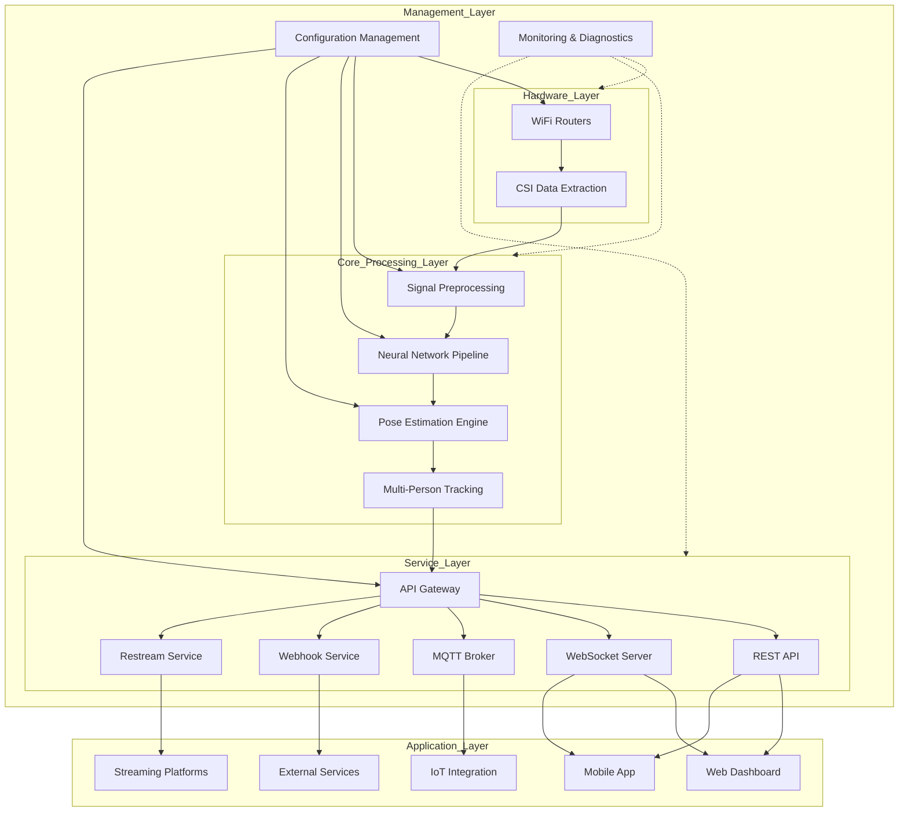
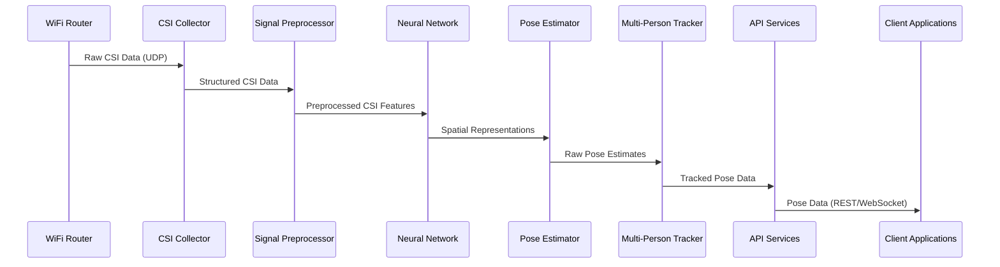
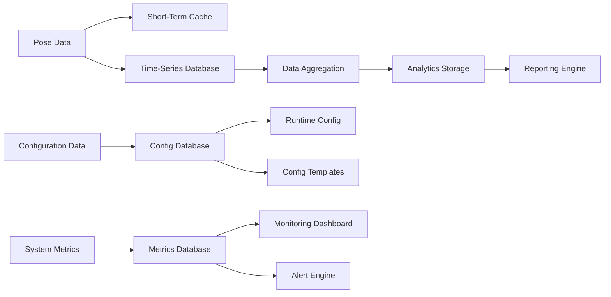
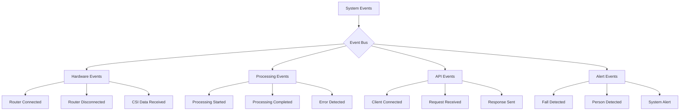
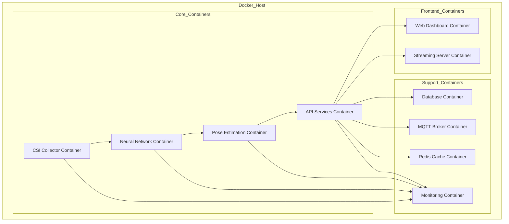
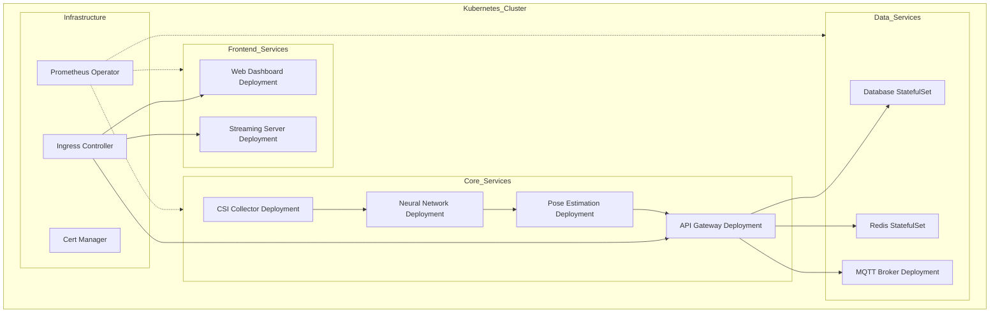
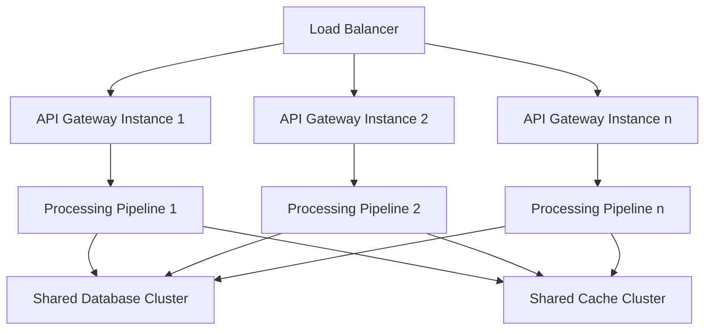
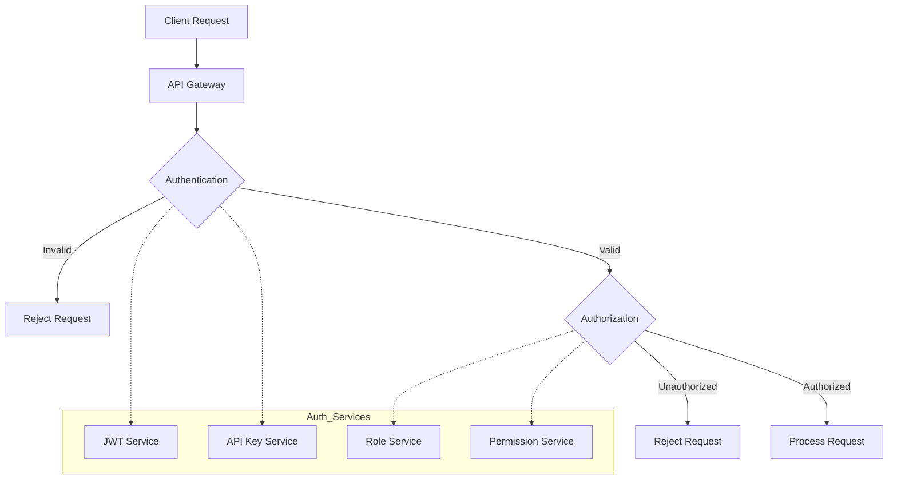
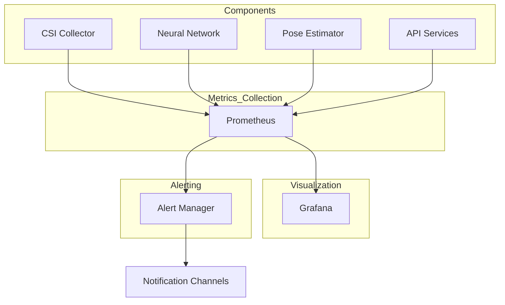
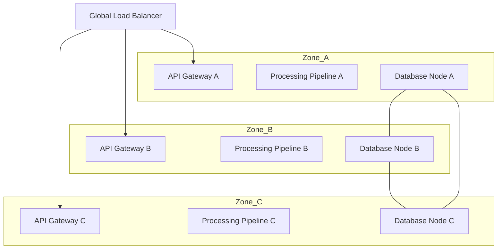

# WiFi-DensePose System Architecture

## Document Information
- **Version**: 1.0
- **Date**: 2025-06-07
- **Project**: InvisPose - WiFi-Based Dense Human Pose Estimation
- **Status**: Draft

---

## 1. High-Level System Design

### 1.1 System Overview

WiFi-DensePose is a revolutionary privacy-preserving human pose estimation system that transforms commodity WiFi infrastructure into a powerful human sensing platform. The system processes WiFi Channel State Information (CSI) through specialized neural networks to achieve real-time human pose estimation with 87.2% accuracy without using cameras or optical sensors.

### 1.2 Architecture Diagram



### 1.3 Key System Characteristics

- **Privacy-Preserving**: No cameras or optical sensors, ensuring complete privacy
- **Real-Time Processing**: End-to-end latency under 100ms
- **Through-Wall Detection**: Ability to detect human poses through walls and obstacles
- **Multi-Person Tracking**: Support for up to 5 individuals simultaneously
- **Scalable Architecture**: Modular design supporting various deployment scenarios
- **Domain-Specific Analytics**: Specialized analytics for healthcare, retail, and security domains

---

## 2. Component Breakdown and Responsibilities

### 2.1 Hardware Interface Layer

#### 2.1.1 WiFi Router Interface
- **Responsibility**: Establish and maintain communication with WiFi routers
- **Functions**:
  - Configure routers for CSI extraction
  - Manage connection lifecycle
  - Handle router failures and reconnections
  - Support multiple router types (Atheros, Intel, ASUS)

#### 2.1.2 CSI Data Collector
- **Responsibility**: Extract and collect CSI data from WiFi routers
- **Functions**:
  - Receive UDP data streams from routers
  - Parse CSI packet formats
  - Buffer incoming data
  - Synchronize multiple data streams
  - Handle packet loss and corruption

### 2.2 Core Processing Layer

#### 2.2.1 Signal Preprocessor
- **Responsibility**: Clean and normalize raw CSI data
- **Functions**:
  - Phase unwrapping
  - Amplitude normalization
  - Temporal filtering
  - Background subtraction
  - Noise reduction
  - Environmental calibration

#### 2.2.2 Neural Network Pipeline
- **Responsibility**: Transform CSI data into human pose estimates
- **Functions**:
  - Modality translation (CSI to spatial representation)
  - Feature extraction
  - DensePose estimation
  - Confidence scoring
  - Batch processing optimization

#### 2.2.3 Pose Estimation Engine
- **Responsibility**: Orchestrate end-to-end processing pipeline
- **Functions**:
  - Coordinate data flow between components
  - Manage processing queues
  - Optimize resource allocation
  - Handle error recovery
  - Maintain processing performance

#### 2.2.4 Multi-Person Tracker
- **Responsibility**: Track multiple individuals across time
- **Functions**:
  - Person detection and ID assignment
  - Trajectory tracking and prediction
  - Occlusion handling
  - Track management (creation, updating, termination)
  - Temporal consistency enforcement

### 2.3 Service Layer

#### 2.3.1 API Gateway
- **Responsibility**: Provide unified access point for all services
- **Functions**:
  - Request routing
  - Load balancing
  - Authentication and authorization
  - Rate limiting
  - Request/response transformation
  - API versioning

#### 2.3.2 REST API Service
- **Responsibility**: Provide HTTP-based access to system functionality
- **Functions**:
  - Pose data access (current and historical)
  - System control (start, stop, status)
  - Configuration management
  - Analytics and reporting
  - Domain-specific endpoints

#### 2.3.3 WebSocket Server
- **Responsibility**: Enable real-time data streaming
- **Functions**:
  - Connection management
  - Subscription handling
  - Real-time pose data streaming
  - System status updates
  - Alert notifications

#### 2.3.4 External Integration Services
- **Responsibility**: Connect with external systems and platforms
- **Functions**:
  - MQTT publishing for IoT integration
  - Webhook delivery for event notifications
  - Restream integration for live broadcasting
  - Third-party API integration

### 2.4 Management Layer

#### 2.4.1 Configuration Management
- **Responsibility**: Manage system configuration and settings
- **Functions**:
  - Configuration storage and retrieval
  - Template management
  - Validation and verification
  - Dynamic configuration updates
  - Environment-specific settings

#### 2.4.2 Monitoring and Diagnostics
- **Responsibility**: Monitor system health and performance
- **Functions**:
  - Performance metrics collection
  - Resource utilization monitoring
  - Error detection and reporting
  - Logging and audit trails
  - Alerting and notifications

---

## 3. Data Flow Architecture

### 3.1 Primary Data Flow



### 3.2 Data Processing Stages

#### 3.2.1 CSI Data Acquisition
- **Input**: Raw WiFi signals from router antennas
- **Processing**: Packet parsing, buffering, synchronization
- **Output**: Structured CSI data (amplitude and phase)
- **Data Rate**: 10-30 Hz sampling rate
- **Data Volume**: ~100 KB/s per router

#### 3.2.2 Signal Preprocessing
- **Input**: Structured CSI data
- **Processing**: Phase unwrapping, filtering, normalization
- **Output**: Clean, normalized CSI features
- **Transformation**: Noise reduction, background removal
- **Quality Metrics**: Signal-to-noise ratio improvement

#### 3.2.3 Neural Network Inference
- **Input**: Preprocessed CSI features
- **Processing**: Deep learning inference
- **Output**: Spatial representations and pose estimates
- **Performance**: <50ms inference time on GPU
- **Accuracy**: 87.2% AP@50 under optimal conditions

#### 3.2.4 Multi-Person Tracking
- **Input**: Raw pose estimates
- **Processing**: ID assignment, trajectory prediction
- **Output**: Consistent tracked poses with IDs
- **Features**: Occlusion handling, track continuity
- **Capacity**: Up to 5 simultaneous persons

#### 3.2.5 API Distribution
- **Input**: Tracked pose data
- **Processing**: Formatting, serialization, streaming
- **Output**: REST responses, WebSocket messages, MQTT publications
- **Performance**: <10ms API response generation
- **Throughput**: Support for 100+ concurrent clients

### 3.3 Data Storage Flow



---

## 4. Service Boundaries and Interfaces

### 4.1 Component Interface Definitions

#### 4.1.1 Hardware Interface Layer Boundaries
- **External Interfaces**:
  - UDP socket interface for CSI data reception
  - Router configuration interface
- **Internal Interfaces**:
  - CSI data queue for preprocessor
  - Router status events for monitoring

#### 4.1.2 Core Processing Layer Boundaries
- **External Interfaces**:
  - Configuration API for parameter tuning
  - Metrics API for performance monitoring
- **Internal Interfaces**:
  - Preprocessed data queue for neural network
  - Pose estimation queue for tracker
  - Event bus for system status updates

#### 4.1.3 Service Layer Boundaries
- **External Interfaces**:
  - REST API endpoints for clients
  - WebSocket interface for real-time streaming
  - MQTT topics for IoT integration
  - Webhook endpoints for event notifications
- **Internal Interfaces**:
  - Pose data access interface
  - Authentication and authorization service
  - Rate limiting and throttling service

### 4.2 API Contracts

#### 4.2.1 Internal API Contracts
- **CSI Collector → Signal Preprocessor**:
  ```typescript
  interface CSIData {
    timestamp: number;
    routerId: string;
    amplitude: Float32Array[][];
    phase: Float32Array[][];
    rssi: number;
    metadata: Record<string, any>;
  }
  ```

- **Neural Network → Pose Estimator**:
  ```typescript
  interface SpatialRepresentation {
    features: Float32Array[][][];
    confidence: number;
    timestamp: number;
    processingTime: number;
  }
  ```

- **Pose Estimator → Multi-Person Tracker**:
  ```typescript
  interface PoseEstimate {
    keypoints: Array<{x: number, y: number, confidence: number}>;
    boundingBox: {x: number, y: number, width: number, height: number};
    confidence: number;
    timestamp: number;
  }
  ```

#### 4.2.2 External API Contracts
- See API Architecture document for detailed external API contracts

### 4.3 Event-Driven Communication



---

## 5. Deployment Architecture

### 5.1 Docker Container Architecture



### 5.2 Container Specifications

#### 5.2.1 Core Containers
- **CSI Collector Container**:
  - Base Image: Python 3.9-slim
  - Resources: 1 CPU core, 1GB RAM
  - Volumes: Configuration volume
  - Network: Host network for UDP reception
  - Restart Policy: Always

- **Neural Network Container**:
  - Base Image: NVIDIA CUDA 11.6 + Python 3.9
  - Resources: 2 CPU cores, 4GB RAM, 1 GPU
  - Volumes: Model volume, shared data volume
  - Network: Internal network
  - Restart Policy: Always

- **Pose Estimation Container**:
  - Base Image: Python 3.9-slim
  - Resources: 2 CPU cores, 2GB RAM
  - Volumes: Shared data volume
  - Network: Internal network
  - Restart Policy: Always

- **API Services Container**:
  - Base Image: Python 3.9-slim
  - Resources: 2 CPU cores, 2GB RAM
  - Volumes: Configuration volume
  - Network: Internal and external networks
  - Ports: 8000 (REST), 8001 (WebSocket)
  - Restart Policy: Always

#### 5.2.2 Support Containers
- **Database Container**:
  - Base Image: TimescaleDB (PostgreSQL extension)
  - Resources: 2 CPU cores, 4GB RAM
  - Volumes: Persistent data volume
  - Network: Internal network
  - Restart Policy: Always

- **MQTT Broker Container**:
  - Base Image: Eclipse Mosquitto
  - Resources: 1 CPU core, 1GB RAM
  - Volumes: Configuration volume
  - Network: Internal and external networks
  - Ports: 1883 (MQTT), 8883 (MQTT over TLS)
  - Restart Policy: Always

- **Redis Cache Container**:
  - Base Image: Redis Alpine
  - Resources: 1 CPU core, 2GB RAM
  - Volumes: Persistent data volume
  - Network: Internal network
  - Restart Policy: Always

- **Monitoring Container**:
  - Base Image: Prometheus + Grafana
  - Resources: 1 CPU core, 2GB RAM
  - Volumes: Persistent data volume
  - Network: Internal network
  - Ports: 9090 (Prometheus), 3000 (Grafana)
  - Restart Policy: Always

### 5.3 Kubernetes Deployment Architecture



### 5.4 Deployment Configurations

#### 5.4.1 Development Environment
- **Deployment Method**: Docker Compose
- **Infrastructure**: Local development machine
- **Scaling**: Single instance of each container
- **Data Persistence**: Local volumes
- **Monitoring**: Basic logging and metrics

#### 5.4.2 Testing Environment
- **Deployment Method**: Kubernetes (minikube or kind)
- **Infrastructure**: Dedicated test server
- **Scaling**: Single instance with realistic data
- **Data Persistence**: Ephemeral with test datasets
- **Monitoring**: Full monitoring stack for performance testing

#### 5.4.3 Production Environment
- **Deployment Method**: Kubernetes
- **Infrastructure**: Cloud provider or on-premises cluster
- **Scaling**: Multiple instances with auto-scaling
- **Data Persistence**: Managed database services or persistent volumes
- **Monitoring**: Comprehensive monitoring, alerting, and logging
- **High Availability**: Multi-zone deployment with redundancy

#### 5.4.4 Edge Deployment
- **Deployment Method**: Docker or K3s
- **Infrastructure**: Edge devices with GPU capability
- **Scaling**: Resource-constrained single instance
- **Data Persistence**: Local storage with cloud backup
- **Monitoring**: Lightweight monitoring with cloud reporting
- **Connectivity**: Offline operation capability with sync

---

## 6. Scalability and Performance Architecture

### 6.1 Horizontal Scaling Strategy



### 6.2 Vertical Scaling Considerations
- **Neural Network Container**: GPU memory is the primary constraint
- **Database Container**: I/O performance and memory for time-series data
- **API Services Container**: CPU cores for concurrent request handling
- **CSI Collector Container**: Network I/O for multiple router streams

### 6.3 Performance Optimization Points
- **Batch Processing**: Neural network inference batching
- **Caching Strategy**: Multi-level caching for API responses
- **Database Indexing**: Optimized indexes for time-series queries
- **Connection Pooling**: Database and service connection reuse
- **Asynchronous Processing**: Non-blocking I/O throughout the system
- **Resource Allocation**: Right-sizing containers for workloads

---

## 7. Security Architecture

### 7.1 Authentication and Authorization



### 7.2 Data Protection
- **In Transit**: TLS 1.3 for all external communications
- **At Rest**: Database encryption for sensitive data
- **Processing**: Memory protection and secure coding practices
- **Privacy**: Data minimization and anonymization by design

### 7.3 Network Security
- **API Gateway**: Single entry point with security controls
- **Network Segmentation**: Internal services not directly accessible
- **Firewall Rules**: Restrictive inbound/outbound rules
- **Rate Limiting**: Protection against abuse and DoS attacks

---

## 8. Monitoring and Observability Architecture

### 8.1 Metrics Collection



### 8.2 Logging Architecture
- **Centralized Logging**: ELK stack or similar
- **Log Levels**: ERROR, WARN, INFO, DEBUG, TRACE
- **Structured Logging**: JSON format with consistent fields
- **Correlation IDs**: Request tracing across components
- **Retention Policy**: Tiered storage with age-based policies

### 8.3 Health Checks and Probes
- **Liveness Probes**: Detect and restart failed containers
- **Readiness Probes**: Prevent traffic to initializing containers
- **Startup Probes**: Allow for longer initialization times
- **Deep Health Checks**: Verify component functionality beyond basic connectivity

---

## 9. Disaster Recovery and High Availability

### 9.1 Backup Strategy
- **Database Backups**: Regular snapshots and transaction logs
- **Configuration Backups**: Version-controlled configuration repository
- **Model Backups**: Neural network model versioning and storage
- **Restoration Testing**: Regular backup restoration validation

### 9.2 High Availability Architecture



### 9.3 Failure Recovery Procedures
- **Automatic Recovery**: Self-healing for common failure scenarios
- **Manual Intervention**: Documented procedures for complex failures
- **Degraded Operation**: Graceful degradation under resource constraints
- **Data Consistency**: Recovery with data integrity preservation

---

## 10. Future Extensibility

### 10.1 Extension Points
- **Plugin Architecture**: Modular design for custom extensions
- **API Versioning**: Backward compatibility with version evolution
- **Feature Flags**: Runtime toggling of experimental features
- **Configuration Templates**: Domain-specific configuration packages

### 10.2 Integration Capabilities
- **Standard Protocols**: REST, WebSocket, MQTT, Webhooks
- **Custom Adapters**: Framework for custom integration development
- **Data Export**: Standardized formats for external analysis
- **Event Streaming**: Real-time event distribution for integrations

---

## 11. Conclusion

The WiFi-DensePose system architecture provides a robust, scalable, and secure foundation for privacy-preserving human pose estimation using WiFi signals. The modular design enables deployment across various environments from edge devices to cloud infrastructure, while the well-defined interfaces ensure extensibility and integration with external systems.

Key architectural decisions prioritize:
- Real-time performance with end-to-end latency under 100ms
- Privacy preservation through camera-free sensing
- Scalability to support multiple concurrent users
- Reliability with fault tolerance and high availability
- Security by design with comprehensive protection measures
- Extensibility through modular components and standard interfaces

This architecture supports the system requirements while providing a clear roadmap for implementation and future enhancements.