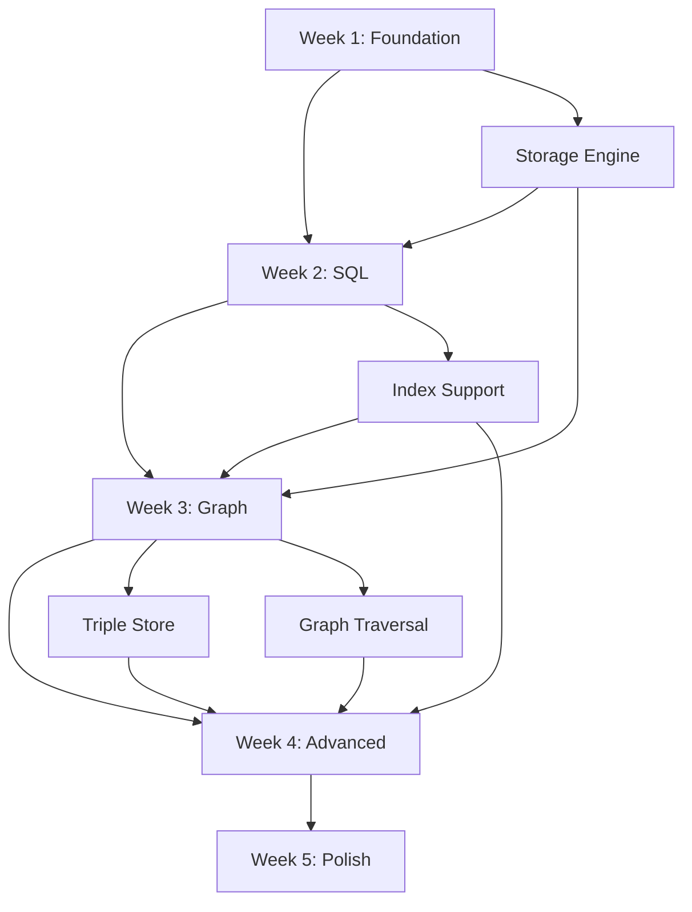

# RvLite Implementation Roadmap

## Accelerated 4-5 Week Timeline

Based on existing WASM infrastructure analysis, we can deliver **MUCH FASTER** than the original 8-week estimate!

---

## Phase 1: Foundation (Week 1)

### Goal: Basic database with vector operations

**Tasks**:
- [x] Analyze existing WASM implementations
- [ ] Create `rvlite` crate using `ruvector-wasm` as template
- [ ] Set up dependencies on `ruvector-core`
- [ ] Implement basic storage engine (in-memory tables)
- [ ] Add WASM bindings for vector operations
- [ ] Write unit tests

**Deliverables**:
```typescript
// Week 1 - Basic vector operations
const db = await RvLite.create();
await db.exec('CREATE TABLE docs (id INT, embedding VECTOR(384))');
await db.sql('INSERT INTO docs VALUES (1, $1)', [embedding]);
const results = await db.searchSimilar('docs', queryVector, { limit: 10 });
```

**Files to Create**:
```
crates/rvlite/
├── Cargo.toml              # Copy from ruvector-wasm, modify
├── src/
│   ├── lib.rs              # WASM entry point
│   ├── storage/
│   │   ├── mod.rs
│   │   ├── database.rs     # In-memory database
│   │   └── table.rs        # Table structure
│   ├── vector.rs           # Vector operations (thin wrapper over ruvector-core)
│   └── error.rs            # Copy from ruvector-wasm
└── tests/wasm.rs           # Basic tests
```

---

## Phase 2: SQL Engine (Week 2)

### Goal: Complete SQL support with indexes

**Tasks**:
- [ ] Integrate SQL parser (sqlparser-rs)
- [ ] Implement SQL executor
- [ ] Add HNSW index support (use `micro-hnsw-wasm`)
- [ ] Add persistence layer (IndexedDB)
- [ ] SQL function wrappers

**Deliverables**:
```typescript
// Week 2 - SQL queries
await db.sql(`
  CREATE TABLE documents (
    id SERIAL PRIMARY KEY,
    title TEXT,
    content TEXT,
    embedding VECTOR(768)
  )
`);

await db.sql(`
  CREATE INDEX idx_embedding
  ON documents USING hnsw (embedding vector_cosine_ops)
`);

await db.sql(`
  SELECT title, embedding <=> $1 AS distance
  FROM documents
  ORDER BY distance
  LIMIT 10
`, [queryEmbedding]);
```

**Files to Create**:
```
src/query/
├── mod.rs
├── sql/
│   ├── mod.rs
│   ├── parser.rs           # SQL parsing
│   ├── planner.rs          # Query planning
│   └── executor.rs         # Execution engine
├── index.rs                # Index management
└── persist.rs              # IndexedDB persistence
```

---

## Phase 3: Graph Engines (Week 3)

### Goal: SPARQL + Cypher support

**Tasks**:
- [ ] Extract SPARQL engine from `ruvector-postgres`
- [ ] Remove pgrx dependencies, adapt to RvLite storage
- [ ] Extract Cypher engine from `ruvector-postgres`
- [ ] Integrate triple store (SPO, POS, OSP indexes)
- [ ] Add graph traversal algorithms

**Deliverables**:
```typescript
// Week 3 - SPARQL
await db.loadRDF(`
  @prefix foaf: <http://xmlns.com/foaf/0.1/> .
  :alice foaf:knows :bob .
`, 'turtle');

await db.sparql(`
  SELECT ?name WHERE {
    ?person foaf:name ?name .
  }
`);

// Week 3 - Cypher
await db.cypher(`
  CREATE (a:Person {name: 'Alice'})-[:KNOWS]->(b:Person {name: 'Bob'})
`);

await db.cypher(`
  MATCH (a:Person)-[:KNOWS]->(b:Person)
  RETURN a.name, b.name
`);
```

**Files to Create**:
```
src/query/
├── sparql/
│   ├── mod.rs              # From ruvector-postgres (adapted)
│   ├── parser.rs           # Already exists
│   ├── executor.rs         # Already exists (remove pgrx)
│   └── triple_store.rs     # Already exists
└── cypher/
    ├── mod.rs              # From ruvector-postgres (adapted)
    ├── parser.rs           # Already exists
    └── executor.rs         # Already exists (remove pgrx)
```

---

## Phase 4: Advanced Features (Week 4)

### Goal: GNN, Learning, Hyperbolic embeddings

**Tasks**:
- [ ] Integrate `ruvector-gnn-wasm` (if exists, or create)
- [ ] Integrate `sona` for ReasoningBank
- [ ] Add hyperbolic embeddings module
- [ ] Performance optimization
- [ ] Size optimization (tree-shaking)

**Deliverables**:
```typescript
// Week 4 - GNN
const gcn = db.gnn.createLayer('gcn', { inputDim: 128, outputDim: 64 });
const embeddings = await db.gnn.computeEmbeddings('social_network', [gcn]);

// Week 4 - Learning
await db.learning.recordTrajectory({
  state: [0.1, 0.5],
  action: 2,
  reward: 1.0
});
await db.learning.train({ algorithm: 'q-learning', iterations: 1000 });

// Week 4 - Hyperbolic
const poincare_dist = db.hyperbolic.distance([0.1, 0.2], [0.3, 0.4], 'poincare');
```

**Files to Create**:
```
src/
├── gnn/
│   ├── mod.rs              # Wrapper over ruvector-gnn-wasm
│   ├── layers.rs
│   └── training.rs
├── learning/
│   ├── mod.rs              # Wrapper over sona
│   ├── reasoning_bank.rs
│   └── algorithms.rs
└── hyperbolic/
    ├── mod.rs              # From ruvector-postgres (adapted)
    ├── poincare.rs
    └── lorentz.rs
```

---

## Phase 5: Polish & Release (Week 5)

### Goal: Production-ready release

**Tasks**:
- [ ] Comprehensive testing (unit, integration, E2E)
- [ ] Performance benchmarking
- [ ] Size optimization audit
- [ ] Documentation (README, API docs, examples)
- [ ] NPM package setup
- [ ] TypeScript type definitions
- [ ] CI/CD pipeline (GitHub Actions)
- [ ] Beta release

**Deliverables**:
- ✅ `@rvlite/wasm` on npm
- ✅ Complete documentation
- ✅ 10+ examples (browser, Node.js, Deno, Cloudflare Workers)
- ✅ Performance benchmarks
- ✅ Migration guide from ruvector-postgres

---

## Detailed Weekly Breakdown

### Week 1: Foundation
```
Monday:
  - Create rvlite crate
  - Set up Cargo.toml, dependencies
  - Copy error handling from ruvector-wasm

Tuesday:
  - Implement Database struct
  - Add Table struct
  - Basic in-memory storage

Wednesday:
  - WASM bindings (wasm-bindgen)
  - Vector operations wrapper
  - JavaScript API design

Thursday:
  - Unit tests (wasm-bindgen-test)
  - Basic examples
  - Documentation

Friday:
  - Integration testing
  - Fix issues
  - Week 1 demo
```

### Week 2: SQL Engine
```
Monday:
  - Integrate sqlparser-rs
  - Parse CREATE TABLE, INSERT

Tuesday:
  - SQL executor
  - Query planning
  - Vector operators (<->, <=>, <#>)

Wednesday:
  - HNSW index integration (micro-hnsw-wasm)
  - CREATE INDEX support
  - Index maintenance

Thursday:
  - IndexedDB persistence
  - Save/load database
  - Transaction basics

Friday:
  - SQL tests
  - Performance tuning
  - Week 2 demo
```

### Week 3: Graph Engines
```
Monday-Tuesday:
  - Extract SPARQL from ruvector-postgres
  - Remove pgrx dependencies
  - Adapt to RvLite storage
  - Triple store indexes

Wednesday-Thursday:
  - Extract Cypher from ruvector-postgres
  - Graph pattern matching
  - Vector-enhanced queries

Friday:
  - Graph tests
  - SPARQL W3C test suite
  - Week 3 demo
```

### Week 4: Advanced Features
```
Monday:
  - Integrate GNN layers
  - Node embeddings
  - Graph classification

Tuesday:
  - Integrate sona (ReasoningBank)
  - Trajectory recording
  - Q-learning implementation

Wednesday:
  - Hyperbolic embeddings
  - Poincaré distance
  - Hyperbolic neural layers

Thursday:
  - Performance optimization
  - Bundle size reduction
  - SIMD optimization

Friday:
  - Feature completeness testing
  - Week 4 demo
```

### Week 5: Polish & Release
```
Monday:
  - Comprehensive test suite
  - Edge case testing
  - Browser compatibility testing

Tuesday:
  - Performance benchmarks
  - Size audit
  - Optimization pass

Wednesday:
  - Documentation
  - API reference
  - Tutorial examples

Thursday:
  - NPM package setup
  - TypeScript definitions
  - CI/CD pipeline

Friday:
  - Beta release
  - Blog post
  - Community announcement
```

---

## Success Metrics

### Week 1
- [ ] Basic database operations work
- [ ] Vector search returns correct results
- [ ] Bundle size < 1MB

### Week 2
- [ ] SQL queries execute correctly
- [ ] HNSW index recall > 95%
- [ ] Persistence save/load works
- [ ] Bundle size < 2MB

### Week 3
- [ ] SPARQL passes W3C tests
- [ ] Cypher queries work
- [ ] Graph traversal correct
- [ ] Bundle size < 3MB

### Week 4
- [ ] GNN layers produce correct embeddings
- [ ] Learning algorithms converge
- [ ] Hyperbolic distances accurate
- [ ] Bundle size < 4MB (gzipped < 2MB)

### Week 5
- [ ] Test coverage > 90%
- [ ] All examples working
- [ ] Documentation complete
- [ ] Performance benchmarks green

---

## Risk Mitigation

### High Priority Risks

**Risk**: SQL parser too large
- **Mitigation**: Use lightweight parser or custom implementation
- **Fallback**: Phase 1: Programmatic API only, add SQL in v1.1

**Risk**: WASM bundle > 5MB
- **Mitigation**: Aggressive feature gating, tree-shaking
- **Fallback**: Ship "lite" and "full" versions

**Risk**: Query engines too complex to extract
- **Mitigation**: Start with simple subset, iterate
- **Fallback**: Defer advanced queries to v1.1

### Medium Priority Risks

**Risk**: Performance slower than expected
- **Mitigation**: WASM SIMD, profiling, optimization
- **Fallback**: Document performance characteristics, set expectations

**Risk**: Browser compatibility issues
- **Mitigation**: Polyfills, feature detection
- **Fallback**: Document minimum browser versions

---

## Dependencies Between Tasks



---

## Staffing

**Single Developer** (full-time)
- Week 1-2: Core implementation (40 hours/week)
- Week 3-4: Feature development (40 hours/week)
- Week 5: Polish & release (30 hours/week)

**Community Contributors** (optional)
- Documentation
- Examples
- Testing
- Bug fixes

---

## Deliverables Checklist

### Code
- [ ] `crates/rvlite/` - Rust crate
- [ ] `npm/packages/rvlite/` - NPM package
- [ ] `crates/rvlite/pkg/` - WASM build artifacts

### Documentation
- [ ] README.md - Quick start
- [ ] API.md - Complete API reference
- [ ] TUTORIAL.md - Step-by-step guide
- [ ] MIGRATION.md - From ruvector-postgres
- [ ] PERFORMANCE.md - Benchmarks

### Examples
- [ ] `examples/browser/` - Browser demo
- [ ] `examples/nodejs/` - Node.js example
- [ ] `examples/deno/` - Deno example
- [ ] `examples/cloudflare-worker/` - Edge worker
- [ ] `examples/react/` - React integration

### Tests
- [ ] Unit tests (Rust)
- [ ] Integration tests (Rust)
- [ ] E2E tests (TypeScript)
- [ ] Browser tests (wasm-bindgen-test)
- [ ] Performance benchmarks

### Infrastructure
- [ ] GitHub Actions CI/CD
- [ ] NPM publish workflow
- [ ] Automated releases
- [ ] Documentation site (docs.rs)

---

**Next Steps**: Begin Week 1 implementation!

**Start Date**: 2025-12-09
**Target Beta**: 2025-01-13 (5 weeks)
**Target v1.0**: 2025-01-27 (7 weeks with buffer)
